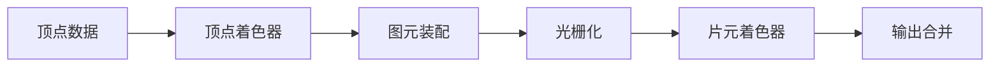

### 渲染管线（Graphics Rendering Pipeline）详解

**渲染管线**是计算机图形学中将3D场景数据转换为最终2D屏幕图像的一系列有序处理步骤。它是实时渲染的核心架构，理解其运作原理是优化性能、实现复杂效果的基础。以下是现代图形渲染管线的详细解析：


#### 一、渲染管线核心阶段（以WebGL/OpenGL ES为例）



##### 1. **顶点数据输入（Vertex Input）**
- **数据来源**：
  - 顶点缓冲对象（VBO）：存储顶点坐标、法线、UV、颜色等属性
  - 索引缓冲对象（IBO）：优化重复顶点的绘制
- **关键操作**：
  ```javascript
  // WebGL绑定VBO示例
  const positions = new Float32Array([...]);
  const vbo = gl.createBuffer();
  gl.bindBuffer(gl.ARRAY_BUFFER, vbo);
  gl.bufferData(gl.ARRAY_BUFFER, positions, gl.STATIC_DRAW);
  ```

##### 2. **顶点着色器（Vertex Shader）**
- **核心任务**：
  - 坐标变换：模型空间 → 世界空间 → 视图空间 → 裁剪空间
  - 计算顶点级属性：法线变换、预计算光照数据
- **数学原理**：
  ```glsl
  // GLSL顶点着色器示例
  uniform mat4 u_MVPMatrix; // Model-View-Projection矩阵
  attribute vec3 a_Position;
  
  void main() {
    gl_Position = u_MVPMatrix * vec4(a_Position, 1.0);
  }
  ```
- **优化重点**：
  - 矩阵计算的合并（预计算MVP矩阵）
  - 使用顶点着色器实例化（Vertex Shader Instancing）

##### 3. **图元装配（Primitive Assembly）**
- **图元类型**：
  - 点（GL_POINTS）
  - 线段（GL_LINES）
  - 三角形（GL_TRIANGLES）
- **关键处理**：
  - 背面剔除（Backface Culling）：通过面法线判断可见性
  - 顶点顺序：确定三角形正面（CCW逆时针或CW顺时针）

##### 4. **几何处理阶段（可选，WebGL不支持）**
- **细分着色器（Tessellation Shader）**：
  - 动态增加几何细节（如地形LOD）
- **几何着色器（Geometry Shader）**：
  - 生成新图元（如将点扩展为四边形实现粒子效果）

##### 5. **光栅化（Rasterization）**
- **核心流程**：
  1. 三角形设置（Triangle Setup）：计算边方程
  2. 扫描转换（Scan Conversion）：确定覆盖像素
  3. 属性插值（Perspective-Correct Interpolation）
- **关键技术**：
  - 多重采样抗锯齿（MSAA）：每个像素多个采样点
  - 保守光栅化（Conservative Rasterization）：保证边缘覆盖

##### 6. **片元着色器（Fragment Shader）**
- **核心任务**：
  - 计算最终像素颜色
  - 实现光照模型（Phong/PBR）、纹理采样、阴影计算
- **代码示例**：
  ```glsl
  precision highp float;
  uniform sampler2D u_DiffuseTexture;
  varying vec2 v_TexCoord;
  
  void main() {
    vec4 texColor = texture2D(u_DiffuseTexture, v_TexCoord);
    gl_FragColor = texColor * vec4(1.0, 0.5, 0.5, 1.0); // 叠加颜色
  }
  ```

##### 7. **逐片段操作（Per-Fragment Operations）**
- **测试与混合**：
  - **深度测试**：Z-Buffer算法（`gl.enable(gl.DEPTH_TEST)`）
  - **模板测试**：实现蒙版效果（如镜面反射）
  - **混合模式**：Alpha混合（`gl.blendFunc(gl.SRC_ALPHA, gl.ONE_MINUS_SRC_ALPHA)`）
- **输出目标**：
  - 颜色缓冲（Color Buffer）
  - 深度/模板缓冲（Depth/Stencil Buffer）

---

#### 二、现代GPU渲染管线演进

##### 1. **可编程管线 vs 固定管线**
| 特性              | 固定管线                     | 可编程管线                   |
|-------------------|----------------------------|----------------------------|
| 灵活性            | 功能固定                    | 通过着色器自定义            |
| 性能优化          | 有限                       | 精细控制GPU指令            |
| 典型API           | OpenGL 1.x                 | OpenGL 3.0+/WebGL 2.0     |

##### 2. **计算着色器（Compute Shader）**
- **作用**：通用GPU计算，与渲染管线并行
- **应用场景**：
  - 粒子系统模拟
  - 光线求交计算（光线追踪辅助）
  ```glsl
  // WebGL 2.0 Compute Shader示例
  #version 310 es
  layout(local_size_x = 16) in;
  
  void main() {
    // 并行计算任务...
  }
  ```

##### 3. **延迟渲染（Deferred Rendering）**
- **流程**：
  1. **几何阶段**：将材质属性写入G-Buffer（位置、法线、颜色等）
  2. **光照阶段**：基于G-Buffer计算光照
- **优势**：
  - 支持大量动态光源
  - 降低Overdraw（过度绘制）

---

#### 三、关键优化技术

##### 1. **减少Draw Call**
- **合并批次（Batching）**：
  ```javascript
  // Three.js合并几何体
  const mergedGeometry = BufferGeometryUtils.mergeBufferGeometries(geometries);
  ```
- **实例化渲染（Instancing）**：
  ```javascript
  // WebGL 2.0实例化绘制
  gl.drawArraysInstanced(gl.TRIANGLES, 0, 6, 1000); // 绘制1000个实例
  ```

##### 2. **压缩传输数据**
- **顶点压缩**：
  - 使用16位浮点数（`gl.HALF_FLOAT`）
  - 量化法线（Spherical Coordinates → 8-bit）
- **纹理压缩**：
  - ASTC格式（Adaptive Scalable Texture Compression）
  - 使用KTX2容器格式

##### 3. **异步处理**
- **Web Worker预计算**：
  ```javascript
  // 在Worker中预处理几何数据
  worker.postMessage({cmd: 'process', data: rawData});
  ```
- **GPU驱动渲染**：
  - 间接绘制（Indirect Drawing）
  - 多线程命令提交（Multi-threaded Command Buffers）

---

#### 四、不同API的管线差异

| 特性                  | WebGL 2.0               | Vulkan                  | Metal                  |
|-----------------------|-------------------------|-------------------------|------------------------|
| 管线状态管理          | 全局状态机              | 显式Pipeline对象        | MTLRenderPipelineState |
| 多线程支持            | 无                      | 完全支持                | 有限支持               |
| 着色器语言            | GLSL ES 3.0             | SPIR-V                  | MSL（Metal Shading）   |
| 内存管理              | 自动垃圾回收            | 显式分配/释放           | 显式管理               |

---

#### 五、经典问题：为何需要矩阵变换？
- **模型矩阵**：物体从本地坐标系定位到世界空间
- **视图矩阵**：世界空间转换到以相机为原点的视图空间
- **投影矩阵**：3D视图空间 → 2D裁剪空间（实现透视变形）

**矩阵级联公式**：
```math
MVP = Projection \times View \times Model
```

---

### 总结
渲染管线是实时图形渲染的"流水线工厂"，每个阶段的优化直接影响最终性能。对于前端3D开发：
1. **基础开发**：掌握Three.js等库的抽象层即可
2. **深度优化**：必须理解管线各阶段的底层机制
3. **未来趋势**：关注WebGPU标准（更接近Vulkan/Metal的底层API）

建议通过Chrome的**RenderDoc**或**WebGL Inspector**工具实际观察管线各阶段的数据流，结合理论实现高效学习。
