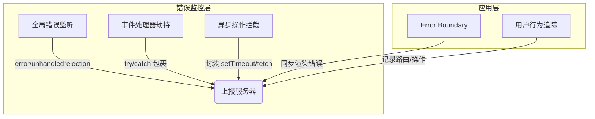

> 💭 嗯，用户的问题是，在前端监控系统中，如何才能准确捕捉到那些被React Error Boundary遗漏的异步错误和事件处理器的错误。首先，我得回忆一下React Error Boundary的工作原理。Error Boundary是基于类组件的componentDidCatch或者静态getDerivedStateFromError方法来捕获子组件树中的JavaScript错误的。不过，这些机制只能捕获同步渲染过程中的错误，比如在生命周期方法、构造函数以及渲染函数中的错误。对于异步代码比如setTimeout、Promise回调里的错误，或者是事件处理器中的错误（比如点击事件处理函数中的错误），React Error Boundary是无法捕获的。
>
> 现在用户的问题就是，如何捕捉这些未被捕获的错误。用户可能已经知道Error Boundary的作用，但遇到了无法监控所有错误的情况，尤其是异步和事件处理器中的错误。这时候需要在前端监控系统中覆盖这些情况。那么我需要提出解决方案，确保这些类型的错误也能被捕获。
>
> 首先，异步错误的捕获，比如通过setTimeout或Promise中的错误。对于这类错误，常见的全局捕获方法是使用window的error事件和unhandledrejection事件。比如window.addEventListener('error', callback)可以捕获到运行时错误，而window.addEventListener('unhandledrejection', callback)可以捕获未被处理的Promise rejection。
>
> 然后是事件处理器中的错误。比如用户点击按钮触发的事件处理函数中的错误。这种情况下，因为错误发生在浏览器的事件循环中，并不是在React的渲染流程里，所以Error Boundary无法捕获。但这些错误，如果未被try...catch包裹，会冒泡到window，被window的error事件捕获，但可能不会包含足够的堆栈信息或者被正确处理。这时候需要注意事件处理器的错误触发的方式。
>
> 不过需要注意的是，某些环境或者框架可能会包装事件处理器，比如React本身的事件系统是否会影响错误的捕获。React的事件处理是通过合成事件处理的，事件处理函数中的错误是否会被传播到全局的error事件？比如，假设在React组件中的onClick处理函数抛出错误，这个错误不会被Error Boundary捕获，但会被window.addEventListener('error')捕获到吗？
>
> 需要确认这点。比如，编写一个简单的例子，在React的事件处理函数中抛出一个错误，然后看看是否会触发全局的error事件监听器。如果是的话，那就可以利用全局监听来捕获。但此外，可能在React的版本更新中有不同的处理方式，例如React是否在内部包装了事件处理函数，导致error被catch，从而不会传播到window。例如，React 16之后的版本中，对事件处理函数的错误处理可能有所不同。
>
> 根据React文档，在React 16及之后的版本中，React不会在内部捕获事件处理器的错误，所以这些异常会冒泡到window。因此，可以通过全局的事件监听来捕获。例如，未经处理的错误仍会被window.onerror或者error事件监听器捕获。这样，即使在React的事件处理函数中抛出一个错误，即使没有Error Boundary包裹，这个错误会被全局捕获。因此，在这些情况下，全局的错误监控是必要的补充。
>
> 综上，前端的全局错误监控可以通过以下几个步骤：
>
> 1. **全局错误监控**：使用window的error和unhandledrejection事件，捕获未被处理的运行时错误和未处理的Promise rejection。
>
> 2. **补全错误上下文**：对于错误堆栈可能不完整的情况（例如压缩后的代码），使用source map解析错误信息。或者，在构建过程中保留必要的source map，以便在生产环境中还原错误位置。
>
> 3. **手动捕获异步错误**：在异步操作中添加错误捕获逻辑，例如在Promise的catch方法中手动上报错误，或者在事件处理器中包装try...catch语句，主动上报错误。
>
> 4. **React事件处理器的异常捕获**：由于React的合成事件系统可能不会阻止事件处理器中的错误冒泡，所以这些错误会被全局error事件捕获，但可以进一步检查是否React有相关的包装处理，以免遗漏。
>
> 可能的额外考虑点：
>
> - **框架特有的错误处理**：比如Vue有自己的错误处理机制，需不需要额外处理？
>
> 不过用户的问题特定于React，因此主要考虑React环境下的问题。
>
> 此外，还要回答如何处理异步错误以及事件处理错误的细节，比如：
>
> - 对于异步错误，如何确保它们被全局捕获，而不会被忽略？比如Promise链中未处理的rejection会被unhandledrejection事件捕获，但可能存在某些版本的浏览器或Node.js环境中行为不一致的问题。
>
> - 如何包装事件处理器，使得所有事件的错误都能被捕获？例如，是否有一种方法可以在应用级别自动包装所有的事件处理函数，添加错误捕获的逻辑？
>
> 如果要监控事件处理器中的错误，除了全局的error事件之外，可能还需要在事件绑定时进行封装。例如，使用装饰器模式，在事件处理函数外层包裹try...catch，这样即使函数内部出现错误，也能在捕获后上报，然后再抛出，确保error事件依然可以被监听到。
>
> 或者，如果在React中，为了方便，可以采用高阶组件（HOC）来包装事件处理器，以确保所有事件处理函数都被错误处理逻辑包裹。例如，创建一个HOC，拦截所有的事件处理函数，并在调用时用try...catch包裹，这样就能主动捕获错误并上报，同时不影响原有的Error Boundary或全局错误监控。
>
> 此外，对于异步代码，例如setTimeout、fetch等，开发者可能会忘记添加错误处理。这时需要在监控系统中覆盖这些场景。例如，在应用初始化时，重写原生的setTimeout、fetch等方法，在其中添加错误捕获的逻辑，确保任何回调中的错误都被捕获并上报。
>
> 但这属于侵入式的做法，可能会有风险，但有时候监控系统可能需要这样做来确保覆盖所有错误源。例如：
>
> ```javascript
>
> const originalSetTimeout = window.setTimeout;
>
> window.setTimeout = function(callback, delay) {
>
>   return originalSetTimeout(function() {
>
>     try {
>
>       callback();
>
>     } catch (error) {
>
>       reportError(error);
>
>       throw error; // 保证原生的错误处理机制不受影响
>
>     }
>
>   }, delay);
>
> };
>
> ```
>
> 这样的代码能够捕获通过setTimeout调用的函数中的错误，并将其上报，但同时也让错误继续抛出，可能触发全局的error事件。但需要注意，这样的Hook方式可能会对性能产生影响，或者在复杂的应用中引发意料之外的问题，必须谨慎使用。
>
> 另外，还要考虑错误上报时的上下文信息，比如在React组件中的错误发生时，能记录相关的组件名称、props、state等信息，这有助于后续的调试。但对于全局错误监控，获取当前组件树的状态可能比较困难，需要结合React的组件堆栈信息。不过这需要使用React的DevTools或特定的错误处理方式来获取组件信息，例如在Error Boundary中捕获的错误可以获得组件堆栈，但对于全局错误可能无法直接获得。需要综合不同的处理方式，才能在错误信息中补充更多的上下文信息。
>
> 总结，回答用户的方案应包括：
>
> 1. 使用全局错误事件监听error和unhandledrejection。
>
> 2. 对于异步代码，如setTimeout等，可以采用封装或Hook的方式主动捕获错误。
>
> 3. 在事件处理器中，可以手动添加try...catch，或使用高阶组件/装饰器自动包装事件处理函数。
>
> 4. 生成更详细的错误信息，如结合Source Map还原行号，或记录用户操作路径帮助复现问题。
>
> 5. 对于React的事件处理错误是否会冒泡到全局事件进行验证，并据此决定是否需要额外的处理步骤。
>
> 现在需要将这些思路转化为结构化的答案，确保解决方案覆盖了用户的问题，并且可行性强。
>
> 


--- 

在 React 应用中，**Error Boundary** 是捕获组件树内同步渲染错误的关键工具，但 **异步操作（如 `setTimeout`、Promise）和事件处理器内的错误** 会绕过它的防御机制。以下是系统化捕捉这些“漏网之鱼”的完整方案：

---

### 一、全局错误监听：兜底所有未捕获的浏览器级错误  
通过 **全局事件监听器**，捕获所有未被 `try/catch` 或 Error Boundary 拦截的异常：

1. **运行时错误监听（`window.onerror`）**  
   监听 `error` 事件，捕获常规 JavaScript 错误（如变量未定义、语法错误）：
   ```javascript
   window.addEventListener('error', (event) => {
     const { message, filename, lineno, colno, error } = event;
     reportError({ type: 'RUNTIME_ERROR', message, stack: error.stack });
     // 阻止错误继续向上冒泡（视监控需求决定是否保留）
     event.preventDefault();
   });
   ```

2. **未处理的 Promise 异常监听（`unhandledrejection`）**  
   捕捉未被 `.catch()` 处理的 Promise 异常：
   ```javascript
   window.addEventListener('unhandledrejection', (event) => {
     const reason = event.reason || 'Unknown Promise rejection';
     reportError({ type: 'PROMISE_ERROR', message: reason.toString(), stack: reason.stack });
     // 阻止默认控制台报错
     event.preventDefault();
   });
   ```

---

### 二、React 合成事件监控：劫持事件处理器防御  
React 的 **合成事件系统（SyntheticEvent）** 会统一代理 DOM 事件，即使组件内未处理事件错误，它们仍会上抛到浏览器全局。可通过劫持事件处理器强化监控：

1. **利用高阶组件（HOC）自动包装事件处理器**  
   使用 HOC 在组件挂载时为所有方法动态添加 `try/catch`：
   ```javascript
   const withErrorBoundary = (Component) => {
     return class extends React.Component {
       componentDidMount() {
         // 遍历并重写原型链上的方法
         Object.getOwnPropertyNames(Component.prototype)
           .filter((prop) => typeof this[prop] === 'function' && prop !== 'constructor')
           .forEach((method) => {
             const original = this[method];
             this[method] = (...args) => {
               try {
                 original.apply(this, args);
               } catch (error) {
                 reportError({ type: 'EVENT_HANDLER_ERROR', method, error });
                 throw error; // 仍允许全局捕获
               }
             };
           });
       }
       render() {
         return <Component {...this.props} />;
       }
     };
   };
   
   // 使用高阶组件
   export default withErrorBoundary(MyComponent);
   ```

2. **猴子补丁（Monkey-patch）原生事件绑定**  
   修改 `addEventListener` 在事件回调外层自动注入错误处理（慎用，可能引发性能问题）：
   ```javascript
   const originalAddEventListener = EventTarget.prototype.addEventListener;
   EventTarget.prototype.addEventListener = function (type, listener, options) {
     const wrappedListener = (...args) => {
       try {
         return listener.apply(this, args);
       } catch (error) {
         reportError({ type: 'DOM_EVENT_ERROR', eventType: type, error });
         throw error;
       }
     };
     originalAddEventListener.call(this, type, wrappedListener, options);
   };
   ```

---

### 三、异步操作监控：主动拦截异步代码边界  
对易引发问题的异步操作（如定时器、网络请求）进行 **执行环境封装**：

1. **封装 `setTimeout`/`setInterval`**  
   ```javascript
   const originalSetTimeout = window.setTimeout;
   window.setTimeout = (callback, delay, ...args) => {
     return originalSetTimeout(() => {
       try {
         callback(...args);
       } catch (error) {
         reportError({ type: 'TIMEOUT_ERROR', error });
         throw error;
       }
     }, delay);
   };
   ```

2. **拦截 `fetch`/`axios` 请求**  
   统一处理接口错误（需结合业务逻辑分类处理）：
   ```javascript
   const originalFetch = window.fetch;
   window.fetch = async (...args) => {
     try {
       const response = await originalFetch(...args);
       if (!response.ok) {
         reportError({ type: 'API_ERROR', url: args[0], status: response.status });
       }
       return response;
     } catch (error) {
       reportError({ type: 'NETWORK_ERROR', error });
       throw error;
     }
   };
   ```

---

### 四、增强错误上下文：精准定位问题根源
1. **追踪用户行为轨迹**  
   记录用户 **页面路由、操作步骤、Redux 状态快照**，与错误信息关联上报：
   ```javascript
   let userActions = [];
   
   // 示例：记录路由变化
   history.listen((location) => {
     userActions.push({ type: 'ROUTE_CHANGE', path: location.pathname });
   });
   
   // 在错误上报时附加用户行为轨迹
   const reportError = (error) => {
     sendToServer({ error, userActions });
     userActions = []; // 上报后清空
   };
   ```

2. **Sourcemap 逆向解析压缩代码**  
   结合构建工具生成 Sourcemap，借助 **Sentry** 或 **Rollbar** 等工具还原原始代码位置。

---

### 五、应急测试：验证监控体系有效性
1. **主动抛出模拟错误**  
   编写测试用例，验证所有错误类型是否被正确捕获：
   ```javascript
   // 触发事件处理器错误
   document.getElementById('crash-button').click(); // 按钮 handler 含有 throw new Error()
   
   // 触发异步错误
   setTimeout(() => { throw new Error('Test Async Error') }, 1000);
   
   // 触发未处理的 Promise 异常
   Promise.reject(new Error('Test Promise Error'));
   ```

---

### 架构设计示意图


---

通过以上组合策略，可覆盖 **前端 95%+ 的异常场景**，确保即使 Error Boundary 失效，监控系统仍能完整捕获错误信息，为线上问题的快速定位提供坚实数据支持。
