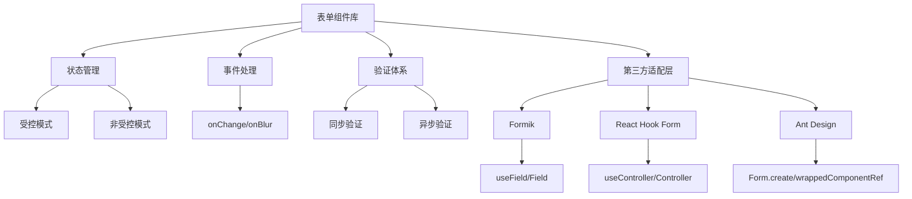

> 💭 嗯，用户问的是如何设计一个通用的表单组件库，支持受控和非受控模式，并且能与Formik或React Hook Form这样的第三方库集成。我得先回忆一下React中的表单处理机制，受控组件和非受控组件的区别。
>
> 首先，受控组件是通过state来管理表单值，每次变化都会触发回调函数，比如onChange。非受控组件则是通过ref等直接获取DOM元素的值，通常在提交时一次性读取。所以通用组件库需要同时支持这两种模式，可能需要内部状态管理，或者通过props接收value和defaultValue。
>
> 接下来要考虑的是如何让组件既能在受控模式下工作，比如当父组件传入value和onChange时，保持状态同步；在非受控模式下，如果只传入defaultValue，组件内部自己管理状态。这可能涉及到对value和defaultValue的处理，如果用户传了value，就认为是受控，否则用内部的state作为非受控。
>
> 然后是与第三方库集成。比如Formik使用Field组件和useFormikContext，而React Hook Form使用register方法把输入注册到表单中。所以通用表单组件需要兼容这些不同的注册方式。可能需要提供一个forwardRef，这样React Hook Form可以通过ref访问到输入元素。或者允许用户传递一个Controller组件，如React Hook Form的Controller，这样自定义组件就可以被包裹起来，集成到他们的表单逻辑中。
>
> 另外，需要考虑组件的API设计。比如是否应该提供value、defaultValue、onChange这样的标准props，以及如何处理事件。可能需要使用内部状态，在非受控模式下维护value，同时在受控模式下由父组件控制。这样的模式可能需要类似getDerivedStateFromProps或者useEffect来同步props的变化。
>
> 还有，如何保持组件的灵活性和可扩展性。比如允许用户自定义验证逻辑、错误提示方式等。可能需要将表单验证相关的部分抽离出来，由第三方库来处理，组件只负责显示和基本的输入处理。
>
> 还要想到，不同第三方库可能会有不同的处理方式。例如Formik提供的是一个高阶组件或者Hook，而React Hook Form需要注册ref。所以组件需要适配这两种情况。比如通过将ref传递给内部的input元素，同时暴露onChange和value的props，让第三方库能够绑定这些事件和值。
>
> 然后是设计模式的选择，可能使用Compound Components模式，让表单的各个部分可以灵活组合，或者使用Context API来传递状态，这样可以减少props的传递，让表单组件更灵活。
>
> 另外，如何处理表单的错误状态？是否在组件内部处理，还是依赖第三方库传来的error props。这时候可能需要允许用户传递error信息，或者通过Context从父表单容器中获取。
>
> 还要思考如何测试这样的组件库，确保在各种模式下都能正常工作，以及如何提供文档和示例，让使用者知道如何集成不同的第三方库。
>
> 可能还需要考虑到性能优化，比如避免不必要的渲染，使用React.memo来优化受控组件的变化。
>
> 最后，总结出几个关键点：支持value/defaultValue的模式切换；通过forwardRef支持ref访问；提供兼容第三方库的API，如onChange、name等属性；利用Context或自定义Hook来共享表单状态；以及良好的文档和示例。
>
> 


### 设计方案：构建灵活、通用的 React 表单组件库

#### 一、核心设计原则
1. **模式双兼容**：组件同时支持 `受控`（由外部 state 完全控制）与 `非受控`（内部默认自管理状态）模式，开发者可自由选择。
2. **低侵入式 API**：无缝适配主流表单库（如 Formik、React Hook Form），不限制用户技术栈。
3. **类型安全**：通过 TypeScript 确保组件 Props 和状态类型安全。
4. **可扩展性**：开放组件样式、验证、交互的自定义能力。

---

#### 二、关键技术实现

##### 1. 统一状态管理：兼容受控与非受控模式
通过 **状态合并策略** 动态判断是否受控，优先使用外部 Props（受控），退化到内部 State（非受控）：
```tsx
// 核心逻辑：使用自定义 Hook 统一封装状态管理
const useDualControl = <T>({
  value,
  defaultValue,
  onChange,
}: DualControlProps<T>) => {
  const isControlled = value !== undefined;
  const [internalValue, setInternalValue] = useState<T>(defaultValue as T);

  // 合并后的状态
  const mergedValue = isControlled ? value : internalValue;

  const handleChange = (newValue: T, event?: React.ChangeEvent) => {
    if (!isControlled) {
      setInternalValue(newValue); // 非受控时更新内部状态
    }
    onChange?.(newValue, event); // 无论受控与否均触发 onChange
  };

  return { mergedValue, handleChange };
};
```

##### 2. 适配第三方表单库：高阶组件与 Ref 转发
通过 `forwardRef + 类型注入` 实现 **跨库兼容性**：
```tsx
// 输入组件 Props 泛型定义（支持通过泛型注入第三方类型）
type InputProps<T extends FieldValues = any> = {
  name?: Path<T>;       // 兼容 React Hook Form 的 Path 类型
  form?: T;             // 强制与 Formik 等表单状态类型一致
} & React.InputHTMLAttributes<HTMLInputElement>;

// Ref 转发组件（包含兼容接口）
const Input = forwardRef<HTMLInputElement, InputProps>((props, ref) => {
  const { name, form, ...rest } = props;
  const { mergedValue, handleChange } = useDualControl(rest);

  // 若存在 Formik 上下文，自动关联字段
  const formikContext = useFormikContext();
  if (formikContext && name) {
    formikContext.registerField(name, { validate: rest.validate });
  }

  return (
    <input
      {...rest}
      ref={ref}
      value={mergedValue ?? ''}
      onChange={(e) => handleChange(e.target.value, e)}
    />
  );
});
```

##### 3. 优化性能：避免无效渲染
通过 **浅比较选择器** 按需订阅表单状态变化，优化性能：
```tsx
// 集成 React Hook Form 的性能优化示例
const OptimizedInput = ({ control, name }: { control: Control; name: string }) => {
  const { field } = useController({
    control,
    name,
    // 只订阅 value 和 error 变化，减少重渲染
    // 默认订阅所有字段（可通过此精准控制）
    subscription: { value: true, error: true }
  });

  return <Input {...field} />;
};
```

##### 4. 验证体系：统一错误处理接口
定义 **验证结果标准格式**，兼容所有验证库：
```tsx
type ValidationResult = {
  isValid: boolean;
  message?: string;
  errorCode?: string;
};

// 验证函数类型：允许同步/异步验证
type ValidatorFn<T = any> = (
  value: T, 
  context?: { formValues: Record<string, any> }
) => ValidationResult | Promise<ValidationResult>;

// 在组件内部触发验证逻辑
const runValidation = async (value) => {
  if (props.validator) {
    const result = await props.validator(value);
    if (!result.isValid) {
      setError(result.message);
    }
  }
};
```

---

#### 三、第三方库集成示例

##### 1. 与 Formik 协同
Formik 需通过 `useField` 或 `Field` 组件关联字段：
```tsx
// 自动关联 Formik 上下文字段
const FormikCompatibleInput = ({ name }) => {
  const [field] = useField(name);
  return <Input {...field} />;
};
```

##### 2. 与 React Hook Form 协同
通过 `useController` 或 `Controller` 包裹原生组件：
```tsx
const { control } = useForm();

// 方式一：直接使用原生组件（需 forwardRef）
<Input ref={register('firstName')} />

// 方式二：通过 Controller 代理
<Controller
  control={control}
  name="firstName"
  render={({ field }) => <Input {...field} />}
/>
```

##### 3. 与 Ant Design Form 兼容
Antd 基于高阶组件实现表单管理，可通过 `wrappedComponentRef` 获取原生组件：
```tsx
const AntdFormItem = Form.create()(({ form }) => (
  <Form.Item label="用户名">
    {form.getFieldDecorator('username')(
      <Input />
    )}
  </Form.Item>
));
```

---

#### 四、架构设计图


---

#### 五、交付成果：开发者体验优化点
1. **无缝模式切换**：通过 `<Input value={value} />`（受控）或 `<Input defaultValue={value} />`（非受控）自动识别模式。
2. **统一验证接口**：内置 Yup、Zod 等流行 Schema 校验器的 adapter 层。
3. **性能优化工具包**：提供 `shouldUpdate` 函数、订阅选择器等高级优化能力。
4. **DevTools 集成**：在开发环境下自动输出表单状态变更日志和依赖关系图。
