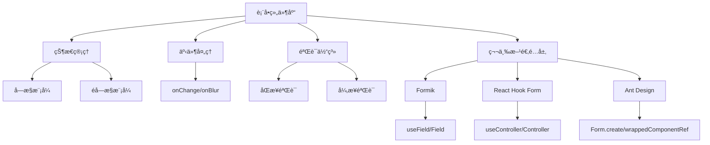

> 💭 嗯，用户问的是如何设计一个通用的表å•ç»„件库，支æŒå—æ§å’Œéå—æ§æ¨¡å¼ï¼Œå¹¶ä¸”能ä¸Formik或React Hook Form这样的第三方库集æˆã€‚我得先å›å¿†ä¸€ä¸‹React中的表å•å¤„ç†æœºåˆ¶ï¼Œå—æ§ç»„件和éå—æ§ç»„件的区别。
>
> 首先，å—æ§ç»„件是通过stateæ¥ç®¡ç†è¡¨å•å€¼ï¼Œæ¯æ¬¡å˜åŒ–都会触å‘å›è°ƒå‡½æ•°ï¼Œæ¯”如onChange。éå—æ§ç»„件则是通过ref等直æ¥è·å–DOM元素的值，通常在æ交时一次性读å–。所以通用组件库需è¦åŒæ—¶æ”¯æŒè¿™ä¸¤ç§æ¨¡å¼ï¼Œå¯èƒ½éœ€è¦å†…部状æ€ç®¡ç†ï¼Œæˆ–者通过propsæ¥æ”¶valueå’ŒdefaultValue。
>
> æ¥ä¸‹æ¥è¦è€ƒè™‘的是如何让组件既能在å—æ§æ¨¡å¼ä¸‹å·¥ä½œï¼Œæ¯”如当父组件传入valueå’ŒonChange时，ä¿æŒçŠ¶æ€åŒæ­¥ï¼›åœ¨éå—æ§æ¨¡å¼ä¸‹ï¼Œå¦‚æœåªä¼ å…¥defaultValue，组件内部自己管ç†çŠ¶æ€ã€‚è¿™å¯èƒ½æ¶‰åŠåˆ°å¯¹valueå’ŒdefaultValue的处ç†ï¼Œå¦‚æœç”¨æˆ·ä¼ äº†value，就认为是å—æ§ï¼Œå¦åˆ™ç”¨å†…部的state作为éå—æ§ã€‚
>
> 然å是ä¸ç¬¬ä¸‰æ–¹åº“集æˆã€‚比如Formik使用Field组件和useFormikContext，而React Hook Form使用register方法把输入注册到表å•ä¸­ã€‚所以通用表å•ç»„件需è¦å…¼å®¹è¿™äº›ä¸åŒçš„注册方å¼ã€‚å¯èƒ½éœ€è¦æ供一个forwardRef，这样React Hook Formå¯ä»¥é€šè¿‡ref访问到输入元素。或者å…许用户传递一个Controller组件，如React Hook Formçš„Controller，这样自定义组件就å¯ä»¥è¢«åŒ…裹起æ¥ï¼Œé›†æˆåˆ°ä»–们的表å•é€»è¾‘中。
>
> å¦å¤–，需è¦è€ƒè™‘组件的API设计。比如是å¦åº”该æä¾›valueã€defaultValueã€onChange这样的标准props，以åŠå¦‚何处ç†äº‹ä»¶ã€‚å¯èƒ½éœ€è¦ä½¿ç”¨å†…部状æ€ï¼Œåœ¨éå—æ§æ¨¡å¼ä¸‹ç»´æŠ¤value，åŒæ—¶åœ¨å—æ§æ¨¡å¼ä¸‹ç”±çˆ¶ç»„件æ§åˆ¶ã€‚这样的模å¼å¯èƒ½éœ€è¦ç±»ä¼¼getDerivedStateFromProps或者useEffectæ¥åŒæ­¥propsçš„å˜åŒ–。
>
> 还有，如何ä¿æŒç»„件的çµæ´»æ€§å’Œå¯æ‰©å±•æ€§ã€‚比如å…许用户自定义验è¯é€»è¾‘ã€é”™è¯¯æ示方å¼ç­‰ã€‚å¯èƒ½éœ€è¦å°†è¡¨å•éªŒè¯ç›¸å…³çš„部分抽离出æ¥ï¼Œç”±ç¬¬ä¸‰æ–¹åº“æ¥å¤„ç†ï¼Œç»„件åªè´Ÿè´£æ˜¾ç¤ºå’ŒåŸºæœ¬çš„输入处ç†ã€‚
>
> 还è¦æƒ³åˆ°ï¼Œä¸åŒç¬¬ä¸‰æ–¹åº“å¯èƒ½ä¼šæœ‰ä¸åŒçš„处ç†æ–¹å¼ã€‚例如Formikæ供的是一个高阶组件或者Hook，而React Hook Form需è¦æ³¨å†Œref。所以组件需è¦é€‚é…这两ç§æƒ…况。比如通过将ref传递给内部的input元素，åŒæ—¶æš´éœ²onChangeå’Œvalueçš„props，让第三方库能够绑定这些事件和值。
>
> 然å是设计模å¼çš„选择，å¯èƒ½ä½¿ç”¨Compound Components模å¼ï¼Œè®©è¡¨å•çš„å„个部分å¯ä»¥çµæ´»ç»„åˆï¼Œæˆ–者使用Context APIæ¥ä¼ é€’状æ€ï¼Œè¿™æ ·å¯ä»¥å‡å°‘props的传递，让表å•ç»„件更çµæ´»ã€‚
>
> å¦å¤–，如何处ç†è¡¨å•çš„错误状æ€ï¼Ÿæ˜¯å¦åœ¨ç»„件内部处ç†ï¼Œè¿˜æ˜¯ä¾èµ–第三方库传æ¥çš„error props。这时候å¯èƒ½éœ€è¦å…许用户传递errorä¿¡æ¯ï¼Œæˆ–者通过Contextä»çˆ¶è¡¨å•å®¹å™¨ä¸­è·å–。
>
> 还è¦æ€è€ƒå¦‚何测试这样的组件库，确ä¿åœ¨å„ç§æ¨¡å¼ä¸‹éƒ½èƒ½æ­£å¸¸å·¥ä½œï¼Œä»¥åŠå¦‚何æ供文档和示例，让使用者知é“如何集æˆä¸åŒçš„第三方库。
>
> å¯èƒ½è¿˜éœ€è¦è€ƒè™‘到性能优化，比如é¿å…ä¸å¿…è¦çš„渲染，使用React.memoæ¥ä¼˜åŒ–å—æ§ç»„件的å˜åŒ–。
>
> 最å，总结出几个关键点：支æŒvalue/defaultValue的模å¼åˆ‡æ¢ï¼›é€šè¿‡forwardRef支æŒref访问；æ供兼容第三方库的API，如onChangeã€nameç­‰å±æ€§ï¼›åˆ©ç”¨Context或自定义Hookæ¥å…±äº«è¡¨å•çŠ¶æ€ï¼›ä»¥åŠè‰¯å¥½çš„文档和示例。
>
> 


### 设计方案：æ„建çµæ´»ã€é€šç”¨çš„ React 表å•ç»„件库

#### 一ã€æ ¸å¿ƒè®¾è®¡åŸåˆ™
1. **模å¼åŒå…¼å®¹**：组件åŒæ—¶æ”¯æŒ `å—æ§`（由外部 state 完全æ§åˆ¶ï¼‰ä¸ `éå—æ§`（内部默认自管ç†çŠ¶æ€ï¼‰æ¨¡å¼ï¼Œå¼€å‘者å¯è‡ªç”±é€‰æ‹©ã€‚
2. **ä½ä¾µå…¥å¼ API**：无ç¼é€‚é…主æµè¡¨å•åº“（如 Formikã€React Hook Form），ä¸é™åˆ¶ç”¨æˆ·æŠ€æœ¯æ ˆã€‚
3. **ç±»å‹å®‰å…¨**：通过 TypeScript ç¡®ä¿ç»„件 Props 和状æ€ç±»å‹å®‰å…¨ã€‚
4. **å¯æ‰©å±•æ€§**：开放组件样å¼ã€éªŒè¯ã€äº¤äº’的自定义能力。

---

#### 二ã€å…³é”®æŠ€æœ¯å®ç°

##### 1. 统一状æ€ç®¡ç†ï¼šå…¼å®¹å—æ§ä¸éå—æ§æ¨¡å¼
通过 **状æ€åˆå¹¶ç­–ç•¥** 动æ€åˆ¤æ–­æ˜¯å¦å—æ§ï¼Œä¼˜å…ˆä½¿ç”¨å¤–部 Props（å—æ§ï¼‰ï¼Œé€€åŒ–到内部 State（éå—æ§ï¼‰ï¼š
```tsx
// 核心逻辑：使用自定义 Hook 统一å°è£…状æ€ç®¡ç†
const useDualControl = <T>({
  value,
  defaultValue,
  onChange,
}: DualControlProps<T>) => {
  const isControlled = value !== undefined;
  const [internalValue, setInternalValue] = useState<T>(defaultValue as T);

  // åˆå¹¶å的状æ€
  const mergedValue = isControlled ? value : internalValue;

  const handleChange = (newValue: T, event?: React.ChangeEvent) => {
    if (!isControlled) {
      setInternalValue(newValue); // éå—æ§æ—¶æ›´æ–°å†…部状æ€
    }
    onChange?.(newValue, event); // 无论å—æ§ä¸å¦å‡è§¦å‘ onChange
  };

  return { mergedValue, handleChange };
};
```

##### 2. 适é…第三方表å•åº“ï¼šé«˜é˜¶ç»„ä»¶ä¸ Ref 转å‘
通过 `forwardRef + ç±»å‹æ³¨å…¥` å®ç° **跨库兼容性**：
```tsx
// 输入组件 Props æ³›å‹å®šä¹‰ï¼ˆæ”¯æŒé€šè¿‡æ³›å‹æ³¨å…¥ç¬¬ä¸‰æ–¹ç±»å‹ï¼‰
type InputProps<T extends FieldValues = any> = {
  name?: Path<T>;       // 兼容 React Hook Form çš„ Path ç±»å‹
  form?: T;             // å¼ºåˆ¶ä¸ Formik 等表å•çŠ¶æ€ç±»å‹ä¸€è‡´
} & React.InputHTMLAttributes<HTMLInputElement>;

// Ref 转å‘组件（包å«å…¼å®¹æ¥å£ï¼‰
const Input = forwardRef<HTMLInputElement, InputProps>((props, ref) => {
  const { name, form, ...rest } = props;
  const { mergedValue, handleChange } = useDualControl(rest);

  // 若存在 Formik 上下文，自动关è”字段
  const formikContext = useFormikContext();
  if (formikContext && name) {
    formikContext.registerField(name, { validate: rest.validate });
  }

  return (
    <input
      {...rest}
      ref={ref}
      value={mergedValue ?? ''}
      onChange={(e) => handleChange(e.target.value, e)}
    />
  );
});
```

##### 3. 优化性能：é¿å…无效渲染
通过 **浅比较选择器** 按需订阅表å•çŠ¶æ€å˜åŒ–，优化性能：
```tsx
// é›†æˆ React Hook Form 的性能优化示例
const OptimizedInput = ({ control, name }: { control: Control; name: string }) => {
  const { field } = useController({
    control,
    name,
    // åªè®¢é˜… value å’Œ error å˜åŒ–，å‡å°‘é‡æ¸²æŸ“
    // 默认订阅所有字段（å¯é€šè¿‡æ­¤ç²¾å‡†æ§åˆ¶ï¼‰
    subscription: { value: true, error: true }
  });

  return <Input {...field} />;
};
```

##### 4. 验è¯ä½“系：统一错误处ç†æ¥å£
定义 **验è¯ç»“æœæ ‡å‡†æ ¼å¼**，兼容所有验è¯åº“：
```tsx
type ValidationResult = {
  isValid: boolean;
  message?: string;
  errorCode?: string;
};

// 验è¯å‡½æ•°ç±»å‹ï¼šå…许åŒæ­¥/异步验è¯
type ValidatorFn<T = any> = (
  value: T, 
  context?: { formValues: Record<string, any> }
) => ValidationResult | Promise<ValidationResult>;

// 在组件内部触å‘验è¯é€»è¾‘
const runValidation = async (value) => {
  if (props.validator) {
    const result = await props.validator(value);
    if (!result.isValid) {
      setError(result.message);
    }
  }
};
```

---

#### 三ã€ç¬¬ä¸‰æ–¹åº“集æˆç¤ºä¾‹

##### 1. ä¸ Formik ååŒ
Formik 需通过 `useField` 或 `Field` 组件关è”字段：
```tsx
// è‡ªåŠ¨å…³è” Formik 上下文字段
const FormikCompatibleInput = ({ name }) => {
  const [field] = useField(name);
  return <Input {...field} />;
};
```

##### 2. ä¸ React Hook Form ååŒ
通过 `useController` 或 `Controller` 包裹åŸç”Ÿç»„件：
```tsx
const { control } = useForm();

// æ–¹å¼ä¸€ï¼šç›´æ¥ä½¿ç”¨åŸç”Ÿç»„件（需 forwardRef）
<Input ref={register('firstName')} />

// æ–¹å¼äºŒï¼šé€šè¿‡ Controller 代ç†
<Controller
  control={control}
  name="firstName"
  render={({ field }) => <Input {...field} />}
/>
```

##### 3. ä¸ Ant Design Form 兼容
Antd 基äºé«˜é˜¶ç»„件å®ç°è¡¨å•ç®¡ç†ï¼Œå¯é€šè¿‡ `wrappedComponentRef` è·å–åŸç”Ÿç»„件：
```tsx
const AntdFormItem = Form.create()(({ form }) => (
  <Form.Item label="用户å">
    {form.getFieldDecorator('username')(
      <Input />
    )}
  </Form.Item>
));
```

---

#### å››ã€æ¶æ„设计图


---

#### 五ã€äº¤ä»˜æˆæœï¼šå¼€å‘者体验优化点
1. **æ— ç¼æ¨¡å¼åˆ‡æ¢**：通过 `<Input value={value} />`（å—æ§ï¼‰æˆ– `<Input defaultValue={value} />`（éå—æ§ï¼‰è‡ªåŠ¨è¯†åˆ«æ¨¡å¼ã€‚
2. **统一验è¯æ¥å£**：内置 Yupã€Zod ç­‰æµè¡Œ Schema 校验器的 adapter 层。
3. **性能优化工具包**：æä¾› `shouldUpdate` 函数ã€è®¢é˜…选择器等高级优化能力。
4. **DevTools 集æˆ**：在开å‘ç¯å¢ƒä¸‹è‡ªåŠ¨è¾“出表å•çŠ¶æ€å˜æ›´æ—¥å¿—å’Œä¾èµ–关系图。
