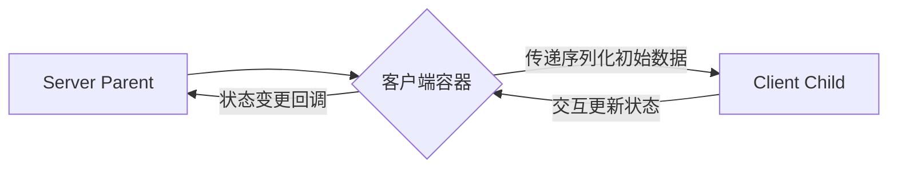
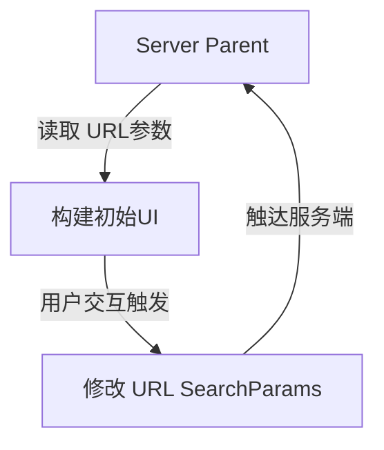
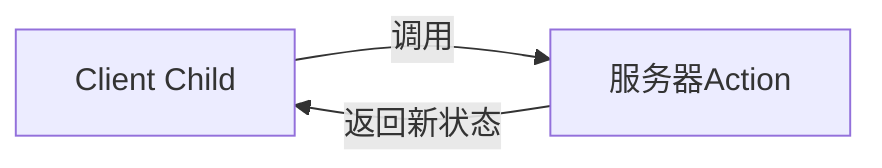
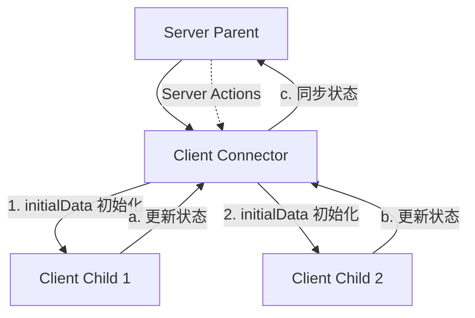
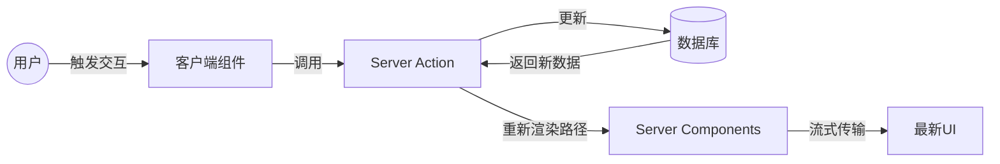

> 💭 好的，用户问的是在 React 的 Server Components 架构中，当父组件是服务端组件，子组件是客户端组件时，如何正确创建共享状态，并且需要画出架构示意图。我得仔细想想这个问题应该如何解决。
>
> 首先，我需要回忆一下 React Server Components（RSC）的基本概念。RSC 是在服务端渲染的组件，它们不会传输到客户端，因此无法使用状态或者effect这些客户端特性。而客户端组件则是传统的React组件，可以在客户端运行，拥有状态和交互能力。
>
> 现在的问题是两个组件，Parent是服务端，Child是客户端，如何共享状态。通常，React中的状态共享是通过状态提升到共同的父组件，或者使用Context、状态管理库（如Redux）。但在RSC中，由于父组件是服务端组件，不能直接使用状态或者Context，因为这些只能在客户端使用。
>
> 可能的解决方案是将共享状态放在客户端组件中。一个办法是让Parent服务端组件渲染一个客户端组件作为父容器，这个容器可以管理状态，然后传递给子组件。也就是说，Parent作为服务端组件，渲染一个包裹的ClientParent组件，这个ClientParent是客户端组件，负责持有状态，并且将状态作为prop传递给Child（客户端组件）。
>
> 需要注意的是，服务端组件不能直接传递状态，但可以将初始状态序列化后传给客户端组件。例如，服务端组件可以获取初始数据，将其作为prop传递给客户端组件，客户端组件接收后用useState初始化本地状态，或者在客户端进行状态管理。
>
> 另外，需要考虑到Server Components无法使用Context，所以共享状态必须由某个客户端组件管理，然后通过props传递给子组件。状态提升到最近的客户端共同祖先可能是一个方法。
>
> 假设用户可能的需求是具体的实现步骤，比如代码结构和数据流动方式，以及示意图的描述。他们可能关心如何保持服务端和客户端状态的同步，尤其是在服务端获取初始数据后，客户端如何继续管理状态的变化。
>
> 可能的风险点包括初始服务端渲染的状态与客户端后续状态的同步问题。例如，如果服务端传递了一个初始值，客户端组件需要在hydrate时正确接收这个初始值，以避免水合不匹配的错误。
>
> 另外需要注意，服务端组件无法互动客户端的交互，所以所有交互相关的状态必须由客户端组件来管理。状态的变化只能在客户端组件内部或通过客户端组件之间的传递来处理。
>
> 可能的架构示意图应该显示，服务端组件Parent渲染一个客户端组件ClientParent，该ClientParent管理状态，并将状态通过props或Context传递给Child客户端组件。数据流是从Server Parent到Client Parent到Child，状态的管理在Client Parent内部。
>
> 需要确认是否正确图示了这个结构，配合文本说明，可能会用Mermaid之类的工具绘制示意图。
>
> 


### 解决方案：Server-Client 状态桥接模式

---

#### 1. 核心技术实现原理
在 Server Components 架构中，**服务端组件无法直接管理动态状态**，需要用混合架构构建 **双向状态桥梁**。以下是 3 种典型解决方案：

##### 方案 1: 中间客户端容器桥接


##### 方案 2: URL 状态同步


##### 方案 3: 服务端 Actions （RSC 终极形态）


---

#### 2. 推荐方案：桥接容器详解 (配合 Next.js App Router)

##### 架构示意图


##### 对应代码实现
```tsx
// Server Parent (app/page.tsx)
export default async function Parent() {
  const initialData = await fetchDataFromDB(); // 服务端获取初始数据

  return (
    <ClientConnector initialData={initialData}>
      <Child1 />
      <Child2 />
    </ClientConnector>
  );
}

// 客户端桥接容器 (components/client-connector.tsx)
'use client';
export function ClientConnector({
  initialData,
  children
}: { 
  initialData: string;
  children: React.ReactNode;
}) {
  const [value, setValue] = useState(initialData);

  return (
    <StateContext.Provider value={{ value, setValue }}>
      {children}
      <SyncButton onSubmit={handleUpdateServerState} />
    </StateProvider>
  );

  async function handleUpdateServerState(newValue: string) {
    await fetch('/api/update', { method: 'POST', body: newValue });
  }
}
```

##### 核心优势
| 方案              | 通信延迟 | SSG 友好度 | 交互复杂度 | 状态持久化   |
|------------------|---------|-----------|-----------|-------------|
| 纯客户端方案      | 低       | ❌         | 复杂       | Session     |
| URL 状态同步      | 中       | ✅         | 中等       | URL 可追踪  |
| 服务端 Actions    | 中高     | ✅         | 简单       | 服务端控制  |

---

#### 3. 技术关键点

##### 性能优化技巧
```tsx
// 1. 使用 React.cache 缓存服务端状态
const getServerState = cache(async () => { 
  return fetchData();
});

// 2. 服务端到客户端的轻量序列化
function transformState(serverState: any) {
  return JSON.parse(JSON.stringify(serverState)); // 去除不可序列化对象
}

// 3. 分块传输 (结合 Suspense)
<Suspense fallback={<Skeleton>}>
  <AsyncChildComponent />
</Suspense>
```

##### 安全控制最佳实践
```ts
// 对 Server Action 增加鉴权层
export async function updateServerState(newValue: string) {
  'use server';
  
  const session = await getAuth();
  if (!session.user) throw new Error('Unauthorized');
  
  await db.update({ data: newValue });
}
```

---

#### 4. 扩展阅读：RSC 状态架构规范

| 状态类型       | 推荐存放位置          | 更新方式               | 典型场景          |
|---------------|---------------------|----------------------|------------------|
| **全局状态**   | URL / Cookies       | Server Redirect      | 用户偏好设置      |
| **会话状态**   | Server Session      | Server Action        | 购物车商品        |
| **UI 状态**    | 客户端缓存           | Client Interaction   | 折叠面板状态      |
| **临时状态**   | LocalStorage        | Debounced Update     | 表单草稿保存      |


