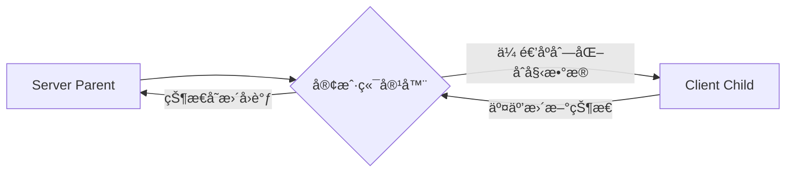
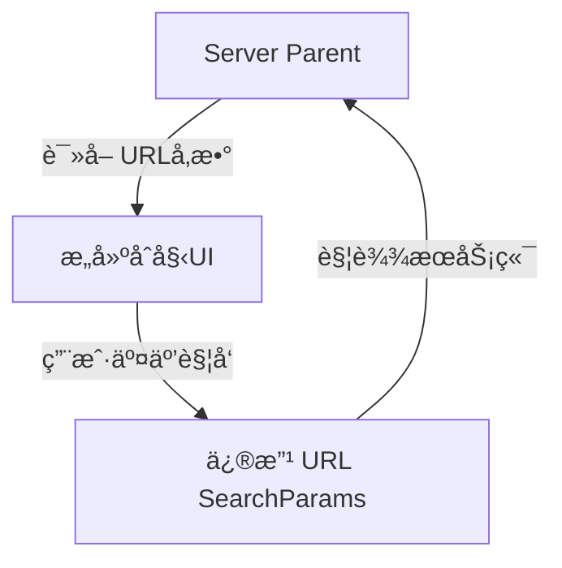
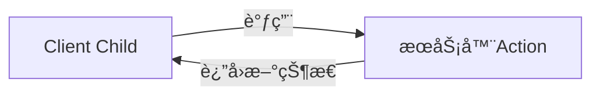
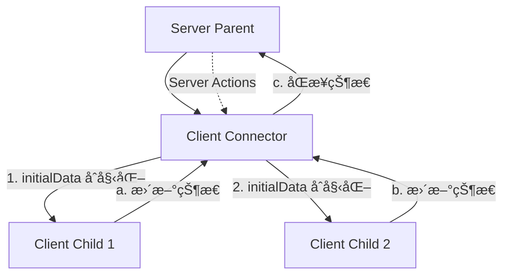
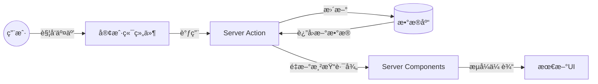

> 💭 好的，用户问的是在 React çš„ Server Components æ¶æ„中，当父组件是æœåŠ¡ç«¯ç»„件，å­ç»„件是客户端组件时，如何正确创建共享状æ€ï¼Œå¹¶ä¸”需è¦ç”»å‡ºæ¶æ„示æ„图。我得仔细想想这个问题应该如何解决。
>
> 首先，我需è¦å›å¿†ä¸€ä¸‹ React Server Components（RSC）的基本概念。RSC 是在æœåŠ¡ç«¯æ¸²æŸ“的组件，它们ä¸ä¼šä¼ è¾“到客户端，因此无法使用状æ€æˆ–者effect这些客户端特性。而客户端组件则是传统的React组件，å¯ä»¥åœ¨å®¢æˆ·ç«¯è¿è¡Œï¼Œæ‹¥æœ‰çŠ¶æ€å’Œäº¤äº’能力。
>
> ç°åœ¨çš„问题是两个组件，Parent是æœåŠ¡ç«¯ï¼ŒChild是客户端，如何共享状æ€ã€‚通常，React中的状æ€å…±äº«æ˜¯é€šè¿‡çŠ¶æ€æå‡åˆ°å…±åŒçš„父组件，或者使用Contextã€çŠ¶æ€ç®¡ç†åº“（如Redux）。但在RSC中，由äºçˆ¶ç»„件是æœåŠ¡ç«¯ç»„件，ä¸èƒ½ç›´æ¥ä½¿ç”¨çŠ¶æ€æˆ–者Context，因为这些åªèƒ½åœ¨å®¢æˆ·ç«¯ä½¿ç”¨ã€‚
>
> å¯èƒ½çš„解决方案是将共享状æ€æ”¾åœ¨å®¢æˆ·ç«¯ç»„件中。一个åŠæ³•æ˜¯è®©ParentæœåŠ¡ç«¯ç»„件渲染一个客户端组件作为父容器，这个容器å¯ä»¥ç®¡ç†çŠ¶æ€ï¼Œç„¶å传递给å­ç»„件。也就是说，Parent作为æœåŠ¡ç«¯ç»„件，渲染一个包裹的ClientParent组件，这个ClientParent是客户端组件，负责æŒæœ‰çŠ¶æ€ï¼Œå¹¶ä¸”将状æ€ä½œä¸ºprop传递给Child（客户端组件）。
>
> 需è¦æ³¨æ„的是，æœåŠ¡ç«¯ç»„件ä¸èƒ½ç›´æ¥ä¼ é€’状æ€ï¼Œä½†å¯ä»¥å°†åˆå§‹çŠ¶æ€åºåˆ—化å传给客户端组件。例如，æœåŠ¡ç«¯ç»„件å¯ä»¥è·å–åˆå§‹æ•°æ®ï¼Œå°†å…¶ä½œä¸ºprop传递给客户端组件，客户端组件æ¥æ”¶å用useStateåˆå§‹åŒ–本地状æ€ï¼Œæˆ–者在客户端进行状æ€ç®¡ç†ã€‚
>
> å¦å¤–，需è¦è€ƒè™‘到Server Components无法使用Context，所以共享状æ€å¿…须由æŸä¸ªå®¢æˆ·ç«¯ç»„件管ç†ï¼Œç„¶å通过props传递给å­ç»„件。状æ€æå‡åˆ°æœ€è¿‘的客户端共åŒç¥–å…ˆå¯èƒ½æ˜¯ä¸€ä¸ªæ–¹æ³•ã€‚
>
> å‡è®¾ç”¨æˆ·å¯èƒ½çš„需求是具体的å®ç°æ­¥éª¤ï¼Œæ¯”如代ç ç»“æ„和数æ®æµåŠ¨æ–¹å¼ï¼Œä»¥åŠç¤ºæ„图的æ述。他们å¯èƒ½å…³å¿ƒå¦‚何ä¿æŒæœåŠ¡ç«¯å’Œå®¢æˆ·ç«¯çŠ¶æ€çš„åŒæ­¥ï¼Œå°¤å…¶æ˜¯åœ¨æœåŠ¡ç«¯è·å–åˆå§‹æ•°æ®å，客户端如何继续管ç†çŠ¶æ€çš„å˜åŒ–。
>
> å¯èƒ½çš„é£é™©ç‚¹åŒ…括åˆå§‹æœåŠ¡ç«¯æ¸²æŸ“的状æ€ä¸å®¢æˆ·ç«¯å续状æ€çš„åŒæ­¥é—®é¢˜ã€‚例如，如æœæœåŠ¡ç«¯ä¼ é€’了一个åˆå§‹å€¼ï¼Œå®¢æˆ·ç«¯ç»„件需è¦åœ¨hydrate时正确æ¥æ”¶è¿™ä¸ªåˆå§‹å€¼ï¼Œä»¥é¿å…æ°´åˆä¸åŒ¹é…的错误。
>
> å¦å¤–需è¦æ³¨æ„，æœåŠ¡ç«¯ç»„件无法互动客户端的交互，所以所有交互相关的状æ€å¿…须由客户端组件æ¥ç®¡ç†ã€‚状æ€çš„å˜åŒ–åªèƒ½åœ¨å®¢æˆ·ç«¯ç»„件内部或通过客户端组件之间的传递æ¥å¤„ç†ã€‚
>
> å¯èƒ½çš„æ¶æ„示æ„图应该显示，æœåŠ¡ç«¯ç»„件Parent渲染一个客户端组件ClientParent，该ClientParent管ç†çŠ¶æ€ï¼Œå¹¶å°†çŠ¶æ€é€šè¿‡props或Context传递给Child客户端组件。数æ®æµæ˜¯ä»Server Parent到Client Parent到Child，状æ€çš„管ç†åœ¨Client Parent内部。
>
> 需è¦ç¡®è®¤æ˜¯å¦æ­£ç¡®å›¾ç¤ºäº†è¿™ä¸ªç»“æ„，é…åˆæ–‡æœ¬è¯´æ˜ï¼Œå¯èƒ½ä¼šç”¨Mermaid之类的工具绘制示æ„图。
>
> 


### 解决方案：Server-Client 状æ€æ¡¥æ¥æ¨¡å¼

---

#### 1. 核心技术å®ç°åŸç†
在 Server Components æ¶æ„中，**æœåŠ¡ç«¯ç»„件无法直æ¥ç®¡ç†åŠ¨æ€çŠ¶æ€**，需è¦ç”¨æ··åˆæ¶æ„æ„建 **åŒå‘状æ€æ¡¥æ¢**。以下是 3 ç§å…¸å‹è§£å†³æ–¹æ¡ˆï¼š

##### 方案 1: 中间客户端容器桥æ¥


##### 方案 2: URL 状æ€åŒæ­¥


##### 方案 3: æœåŠ¡ç«¯ Actions （RSC 终æå½¢æ€ï¼‰


---

#### 2. æ¨è方案：桥æ¥å®¹å™¨è¯¦è§£ (é…åˆ Next.js App Router)

##### æ¶æ„示æ„图


##### 对应代ç å®ç°
```tsx
// Server Parent (app/page.tsx)
export default async function Parent() {
  const initialData = await fetchDataFromDB(); // æœåŠ¡ç«¯è·å–åˆå§‹æ•°æ®

  return (
    <ClientConnector initialData={initialData}>
      <Child1 />
      <Child2 />
    </ClientConnector>
  );
}

// 客户端桥æ¥å®¹å™¨ (components/client-connector.tsx)
'use client';
export function ClientConnector({
  initialData,
  children
}: { 
  initialData: string;
  children: React.ReactNode;
}) {
  const [value, setValue] = useState(initialData);

  return (
    <StateContext.Provider value={{ value, setValue }}>
      {children}
      <SyncButton onSubmit={handleUpdateServerState} />
    </StateProvider>
  );

  async function handleUpdateServerState(newValue: string) {
    await fetch('/api/update', { method: 'POST', body: newValue });
  }
}
```

##### 核心优势
| 方案              | 通信延迟 | SSG å‹å¥½åº¦ | 交互å¤æ‚度 | 状æ€æŒä¹…化   |
|------------------|---------|-----------|-----------|-------------|
| 纯客户端方案      | ä½       | ⌠        | å¤æ‚       | Session     |
| URL 状æ€åŒæ­¥      | 中       | ✅         | 中等       | URL å¯è¿½è¸ª  |
| æœåŠ¡ç«¯ Actions    | 中高     | ✅         | ç®€å•       | æœåŠ¡ç«¯æ§åˆ¶  |

---

#### 3. 技术关键点

##### 性能优化技巧
```tsx
// 1. 使用 React.cache 缓存æœåŠ¡ç«¯çŠ¶æ€
const getServerState = cache(async () => { 
  return fetchData();
});

// 2. æœåŠ¡ç«¯åˆ°å®¢æˆ·ç«¯çš„è½»é‡åºåˆ—化
function transformState(serverState: any) {
  return JSON.parse(JSON.stringify(serverState)); // å»é™¤ä¸å¯åºåˆ—化对象
}

// 3. 分å—传输 (ç»“åˆ Suspense)
<Suspense fallback={<Skeleton>}>
  <AsyncChildComponent />
</Suspense>
```

##### 安全æ§åˆ¶æœ€ä½³å®è·µ
```ts
// 对 Server Action å¢åŠ é‰´æƒå±‚
export async function updateServerState(newValue: string) {
  'use server';
  
  const session = await getAuth();
  if (!session.user) throw new Error('Unauthorized');
  
  await db.update({ data: newValue });
}
```

---

#### 4. 扩展阅读：RSC 状æ€æ¶æ„规范

| 状æ€ç±»å‹       | æ¨è存放ä½ç½®          | æ›´æ–°æ–¹å¼               | å…¸å‹åœºæ™¯          |
|---------------|---------------------|----------------------|------------------|
| **全局状æ€**   | URL / Cookies       | Server Redirect      | 用户å好设置      |
| **会è¯çŠ¶æ€**   | Server Session      | Server Action        | è´­ç‰©è½¦å•†å“        |
| **UI 状æ€**    | 客户端缓存           | Client Interaction   | 折å é¢æ¿çŠ¶æ€      |
| **临时状æ€**   | LocalStorage        | Debounced Update     | 表å•è‰ç¨¿ä¿å­˜      |


