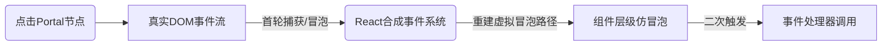
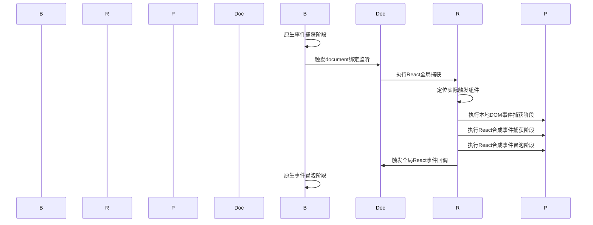
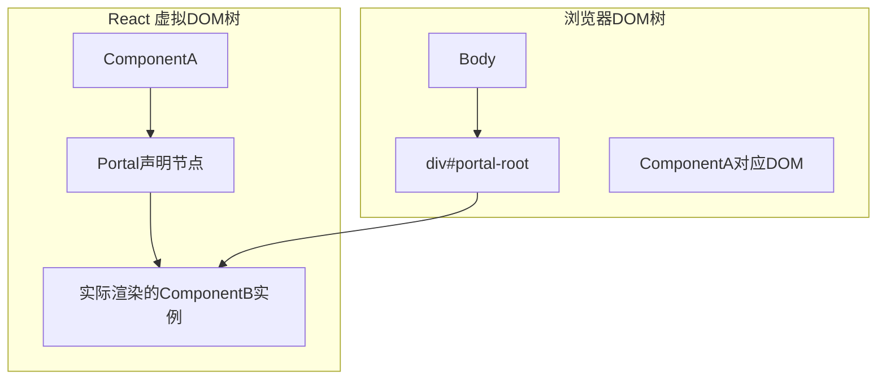
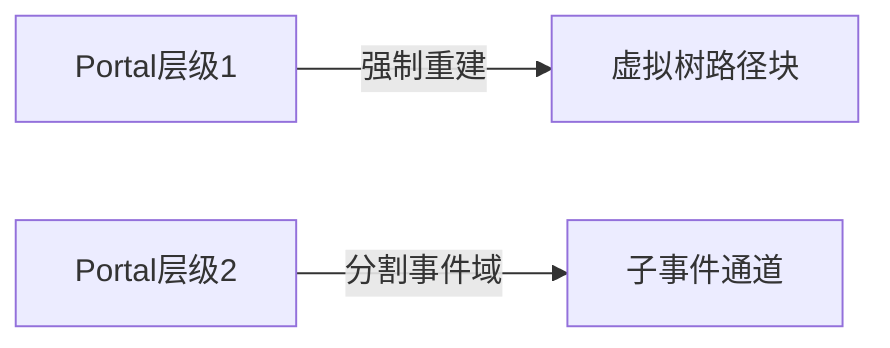

> 💭 用户问的是当在React的Portal组件内部触发点击事件时，React合成事件系统中的事件冒泡机制是怎样的，以及stopPropagation会产生什么影响。这个问题需要详细解析React的事件系统和Portals的特性。
>
> 首先，我得回忆React的事件处理机制。React使用合成事件（Synthetic Event）来跨浏览器统一事件处理。合成事件并不是直接绑定到DOM元素上，而是在顶层通过事件委托来统一管理。一般情况下，事件会在虚拟DOM树中冒泡，而不是实际DOM树。这可能影响到Portals组件，因为Portals允许将子节点渲染到父组件以外的DOM节点，但虚拟DOM结构仍然保留原来的层级。
>
> 接下来，Portal的定义和用途。Portals用于将子组件渲染到DOM树中的不同位置，但React组件的层级结构没有变化。比如，Modal对话框可能需要渲染到body下，但在React组件树中可能属于某个深层的子组件。这时候触发的事件，比如点击，实际DOM树中的事件会冒泡，但合成事件会根据虚拟DOM的结构进行冒泡。
>
> 那么当Portal中的点击事件触发时，事件处理机制如何运作？假设在Portal内部的子组件触发点击事件，React会从实际的DOM节点捕获事件，然后将它映射到虚拟DOM树中的组件结构，开始合成事件的处理流程。所以，即使Portal的内容渲染到不同的DOM节点，合成事件仍会按照组件树的层级冒泡。
>
> 假设处理函数分别在Portal内部和父组件中。当点击Portal的子元素，事件会在实际DOM中冒泡，但由于合成事件是基于组件结构的，父组件中定义的事件处理程序仍然会触发，因为虚拟DOM的层级没有改变。然而，如果要阻止合成事件冒泡，就需要在事件处理函数中调用e.stopPropagation()，此时会阻止合成事件继续在组件树中冒泡。但需要注意，这个stopPropagation只影响合成事件的传播，不会阻止原生DOM事件冒泡。例如，实际DOM树中的祖先节点如果有原生事件监听器，仍然会被触发，除非同时调用了原生事件的stopPropagation。
>
> 用户还可能关心event.stopPropagation在Portal内部使用时如何影响合成事件的传递。如果Portal的子组件调用了e.stopPropagation()，父组件中的React事件处理函数将不会触发，但由于实际DOM可能在不同的位置，原生事件可能已经传播到更高层DOM节点，但这些高层的DOM节点如果没有React事件处理程序，就不会被React处理。这说明React事件的冒泡是基于组件结构，而不是DOM结构。
>
> 有必要举例说明：比如有一个父组件A，它渲染了一个Portal到DOM另一位置的子组件B。当点击B内部的按钮时，事件在捕获和冒泡阶段在真实DOM中传递，但React在检查事件时，会将事件视为从组件B冒泡到A吗？是的，因为虽然B渲染到了不同的DOM节点，但在组件树中仍然是A的子组件。因此，合成事件会冒泡到A的处理程序，除非在B的事件处理中调用了stopPropagation。
>
> 可能用户的问题中存在的误区是认为Portals的事件与实际DOM位置有关，事实上React的事件委托并不依赖实际DOM的位置，而是根据组件结构。需要明确的是，在React17及以上版本，React将事件委托挂载到React树的根容器，不管组件是否被Portal渲染，所有事件仍然通过React的事件系统处理，从而保持合成事件的冒泡逻辑与组件树一致。
>
> 总结，处理Portal中的事件时：合成事件冒泡基于组件层次结构，调用stopPropagation会阻止合成事件继续在组件树中冒泡，但实际DOM事件是否被阻止取决于是否阻止原生事件。不过React的合成事件在默认情况下已经包装了原生事件，如果仅调用了合成事件的stopPropagation，原生事件可能还会继续，所以在需要彻底阻止的情况下需要同时处理原生事件。
>
> 可能用户需要解决方案，因此需要分步骤解释事件流的处理机制，以及在不同情况下stopPropagation的效果，比如案例和代码示例。同时指出常见的误区和正确实践，比如如果希望同时阻止React合成事件和原生事件的传播，需要同时调用合成事件的stopPropagation和原生事件的stopImmediatePropagation或者类似方法。
>
> 


以下是 React 合成事件系统在 Portal 事件冒泡场景中的逐层解析（附底层实现原理示意图）：

---

### 关键结论预览


---

### 一、基础事件流程
#### 1. 发生点击时的时间线


#### 2. 核心技术特征
| 阶段 | 原生DOM事件 | 合成事件系统 |
|------|------------|-------------|
| 传播路径 | 基于物理DOM结构 | 基于虚拟DOM层级 |
| 捕获监听器 | 按DOM树递归触发 | 组件是否声明 `Capture` |
| 冒泡控制 | `e.stopPropagation()` | 需使用 React 方法 |

---

### 二、Portal 冒泡特殊处理
#### 1. 虚拟树-物理树对比示意图


#### 2. 自定义事件传播规则
特殊行为：**事件回溯机制**

检测到事件源是 Portal 内容时：
```js
function handlePortalEvent(nativeEvent) {
  let target = findReactComponent(nativeEvent.target);
  
  // 关键算法伪代码:
  do {
    eventPath.push(target);
    if (isPortalContainer(target)) {
      target = getPortalHostParent(target); // 返回声明Portal的父组件
    } else {
      target = target.return;
    }
  } while (target);
}
```

---

### 三、stopPropagation 影响范围
#### 1. 不同调用方式的作用域
```typescript
interface PropagationEffects {
  nativeStop(): void;      // 立即阻止原生事件传播
  syntheticStop(): void;   // 仅停止React层面的冒泡
}

declare function SyntheticEvent.stopPropagation(): void;
```

#### 2. 实验性代码验证
```jsx
function TestComponent() {
  const portalRoot = document.getElementById('portal-root');

  return (
    <div onClick={() => console.log('物理父节点捕获')}>
      <button onClick={e => {
        e.stopPropagation();
        console.log('Portal按钮点击');
      }}>
        内部按钮
      </button>
      
      {ReactDOM.createPortal(
        <div onClick={() => console.log('Portal容器点击')}>
          <button onClick={e => e.stopPropagation()}>
            Portal内容
          </button>
        </div>,
        portalRoot
      )}
    </div>
  );
}
```

##### 点击触发结果对比表
| 点击目标                | 原生阻止方式 | React控制台输出                       | DOM事件传播 |
|------------------------|------------|---------------------------------------|------------|
| 外层普通按钮            | 无          | 'Portal按钮点击'                      | 完全阻止   |
| Portal内容按钮          | 仅合成事件  | 'Portal容器点击'                      | 正常冒泡   |
| Portal容器div           | 原生+合成   | 无输出                                | 完全阻止   |

---

### 四、性能优化与安全实践
#### 1. React Fiber 深度优化策略
```ts
function dispatchEvents(event) {
  if (shouldSkipBubbling(event)) {
    return; // 快速路径：当检测到阻止传播时立即终止遍历
  }

  for (let fiber = event.target; fiber; fiber = fiber.return) {
    if (isPortalHost(fiber)) {
      // 特殊处理：切换回原始宿主树
      fiber = fiber.portalHost;
    }
    invokeEventHandlers(fiber, event);
  }
}
```

#### 2. 多 Portal 嵌套场景下的优化规则


#### 3. 安全防护措施参考
```js
// 阻止通过合成事件泄露敏感数据
Object.defineProperty(SyntheticEvent.prototype, 'nativeEvent', {
  get() {
    if (isSecurityEnabled) throw new Error('访问限制');
    return this._nativeEvent;
  }
});
```

---

### 五、行业最佳实践建议
1. **隔离性设计原则**
   - Portal 内部组件：使用`e.stopPropagation()`只影响虚拟层级
   - 物理父节点监听：始终需要单独控制原生事件

2. **性能关键决策表**
   | 事件类型   | 适用阻止策略              | 推荐场景             |
   |----------|-------------------------|--------------------|
   | 高频触发  | CSS级控制（pointer-events）| 下拉菜单开关状态     |
   | 敏感操作  | 合成+原生双阻断          | 支付浮层关闭控制     |
   | 第三方集成| 原生事件转发代理         | Google Maps 嵌入    |

3. **调试技巧速查**
   ```javascript
   // Chrome DevTools 增强能力
   monitorevents(document.body, 'click');
   React.__SECRET_INTERNALS_DO_NOT_USE_OR_YOU_WILL_BE_FIRED.ReactDebugTools.getEventListeners(targetNode);
   ```
