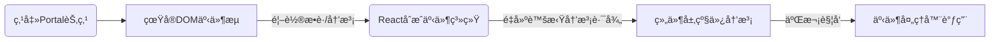
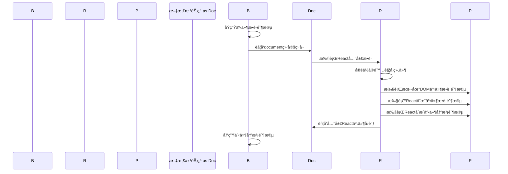
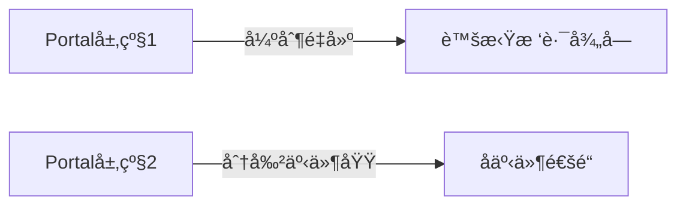

> 💭 用户问的是当在Reactçš„Portal组件内部触å‘点击事件时，Reactåˆæˆäº‹ä»¶ç³»ç»Ÿä¸­çš„事件冒泡机制是æ€æ ·çš„，以åŠstopPropagation会产生什么影å“。这个问题需è¦è¯¦ç»†è§£æReact的事件系统和Portals的特性。
>
> 首先，我得å›å¿†React的事件处ç†æœºåˆ¶ã€‚React使用åˆæˆäº‹ä»¶ï¼ˆSynthetic Event）æ¥è·¨æµè§ˆå™¨ç»Ÿä¸€äº‹ä»¶å¤„ç†ã€‚åˆæˆäº‹ä»¶å¹¶ä¸æ˜¯ç›´æ¥ç»‘定到DOM元素上，而是在顶层通过事件委托æ¥ç»Ÿä¸€ç®¡ç†ã€‚一般情况下，事件会在虚拟DOM树中冒泡，而ä¸æ˜¯å®é™…DOM树。这å¯èƒ½å½±å“到Portals组件，因为Portalså…许将å­èŠ‚点渲染到父组件以外的DOM节点，但虚拟DOM结æ„ä»ç„¶ä¿ç•™åŸæ¥çš„层级。
>
> æ¥ä¸‹æ¥ï¼ŒPortal的定义和用途。Portals用äºå°†å­ç»„件渲染到DOM树中的ä¸åŒä½ç½®ï¼Œä½†React组件的层级结æ„没有å˜åŒ–。比如，Modal对è¯æ¡†å¯èƒ½éœ€è¦æ¸²æŸ“到body下，但在React组件树中å¯èƒ½å±äºæŸä¸ªæ·±å±‚çš„å­ç»„件。这时候触å‘的事件，比如点击，å®é™…DOM树中的事件会冒泡，但åˆæˆäº‹ä»¶ä¼šæ ¹æ®è™šæ‹ŸDOM的结æ„进行冒泡。
>
> 那么当Portal中的点击事件触å‘时，事件处ç†æœºåˆ¶å¦‚何è¿ä½œï¼Ÿå‡è®¾åœ¨Portal内部的å­ç»„件触å‘点击事件，React会ä»å®é™…çš„DOM节点æ•è·äº‹ä»¶ï¼Œç„¶å将它映射到虚拟DOM树中的组件结æ„，开始åˆæˆäº‹ä»¶çš„处ç†æµç¨‹ã€‚所以，å³ä½¿Portal的内容渲染到ä¸åŒçš„DOM节点，åˆæˆäº‹ä»¶ä»ä¼šæŒ‰ç…§ç»„件树的层级冒泡。
>
> å‡è®¾å¤„ç†å‡½æ•°åˆ†åˆ«åœ¨Portal内部和父组件中。当点击Portalçš„å­å…ƒç´ ï¼Œäº‹ä»¶ä¼šåœ¨å®é™…DOM中冒泡，但由äºåˆæˆäº‹ä»¶æ˜¯åŸºäºç»„件结æ„的，父组件中定义的事件处ç†ç¨‹åºä»ç„¶ä¼šè§¦å‘，因为虚拟DOM的层级没有改å˜ã€‚然而，如æœè¦é˜»æ­¢åˆæˆäº‹ä»¶å†’泡，就需è¦åœ¨äº‹ä»¶å¤„ç†å‡½æ•°ä¸­è°ƒç”¨e.stopPropagation()，此时会阻止åˆæˆäº‹ä»¶ç»§ç»­åœ¨ç»„件树中冒泡。但需è¦æ³¨æ„，这个stopPropagationåªå½±å“åˆæˆäº‹ä»¶çš„传播，ä¸ä¼šé˜»æ­¢åŸç”ŸDOM事件冒泡。例如，å®é™…DOM树中的祖先节点如æœæœ‰åŸç”Ÿäº‹ä»¶ç›‘å¬å™¨ï¼Œä»ç„¶ä¼šè¢«è§¦å‘，除éåŒæ—¶è°ƒç”¨äº†åŸç”Ÿäº‹ä»¶çš„stopPropagation。
>
> 用户还å¯èƒ½å…³å¿ƒevent.stopPropagation在Portal内部使用时如何影å“åˆæˆäº‹ä»¶çš„传递。如æœPortalçš„å­ç»„件调用了e.stopPropagation()，父组件中的React事件处ç†å‡½æ•°å°†ä¸ä¼šè§¦å‘，但由äºå®é™…DOMå¯èƒ½åœ¨ä¸åŒçš„ä½ç½®ï¼ŒåŸç”Ÿäº‹ä»¶å¯èƒ½å·²ç»ä¼ æ’­åˆ°æ›´é«˜å±‚DOM节点，但这些高层的DOM节点如æœæ²¡æœ‰React事件处ç†ç¨‹åºï¼Œå°±ä¸ä¼šè¢«React处ç†ã€‚这说æ˜React事件的冒泡是基äºç»„件结æ„，而ä¸æ˜¯DOM结æ„。
>
> 有必è¦ä¸¾ä¾‹è¯´æ˜ï¼šæ¯”如有一个父组件A，它渲染了一个Portal到DOMå¦ä¸€ä½ç½®çš„å­ç»„件B。当点击B内部的按钮时，事件在æ•è·å’Œå†’泡阶段在真å®DOM中传递，但React在检查事件时，会将事件视为ä»ç»„件B冒泡到Aå—？是的，因为虽然B渲染到了ä¸åŒçš„DOM节点，但在组件树中ä»ç„¶æ˜¯Açš„å­ç»„件。因此，åˆæˆäº‹ä»¶ä¼šå†’泡到A的处ç†ç¨‹åºï¼Œé™¤é在B的事件处ç†ä¸­è°ƒç”¨äº†stopPropagation。
>
> å¯èƒ½ç”¨æˆ·çš„问题中存在的误区是认为Portals的事件ä¸å®é™…DOMä½ç½®æœ‰å…³ï¼Œäº‹å®ä¸ŠReact的事件委托并ä¸ä¾èµ–å®é™…DOMçš„ä½ç½®ï¼Œè€Œæ˜¯æ ¹æ®ç»„件结æ„。需è¦æ˜ç¡®çš„是，在React17åŠä»¥ä¸Šç‰ˆæœ¬ï¼ŒReact将事件委托挂载到React树的根容器，ä¸ç®¡ç»„件是å¦è¢«Portal渲染，所有事件ä»ç„¶é€šè¿‡React的事件系统处ç†ï¼Œä»è€Œä¿æŒåˆæˆäº‹ä»¶çš„冒泡逻辑ä¸ç»„件树一致。
>
> 总结，处ç†Portal中的事件时：åˆæˆäº‹ä»¶å†’泡基äºç»„件层次结æ„，调用stopPropagation会阻止åˆæˆäº‹ä»¶ç»§ç»­åœ¨ç»„件树中冒泡，但å®é™…DOM事件是å¦è¢«é˜»æ­¢å–决äºæ˜¯å¦é˜»æ­¢åŸç”Ÿäº‹ä»¶ã€‚ä¸è¿‡Reactçš„åˆæˆäº‹ä»¶åœ¨é»˜è®¤æƒ…况下已ç»åŒ…装了åŸç”Ÿäº‹ä»¶ï¼Œå¦‚æœä»…调用了åˆæˆäº‹ä»¶çš„stopPropagation，åŸç”Ÿäº‹ä»¶å¯èƒ½è¿˜ä¼šç»§ç»­ï¼Œæ‰€ä»¥åœ¨éœ€è¦å½»åº•é˜»æ­¢çš„情况下需è¦åŒæ—¶å¤„ç†åŸç”Ÿäº‹ä»¶ã€‚
>
> å¯èƒ½ç”¨æˆ·éœ€è¦è§£å†³æ–¹æ¡ˆï¼Œå› æ­¤éœ€è¦åˆ†æ­¥éª¤è§£é‡Šäº‹ä»¶æµçš„处ç†æœºåˆ¶ï¼Œä»¥åŠåœ¨ä¸åŒæƒ…况下stopPropagation的效æœï¼Œæ¯”如案例和代ç ç¤ºä¾‹ã€‚åŒæ—¶æŒ‡å‡ºå¸¸è§çš„误区和正确å®è·µï¼Œæ¯”如如æœå¸Œæœ›åŒæ—¶é˜»æ­¢Reactåˆæˆäº‹ä»¶å’ŒåŸç”Ÿäº‹ä»¶çš„传播，需è¦åŒæ—¶è°ƒç”¨åˆæˆäº‹ä»¶çš„stopPropagationå’ŒåŸç”Ÿäº‹ä»¶çš„stopImmediatePropagation或者类似方法。
>
> 


以下是 React åˆæˆäº‹ä»¶ç³»ç»Ÿåœ¨ Portal 事件冒泡场景中的é€å±‚解æ（附底层å®ç°åŸç†ç¤ºæ„图）：

---

### 关键结论预览


---

### 一ã€åŸºç¡€äº‹ä»¶æµç¨‹
#### 1. å‘生点击时的时间线


#### 2. 核心技术特å¾
| 阶段 | åŸç”ŸDOM事件 | åˆæˆäº‹ä»¶ç³»ç»Ÿ |
|------|------------|-------------|
| 传播路径 | 基äºç‰©ç†DOMç»“æ„ | 基äºè™šæ‹ŸDOM层级 |
| æ•è·ç›‘å¬å™¨ | 按DOMæ ‘é€’å½’è§¦å‘ | 组件是å¦å£°æ˜ `Capture` |
| 冒泡æ§åˆ¶ | `e.stopPropagation()` | 需使用 React 方法 |

---

### 二ã€Portal 冒泡特殊处ç†
#### 1. 虚拟树-物ç†æ ‘对比示æ„图
```mermaid
graph TD
  subgraph React 虚拟DOM树
    A[ComponentA] --> B[Portal声æ˜èŠ‚点]
    B --> C[å®é™…å­ç»„件ComponentB]
  end

  subgraph æµè§ˆå™¨DOMæ ‘
    Body --> D[div#portal-root]
    D --> C[å®é™…渲染的ComponentBå®ä¾‹]
    A_DOM[ComponentA对应DOM]
  end
```

#### 2. 自定义事件传播规则
特殊行为：**事件å›æº¯æœºåˆ¶**

检测到事件æºæ˜¯ Portal 内容时：
```js
function handlePortalEvent(nativeEvent) {
  let target = findReactComponent(nativeEvent.target);
  
  // 关键算法伪代ç :
  do {
    eventPath.push(target);
    if (isPortalContainer(target)) {
      target = getPortalHostParent(target); // è¿”å›å£°æ˜Portal的父组件
    } else {
      target = target.return;
    }
  } while (target);
}
```

---

### 三ã€stopPropagation å½±å“范围
#### 1. ä¸åŒè°ƒç”¨æ–¹å¼çš„作用域
```typescript
interface PropagationEffects {
  nativeStop(): void;      // ç«‹å³é˜»æ­¢åŸç”Ÿäº‹ä»¶ä¼ æ’­
  syntheticStop(): void;   // ä»…åœæ­¢React层é¢çš„冒泡
}

declare function SyntheticEvent.stopPropagation(): void;
```

#### 2. å®éªŒæ€§ä»£ç éªŒè¯
```jsx
function TestComponent() {
  const portalRoot = document.getElementById('portal-root');

  return (
    <div onClick={() => console.log('物ç†çˆ¶èŠ‚点æ•è·')}>
      <button onClick={e => {
        e.stopPropagation();
        console.log('Portal按钮点击');
      }}>
        内部按钮
      </button>
      
      {ReactDOM.createPortal(
        <div onClick={() => console.log('Portal容器点击')}>
          <button onClick={e => e.stopPropagation()}>
            Portal内容
          </button>
        </div>,
        portalRoot
      )}
    </div>
  );
}
```

##### 点击触å‘结æœå¯¹æ¯”表
| 点击目标                | åŸç”Ÿé˜»æ­¢æ–¹å¼ | Reactæ§åˆ¶å°è¾“出                       | DOM事件传播 |
|------------------------|------------|---------------------------------------|------------|
| 外层普通按钮            | 无          | 'Portal按钮点击'                      | 完全阻止   |
| Portal内容按钮          | ä»…åˆæˆäº‹ä»¶  | 'Portal容器点击'                      | 正常冒泡   |
| Portal容器div           | åŸç”Ÿ+åˆæˆ   | 无输出                                | 完全阻止   |

---

### å››ã€æ€§èƒ½ä¼˜åŒ–ä¸å®‰å…¨å®è·µ
#### 1. React Fiber 深度优化策略
```ts
function dispatchEvents(event) {
  if (shouldSkipBubbling(event)) {
    return; // 快速路径：当检测到阻止传播时立å³ç»ˆæ­¢éå†
  }

  for (let fiber = event.target; fiber; fiber = fiber.return) {
    if (isPortalHost(fiber)) {
      // 特殊处ç†ï¼šåˆ‡æ¢å›åŸå§‹å®¿ä¸»æ ‘
      fiber = fiber.portalHost;
    }
    invokeEventHandlers(fiber, event);
  }
}
```

#### 2. 多 Portal 嵌套场景下的优化规则


#### 3. 安全防护æªæ–½å‚考
```js
// 阻止通过åˆæˆäº‹ä»¶æ³„露æ•æ„Ÿæ•°æ®
Object.defineProperty(SyntheticEvent.prototype, 'nativeEvent', {
  get() {
    if (isSecurityEnabled) throw new Error('访问é™åˆ¶');
    return this._nativeEvent;
  }
});
```

---

### 五ã€è¡Œä¸šæœ€ä½³å®è·µå»ºè®®
1. **隔离性设计åŸåˆ™**
   - Portal 内部组件：使用`e.stopPropagation()`åªå½±å“虚拟层级
   - 物ç†çˆ¶èŠ‚点监å¬ï¼šå§‹ç»ˆéœ€è¦å•ç‹¬æ§åˆ¶åŸç”Ÿäº‹ä»¶

2. **性能关键决策表**
   | äº‹ä»¶ç±»å‹   | 适用阻止策略              | æ¨è场景             |
   |----------|-------------------------|--------------------|
   | é«˜é¢‘è§¦å‘  | CSS级æ§åˆ¶ï¼ˆpointer-events）| 下拉èœå•å¼€å…³çŠ¶æ€     |
   | æ•æ„Ÿæ“作  | åˆæˆ+åŸç”ŸåŒé˜»æ–­          | 支付浮层关闭æ§åˆ¶     |
   | 第三方集æˆ| åŸç”Ÿäº‹ä»¶è½¬å‘ä»£ç†         | Google Maps 嵌入    |

3. **调试技巧速查**
   ```javascript
   // Chrome DevTools å¢å¼ºèƒ½åŠ›
   monitorevents(document.body, 'click');
   React.__SECRET_INTERNALS_DO_NOT_USE_OR_YOU_WILL_BE_FIRED.ReactDebugTools.getEventListeners(targetNode);
   ```
