> 💭 好的，我现在在帮助一个用户解决如何将现有的React代码库逐步迁移到TypeScript的问题。用户可能已经有一个比较大的React项目，现在想引入TypeScript的类型系统，但需要知道具体的步骤和必须使用的高级特性。
>
> 首先，用户可能是团队的技术负责人或者核心开发者，他们可能已经意识到JavaScript在大型项目中的维护成本较高，希望通过TypeScript提高代码的可维护性和减少错误。迁移过程需要尽量平滑，不影响现有功能的开发，所以需要逐步进行，而不是一次性重写所有代码。他们也可能会担心迁移过程中的一些挑战，比如类型定义、第三方库的支持、构建工具的配置等。
>
> 接下来，我需要回忆TypeScript在React项目中的最佳实践，特别是迁移步骤。一般来说，迁移应该从配置TypeScript环境开始，包括安装必要的依赖（typescript、@types/react等），调整构建工具（比如Webpack或Babel）来支持TS/TSX文件，然后逐步将文件从.js/.jsx重命名为.ts/.tsx，同时添加类型注解。同时，用户可能需要先处理一些通用的工具函数或者组件，逐渐覆盖整个项目。
>
> 关于必须使用的高级特性，可能需要考虑TypeScript的高级类型，如泛型、联合类型、类型守卫、映射类型、条件类型等。此外，React相关的类型如组件类型（FC、ReactElement）、Hooks的类型定义（useState、useEffect等）、高阶组件和Context的类型处理都是关键。还有如何处理第三方库的类型定义，如果没有现成的@types包，可能需要自己声明模块或者使用any暂时绕过。
>
> 可能的痛点包括现有代码中大量使用PropTypes，需要将其转换为TypeScript接口；如何处理Redux或Context API中的复杂状态类型；如何处理动态属性或可选属性。用户可能还关心如何逐步迁移，比如是否可以混合使用JS和TS文件，如何配置TypeScript的严格模式，以及如何处理测试代码（如Jest）的类型支持。
>
> 另外，用户可能想知道迁移过程中的工具支持，比如ESLint与TypeScript的集成，Prettier的配置，以及编辑器（如VSCode）的自动补全和错误提示能否顺畅工作。还有一些高级技巧，比如使用类型断言（type assertions）、声明合并（declaration merging）来扩展第三方类型，或者使用工具类型（Utility Types）如Partial、Pick、Omit等来简化类型定义。
>
> 需要分步骤解释迁移流程，确保每个步骤都容易执行，同时最小化对现有开发的影响。例如，优先将配置文件转为TypeScript，接着是工具函数，然后是组件，最后是Redux相关的代码。在每个阶段，逐步开启TypeScript的严格检查选项，从宽松到严格，逐步修复类型错误。同时，建议使用ts-check注释在JavaScript文件中逐步引入类型检查，而无需立即重命名文件。
>
> 可能还需要提到如何处理测试文件的迁移，比如使用ts-jest来支持TypeScript的测试代码。以及在团队中推广TypeScript的最佳实践，比如代码审查时关注类型定义，编写.d.ts文件来补充缺少的类型声明，或者使用TypeScript的工程引用（Project References）来分割大型项目。
>
> 此外，还需要讨论常见的陷阱，比如any的滥用可能导致类型安全性的丧失，如何避免过度使用类型断言，以及如何处理遗留代码中的动态类型问题（如使用索引签名或unknown类型）。同时推荐使用工具如类型生成工具（例如为Redux生成类型）或者自动转换工具来辅助迁移。
>
> 最后，总结关键步骤和必须掌握的高级特性，确保用户有一个清晰的迁移路线图，以及如何在迁移过程中逐步提高类型覆盖率，最终达到全面的类型安全。
>
> 


以下是 React 代码库渐进式 TypeScript 迁移的技术路线图，包含阶段分解和核心 TS 功能应用策略：

---

### 一、战略阶段划分（逆向四阶段模型）

```mermaid
gantt
    title TypeScript 迁移甘特图
    dateFormat  YYYY-MM-DD
    section 基础层
    构建系统配置          :done,    des1, 2023-08-01, 14d
    类型守卫基础模块       :active,  des2, 2023-08-15, 21d
    
    section 组件层
    原子组件强类型化      :         des3, 2023-09-05, 30d
    Hooks 类型系统重构    :         des4, after des3, 25d
    
    section 状态层
    Redux Toolkit 适配   :         des5, after des4, 20d
    异步流类型抽象        :         des6, after des5, 18d
    
    section 生态层
    第三方库类型补全      :         des7, after des6, 30d
    严格模式全面启用      :         des8, after des7, 14d
```



---

### 二、核心迁移步骤（带代价评估）

#### 步骤 1：基础环境贯通
```bash
# 最小化改造命令集
yarn add -D typescript @types/node @types/react @types/react-dom
npx tsc --init  # 生成预设配置
```

关键文件改造：
```diff
// tsconfig.json
{
  "compilerOptions": {
+   "allowJs": true,
+   "checkJs": true,
    "jsx": "preserve",
+   "strict": false,
+   "paths": {
+     "@/*": ["./src/*"]
+   }
  },
+ "include": ["src/**/*.ts", "src/**/*.tsx"],
+ "exclude": ["node_modules"]
}
```

成本矩阵：
| 改造项         | 人工投入 | 风险等级 | 收益系数 |
|----------------|----------|----------|----------|
| 混合编译启用    | 0.5人日  | 低       | ★★★★     |
| 路径别名配置    | 0.3人日  | 中       | ★★★      |

---

#### 步骤 2：类型渗透策略
```typescript
// 示例：渐进增强型类型声明
declare module '*.js' {
  import { ComponentType } from 'react';
  const Component: ComponentType<Partial<{ className: string }>>;
  export default Component;
}

// 使用 JSDoc 逐步强化类型
/**
 * @template T
 * @param {T[]} list 
 * @returns {T extends { id: string } ? T : never}
 */
function findWithId(list) {
  return list.find(item => 'id' in item);
}
```

效能优化指标：

```mermaid
pie
    title 类型覆盖率提升计划
    "阶段1（核心工具类）" : 45
    "阶段2（业务实体层）" : 30
    "阶段3（视图组件层）" : 20
    "残留动态类型" : 5
```


---

### 三、必须掌握的 TS 高阶特性（React 场景特化）

#### 1. 组件 Props 智能化
```typescript
type ResponsiveProp<T> = T | T[] | { [breakpoint: string]: T };

interface GridProps {
  columns: ResponsiveProp<number>;
  spacing: ResponsiveProp<number | string>;
}

const Grid: FC<GridProps> = ({ columns = 12 }) => (
  // 布局实现
);
```

#### 2. Redux 状态机类型闭环
```typescript
type ActionMap<M extends { [index: string]: any }> = {
  [Key in keyof M]: M[Key] extends undefined
    ? { type: Key }
    : { type: Key; payload: M[Key] }
};

type AuthActions = ActionMap<{
  LOGIN: { token: string; expires: number };
  LOGOUT: undefined;
}>[keyof ActionMap<{}>];
```

---

### 四、DevOps 自动化支撑

#### 1. 增量类型检查脚本
```bash
#!/bin/bash
# 检查最近修改的文件
git diff --name-only HEAD @{1.day.ago} | grep -E '\.(ts|tsx)$' | xargs tsc --noEmit
```

#### 2. 代码库健康度监控
```javascript
// type-coverage 工具集成
{
  "scripts": {
    "type-check": "tsc --noEmit",
    "type-coverage": "type-coverage --detail"
  }
}
```

---

### 五、迁移阻力分解方案

#### 1. 不可类型化模式逃生舱设计
```typescript
// 紧急逃生模式
type UnsafeAny = {
  [key: string]: any;
  __EMERGENCY_CAST__?: never;
} & any;

const legacyData = (apiResponse as UnsafeAny).oldStructure;
```

#### 2. 成本控制对照表
| 痛点类型           | 短期处理方案            | 长期优化方案                    |
|--------------------|-------------------------|---------------------------------|
| 复杂表单验证       | 类型断言 + any          | 集成 zod 或 yup 类型生成        |
| 动态组件加载       | 泛型异步加载器          | 预编译生成类型清单              |
| 多态配置对象       | 条件类型分发            | 重构为 discriminated union     |
| 遗留 jQuery 插件   | 声明平安符模式          | 渐进式组件包裹重构              |

---

### 六、效果评估矩阵

```mermaid
quadrantChart
    title 迁移成效四象限分析
    x-axis 实施成本 → 
    y-axis 收益程度 ↑
    quadrant-1 关键基础设施
    quadrant-2 核心业务逻辑
    quadrant-3 边缘工具函数
    quadrant-4 UI组件库
    "工具类": [0.3, 0.9]
    "商品详情页": [0.7, 0.6]
    "购物车模块": [0.6, 0.8]
    "第三方支付": [0.8, 0.4]
```



通过上述结构化策略，可在 3-6 个月内完成大型 React 代码库的类型迁移，初期类型覆盖率应达到 80% 以上，最终目标锁定在 98% 覆盖率时开启 strict 模式。
