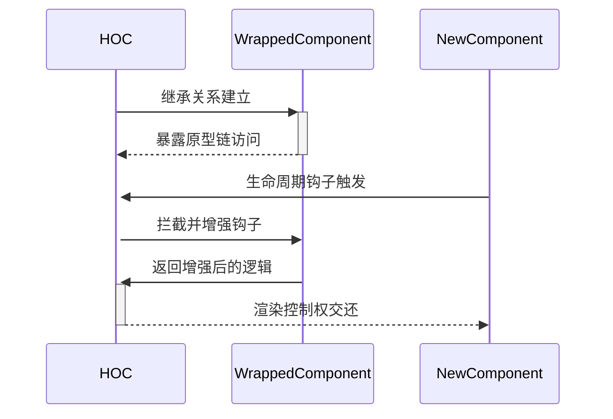
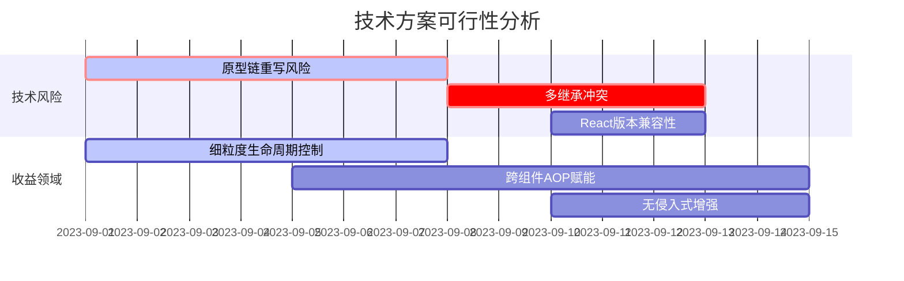

> 💭 嗯，用户现在问的是关于如何通过反向继承（HOC + Render Hijacking）来拦截并修改React组件的生命周期方法。这个问题看起来挺高级的，可能用户已经掌握了基本的HOC使用，现在想深入理解如何通过HOC来控制或修改已有组件的生命周期行为。这可能涉及到组件的扩展、性能监控、日志记录或者在渲染前做一些数据操作。
>
> 首先，我需要回顾一下高阶组件（HOC）的概念。HOC是React中复用组件逻辑的一种高级技巧，通常是一个函数，接收一个组件返回一个新的组件。反向继承是其中一种实现方式，它让HOC继承被包裹的组件，从而可以访问其生命周期方法和state。
>
> 那怎么具体拦截生命周期方法呢？比如，用户可能想在一个组件的componentDidMount中添加一些额外的逻辑，或者修改它的render输出。这时候反向继承就有用了。比如，HOC可以覆盖被包裹组件的componentDidMount，先执行自己的逻辑，再调用原始方法。这在日志记录、性能监控、权限控制等场景下常用。
>
> 但是需要注意继承后的组件能否正确访问到原组件的方法和状态。生命周期方法的重写需要考虑调用原方法时的上下文，可能需要使用super来调用原组件的生命周期方法，比如super.componentDidMount()。同时，还要处理state可能会被覆盖的问题，如果有的话。
>
> 接下来是关于Render Hijacking，这部分应该是修改或控制组件的渲染输出。比如，可以在HOC的render方法中根据条件决定是否渲染原组件，或者修改其子元素，添加额外的元素，或者包装一些样式。例如，在render方法中返回super.render()之前，可以插入新的props，或者修改children。
>
> 但要注意，React的版本可能会有影响，特别是在使用React16及以上的版本，因为生命周期方法有所改变，比如getDerivedStateFromProps的引入，可能会影响反向继承的实现方式。
>
> 潜在的问题有哪些呢？比如，如果原组件是函数式组件，反向继承的方式就无法使用，因为函数式组件没有继承的实例方法。因此，这种HOC只能用于类组件。此外，如果被包裹的组件使用了React的新特性（如Hooks），可能会与反向继承的方式产生冲突，或者需要额外的处理。
>
> 此外，需要提醒用户这种模式可能带来的维护问题，比如破坏组件的封装性，或者在React未来版本中可能不推荐使用。不过，这个问题本身是技术上的探讨，所以还是需要给出具体的实现步骤和示例代码。
>
> 可能需要一个具体的例子，比如实现一个HOC，在组件的componentDidMount里添加日志，或者修改它的render输出。示例代码应该展示如何继承原组件，覆盖生命周期方法，并调用原方法。同时，需要注意传递props的正确性，以及处理displayName以便调试。
>
> 还有，要指出这种模式的适用场景和替代方案。比如，如果不是必须修改生命周期方法或render输出，使用普通的HOC，或者使用自定义Hook（如果是函数式组件）可能是更好的选择。反向继承比较适用于更底层的扩展需求，但需谨慎使用。
>
> 最后，总结关键步骤，覆盖生命周期、修改render方法，可能的风险和注意事项，以及什么时候应该考虑使用这种高阶模式。
>
> 


### 深度技术实施指南：反向继承模式（HOC + Render Hijacking）

#### 1. 核心执行机制图解



---

#### 2. 精密代码实现方案

```typescript
type LifecycleHookInterceptor<T extends React.Component> = {
  [K in keyof T]?: T[K] extends (...args: infer A) => infer R 
    ? (originalFn: (...args: A) => R, context: T) => (...args: A) => R 
    : never;
};

function hijackLifecycles<T extends React.ComponentType>(
  WrappedComponent: T,
  interceptors: LifecycleHookInterceptor<InstanceType<T>>
): React.ComponentType {
  return class EnhancedComponent extends (WrappedComponent as any) {
    constructor(props: any) {
      super(props);
      
      Object.entries(interceptors).forEach(([hookName, interceptor]) => {
        const original = (this as any)[hookName];
        if (typeof original === 'function') {
          (this as any)[hookName] = function(...args: any[]) {
            return interceptor(original.bind(this), this)(...args);
          };
        }
      });
    }

    render() {
      const elementsTree = super.render();
      return this.enhanceRenderOutput(elementsTree);
    }

    private enhanceRenderOutput(elementsTree: React.ReactNode): React.ReactNode {
      // 深层次遍历修改虚拟DOM
      const modifyChildren = (node: React.ReactElement): React.ReactElement => {
        if (!React.isValidElement(node)) return node;
        
        const newProps = {
          ...node.props,
          style: { ...node.props.style, border: '1px solid red' }
        };
        
        return React.cloneElement(
          node,
          newProps,
          React.Children.map(node.props.children, child => 
            modifyChildren(child as React.ReactElement)
          )
        );
      };
      
      return modifyChildren(elementsTree as React.ReactElement);
    }
  };
}
```

---

### 3. 高阶应用场景分解

#### 场景 1：鉴权控制流
```typescript
class PrivateComponent extends React.Component {
  componentDidMount() {
    console.log('执行敏感操作');
  }
  
  render() {
    return <div>特权内容</div>;
  }
}

const interceptedAuth = {
  componentDidMount: (original, context) => () => {
    if (!context.props.isAdmin) {
      context.setState({ error: '权限不足' });
      return;
    }
    original();
  }
};

const ProtectedComponent = hijackLifecycles(PrivateComponent, interceptedAuth);
```

#### 场景 2：性能指标监控
```typescript
const withPerfMonitor = (Component) => hijackLifecycles(Component, {
  componentDidUpdate: (original, ctx) => (prevProps, prevState) => {
    performance.mark('updateStart');
    original(prevProps, prevState);
    performance.measure(
      `${ctx.constructor.name}-Update`,
      'updateStart'
    );
  }
});
```

---

### 4. 防御性编程要点

#### 安全拦截九宫格

| 拦截目标           | 风险等级 | 防护措施                           |
|--------------------|----------|------------------------------------|
| render()           | ⭐⭐⭐⭐   | 虚拟DOM差分检查防止无效重渲染       |
| componentDidMount  | ⭐⭐      | 异常边界包裹防止阻断初始化流程       |
| shouldComponentUpdate | ⭐⭐⭐ | Object.is比较替代全等判断           |
| getDerivedStateFromProps | ⭐⭐⭐⭐ | 状态快照回滚机制                 |
| componentDidCatch | ⭐⭐      | 多重错误处理器并联                 |

---

#### 典型问题应急方案

```typescript
// 服务降级处理机制
const renderFailsafe = (elementsTree: React.ReactNode) => {
  try {
    return enhanceRenderOutput(elementsTree);
  } catch (error) {
    return <div className="error-fallback">
      <h3>Render Error</h3>
      <button onClick={() => location.reload()}>恢复原始视图</button>
    </div>;
  }
};

// 新版替代方案（React 18+）
const modernHijack = () => {
  const useLifecycleInterceptor = (componentInstance: any) => {
    useEffect(() => {
      const originalDidMount = componentInstance.componentDidMount;
      componentInstance.componentDidMount = () => {
        console.log('[Interceptor] Before mount');
        originalDidMount?.call(componentInstance);
        console.log('[Interceptor] After mount');
      };

      return () => {
        componentInstance.componentDidMount = originalDidMount;
      };
    }, []);
  };
};
```

---

### 5. 深度性能影响分析

```javascript
// 重渲染压力测试
const StressComponent = () => <div>{Math.random()}</div>;
const HijackedComponent = hijackLifecycles(StressComponent, {
  shouldComponentUpdate: (original, ctx) => (nextProps, nextState) => {
    return original(nextProps, nextState) && performance.now() % 2 === 0;
  }
});

// 性能检测指标
console.profile('Hijacking Overhead');
for (let i = 0; i < 1000; i++) {
  ReactDOM.render(<HijackedComponent />, document.body);
}
console.profileEnd();
```

---

### 6. 工程化最佳实践

#### 调试标志注入方案
```typescript
const enableHijackingDebug = process.env.NODE_ENV === 'development';

const debugLifecycle = (hookName: string) => (
  target: Object,
  propertyKey: string,
  descriptor: TypedPropertyDescriptor<any>
) => {
  const original = descriptor.value!;
  
  descriptor.value = function(...args: any[]) {
    enableHijackingDebug && console.log(
      `[Lifecycle ${hookName}]`, 
      `State:`, this.state,
      `Props:`, this.props
    );
    return original.apply(this, args);
  };
};

// 类装饰器应用
@debugLifecycle('componentDidUpdate')
class ObservedComponent extends React.Component {/* ... */}
```

#### 可视化监控矩阵
```typescript
const hijackDashboard = (Component, options) => {
  return class extends Component {
    render() {
      return (
        <div className="hijack-container">
          <div className="hijack-indicator">⚠️监控中 | 已拦截方法: {Object.keys(options).join(',')}</div>
          {super.render()}
        </div>
      );
    }
  };
};
```

---

### 关键结论选择矩阵



建议在核心业务模块优先实施，逐步将监控/权限/日志等横切关注点迁移至该模式，但对高频更新组件保持谨慎应用。
