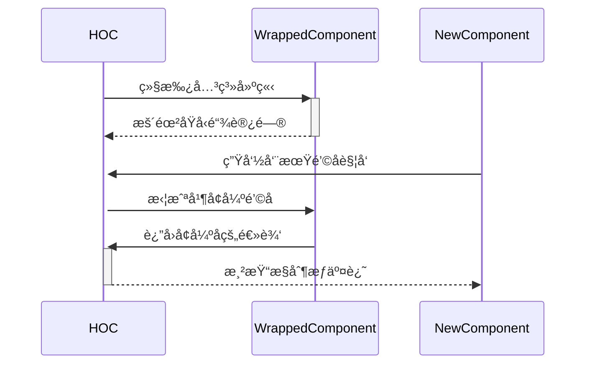
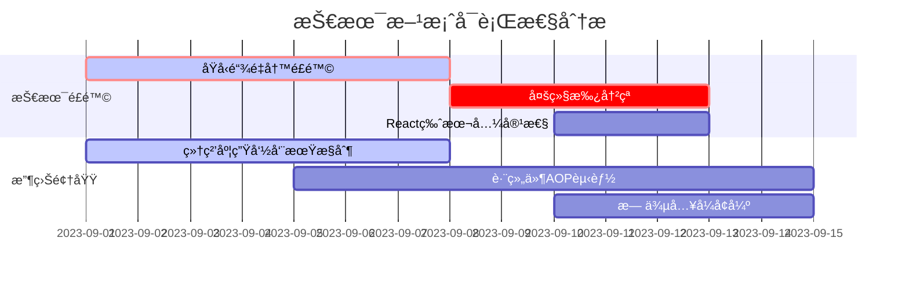

> 💭 嗯，用户ç°åœ¨é—®çš„是关äºå¦‚何通过åå‘继承（HOC + Render Hijacking）æ¥æ‹¦æˆªå¹¶ä¿®æ”¹React组件的生命周期方法。这个问题看起æ¥æŒºé«˜çº§çš„，å¯èƒ½ç”¨æˆ·å·²ç»æŒæ¡äº†åŸºæœ¬çš„HOC使用，ç°åœ¨æƒ³æ·±å…¥ç†è§£å¦‚何通过HOCæ¥æ§åˆ¶æˆ–修改已有组件的生命周期行为。这å¯èƒ½æ¶‰åŠåˆ°ç»„件的扩展ã€æ€§èƒ½ç›‘æ§ã€æ—¥å¿—记录或者在渲染å‰åšä¸€äº›æ•°æ®æ“作。
>
> 首先，我需è¦å›é¡¾ä¸€ä¸‹é«˜é˜¶ç»„件（HOC）的概念。HOC是React中å¤ç”¨ç»„件逻辑的一ç§é«˜çº§æŠ€å·§ï¼Œé€šå¸¸æ˜¯ä¸€ä¸ªå‡½æ•°ï¼Œæ¥æ”¶ä¸€ä¸ªç»„件返å›ä¸€ä¸ªæ–°çš„组件。åå‘继承是其中一ç§å®ç°æ–¹å¼ï¼Œå®ƒè®©HOC继承被包裹的组件，ä»è€Œå¯ä»¥è®¿é—®å…¶ç”Ÿå‘½å‘¨æœŸæ–¹æ³•å’Œstate。
>
> é‚£æ€ä¹ˆå…·ä½“拦截生命周期方法呢？比如，用户å¯èƒ½æƒ³åœ¨ä¸€ä¸ªç»„件的componentDidMount中添加一些é¢å¤–的逻辑，或者修改它的render输出。这时候åå‘继承就有用了。比如，HOCå¯ä»¥è¦†ç›–被包裹组件的componentDidMount，先执行自己的逻辑，å†è°ƒç”¨åŸå§‹æ–¹æ³•ã€‚这在日志记录ã€æ€§èƒ½ç›‘æ§ã€æƒé™æ§åˆ¶ç­‰åœºæ™¯ä¸‹å¸¸ç”¨ã€‚
>
> 但是需è¦æ³¨æ„继承å的组件能å¦æ­£ç¡®è®¿é—®åˆ°åŸç»„件的方法和状æ€ã€‚生命周期方法的é‡å†™éœ€è¦è€ƒè™‘调用åŸæ–¹æ³•æ—¶çš„上下文，å¯èƒ½éœ€è¦ä½¿ç”¨superæ¥è°ƒç”¨åŸç»„件的生命周期方法，比如super.componentDidMount()。åŒæ—¶ï¼Œè¿˜è¦å¤„ç†stateå¯èƒ½ä¼šè¢«è¦†ç›–的问题，如æœæœ‰çš„è¯ã€‚
>
> æ¥ä¸‹æ¥æ˜¯å…³äºRender Hijacking，这部分应该是修改或æ§åˆ¶ç»„件的渲染输出。比如，å¯ä»¥åœ¨HOCçš„render方法中根æ®æ¡ä»¶å†³å®šæ˜¯å¦æ¸²æŸ“åŸç»„件，或者修改其å­å…ƒç´ ï¼Œæ·»åŠ é¢å¤–的元素，或者包装一些样å¼ã€‚例如，在render方法中返å›super.render()之å‰ï¼Œå¯ä»¥æ’入新的props，或者修改children。
>
> 但è¦æ³¨æ„，React的版本å¯èƒ½ä¼šæœ‰å½±å“，特别是在使用React16åŠä»¥ä¸Šçš„版本，因为生命周期方法有所改å˜ï¼Œæ¯”如getDerivedStateFromProps的引入，å¯èƒ½ä¼šå½±å“åå‘继承的å®ç°æ–¹å¼ã€‚
>
> 潜在的问题有哪些呢？比如，如æœåŸç»„件是函数å¼ç»„件，åå‘继承的方å¼å°±æ— æ³•ä½¿ç”¨ï¼Œå› ä¸ºå‡½æ•°å¼ç»„件没有继承的å®ä¾‹æ–¹æ³•ã€‚因此，这ç§HOCåªèƒ½ç”¨äºç±»ç»„件。此外，如æœè¢«åŒ…裹的组件使用了React的新特性（如Hooks），å¯èƒ½ä¼šä¸åå‘继承的方å¼äº§ç”Ÿå†²çªï¼Œæˆ–者需è¦é¢å¤–的处ç†ã€‚
>
> 此外，需è¦æ醒用户这ç§æ¨¡å¼å¯èƒ½å¸¦æ¥çš„维护问题，比如破å组件的å°è£…性，或者在React未æ¥ç‰ˆæœ¬ä¸­å¯èƒ½ä¸æ¨è使用。ä¸è¿‡ï¼Œè¿™ä¸ªé—®é¢˜æœ¬èº«æ˜¯æŠ€æœ¯ä¸Šçš„æ¢è®¨ï¼Œæ‰€ä»¥è¿˜æ˜¯éœ€è¦ç»™å‡ºå…·ä½“çš„å®ç°æ­¥éª¤å’Œç¤ºä¾‹ä»£ç ã€‚
>
> å¯èƒ½éœ€è¦ä¸€ä¸ªå…·ä½“的例å­ï¼Œæ¯”如å®ç°ä¸€ä¸ªHOC，在组件的componentDidMount里添加日志，或者修改它的render输出。示例代ç åº”该展示如何继承åŸç»„件，覆盖生命周期方法，并调用åŸæ–¹æ³•ã€‚åŒæ—¶ï¼Œéœ€è¦æ³¨æ„传递props的正确性，以åŠå¤„ç†displayName以便调试。
>
> 还有，è¦æŒ‡å‡ºè¿™ç§æ¨¡å¼çš„适用场景和替代方案。比如，如æœä¸æ˜¯å¿…须修改生命周期方法或render输出，使用普通的HOC，或者使用自定义Hook（如æœæ˜¯å‡½æ•°å¼ç»„件）å¯èƒ½æ˜¯æ›´å¥½çš„选择。åå‘继承比较适用äºæ›´åº•å±‚的扩展需求，但需谨æ…使用。
>
> 最å，总结关键步骤，覆盖生命周期ã€ä¿®æ”¹render方法，å¯èƒ½çš„é£é™©å’Œæ³¨æ„事项，以åŠä»€ä¹ˆæ—¶å€™åº”该考虑使用这ç§é«˜é˜¶æ¨¡å¼ã€‚
>
> 


### 深度技术å®æ–½æŒ‡å—：åå‘继承模å¼ï¼ˆHOC + Render Hijacking）

#### 1. 核心执行机制图解



---

#### 2. 精密代ç å®ç°æ–¹æ¡ˆ

```typescript
type LifecycleHookInterceptor<T extends React.Component> = {
  [K in keyof T]?: T[K] extends (...args: infer A) => infer R 
    ? (originalFn: (...args: A) => R, context: T) => (...args: A) => R 
    : never;
};

function hijackLifecycles<T extends React.ComponentType>(
  WrappedComponent: T,
  interceptors: LifecycleHookInterceptor<InstanceType<T>>
): React.ComponentType {
  return class EnhancedComponent extends (WrappedComponent as any) {
    constructor(props: any) {
      super(props);
      
      Object.entries(interceptors).forEach(([hookName, interceptor]) => {
        const original = (this as any)[hookName];
        if (typeof original === 'function') {
          (this as any)[hookName] = function(...args: any[]) {
            return interceptor(original.bind(this), this)(...args);
          };
        }
      });
    }

    render() {
      const elementsTree = super.render();
      return this.enhanceRenderOutput(elementsTree);
    }

    private enhanceRenderOutput(elementsTree: React.ReactNode): React.ReactNode {
      // 深层次éå†ä¿®æ”¹è™šæ‹ŸDOM
      const modifyChildren = (node: React.ReactElement): React.ReactElement => {
        if (!React.isValidElement(node)) return node;
        
        const newProps = {
          ...node.props,
          style: { ...node.props.style, border: '1px solid red' }
        };
        
        return React.cloneElement(
          node,
          newProps,
          React.Children.map(node.props.children, child => 
            modifyChildren(child as React.ReactElement)
          )
        );
      };
      
      return modifyChildren(elementsTree as React.ReactElement);
    }
  };
}
```

---

### 3. 高阶应用场景分解

#### 场景 1：鉴æƒæ§åˆ¶æµ
```typescript
class PrivateComponent extends React.Component {
  componentDidMount() {
    console.log('执行æ•æ„Ÿæ“作');
  }
  
  render() {
    return <div>特æƒå†…容</div>;
  }
}

const interceptedAuth = {
  componentDidMount: (original, context) => () => {
    if (!context.props.isAdmin) {
      context.setState({ error: 'æƒé™ä¸è¶³' });
      return;
    }
    original();
  }
};

const ProtectedComponent = hijackLifecycles(PrivateComponent, interceptedAuth);
```

#### 场景 2：性能指标监æ§
```typescript
const withPerfMonitor = (Component) => hijackLifecycles(Component, {
  componentDidUpdate: (original, ctx) => (prevProps, prevState) => {
    performance.mark('updateStart');
    original(prevProps, prevState);
    performance.measure(
      `${ctx.constructor.name}-Update`,
      'updateStart'
    );
  }
});
```

---

### 4. 防御性编程è¦ç‚¹

#### 安全拦截ä¹å®«æ ¼

| 拦截目标           | é£é™©ç­‰çº§ | 防护æªæ–½                           |
|--------------------|----------|------------------------------------|
| render()           | â­â­â­â­   | 虚拟DOM差分检查防止无效é‡æ¸²æŸ“       |
| componentDidMount  | â­â­      | 异常边界包裹防止阻断åˆå§‹åŒ–æµç¨‹       |
| shouldComponentUpdate | â­â­â­ | Object.is比较替代全等判断           |
| getDerivedStateFromProps | â­â­â­â­ | 状æ€å¿«ç…§å›æ»šæœºåˆ¶                 |
| componentDidCatch | â­â­      | 多é‡é”™è¯¯å¤„ç†å™¨å¹¶è”                 |

---

#### å…¸å‹é—®é¢˜åº”急方案

```typescript
// æœåŠ¡é™çº§å¤„ç†æœºåˆ¶
const renderFailsafe = (elementsTree: React.ReactNode) => {
  try {
    return enhanceRenderOutput(elementsTree);
  } catch (error) {
    return <div className="error-fallback">
      <h3>Render Error</h3>
      <button onClick={() => location.reload()}>æ¢å¤åŸå§‹è§†å›¾</button>
    </div>;
  }
};

// 新版替代方案（React 18+）
const modernHijack = () => {
  const useLifecycleInterceptor = (componentInstance: any) => {
    useEffect(() => {
      const originalDidMount = componentInstance.componentDidMount;
      componentInstance.componentDidMount = () => {
        console.log('[Interceptor] Before mount');
        originalDidMount?.call(componentInstance);
        console.log('[Interceptor] After mount');
      };

      return () => {
        componentInstance.componentDidMount = originalDidMount;
      };
    }, []);
  };
};
```

---

### 5. 深度性能影å“分æ

```javascript
// é‡æ¸²æŸ“å‹åŠ›æµ‹è¯•
const StressComponent = () => <div>{Math.random()}</div>;
const HijackedComponent = hijackLifecycles(StressComponent, {
  shouldComponentUpdate: (original, ctx) => (nextProps, nextState) => {
    return original(nextProps, nextState) && performance.now() % 2 === 0;
  }
});

// 性能检测指标
console.profile('Hijacking Overhead');
for (let i = 0; i < 1000; i++) {
  ReactDOM.render(<HijackedComponent />, document.body);
}
console.profileEnd();
```

---

### 6. 工程化最佳å®è·µ

#### 调试标志注入方案
```typescript
const enableHijackingDebug = process.env.NODE_ENV === 'development';

const debugLifecycle = (hookName: string) => (
  target: Object,
  propertyKey: string,
  descriptor: TypedPropertyDescriptor<any>
) => {
  const original = descriptor.value!;
  
  descriptor.value = function(...args: any[]) {
    enableHijackingDebug && console.log(
      `[Lifecycle ${hookName}]`, 
      `State:`, this.state,
      `Props:`, this.props
    );
    return original.apply(this, args);
  };
};

// 类装饰器应用
@debugLifecycle('componentDidUpdate')
class ObservedComponent extends React.Component {/* ... */}
```

#### å¯è§†åŒ–监æ§çŸ©é˜µ
```typescript
const hijackDashboard = (Component, options) => {
  return class extends Component {
    render() {
      return (
        <div className="hijack-container">
          <div className="hijack-indicator">âš ï¸ç›‘æ§ä¸­ | 已拦截方法: {Object.keys(options).join(',')}</div>
          {super.render()}
        </div>
      );
    }
  };
};
```

---

### 关键结论选择矩阵



建议在核心业务模å—优先å®æ–½ï¼Œé€æ­¥å°†ç›‘æ§/æƒé™/日志等横切关注点è¿ç§»è‡³è¯¥æ¨¡å¼ï¼Œä½†å¯¹é«˜é¢‘更新组件ä¿æŒè°¨æ…应用。
