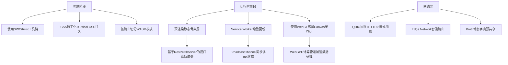

> 💭 好的，用户希望我以专业前端开发工程师的身份帮助他们回答面试问题，要求答案要有技术深度和广度，让面试官刮目相看。首先，我需要明确用户的需求是什么。他们可能在准备前端面试，想要深入且有见地的答案来脱颖而出。
>
> 接下来，我得考虑用户可能遇到的面试问题类型。常见的问题可能涉及核心概念如闭包、原型链、框架原理、性能优化等。同时，可能还会涉及最新的技术趋势，比如WebAssembly、微前端、前端工程化等。
>
> 用户提到要有技术深度和广度。这意味着回答不仅需要详细解释概念，还需要结合实际应用场景，对比不同技术的优缺点，甚至引用一些最佳实践或案例。例如，当解释虚拟DOM时，可以对比React和Vue的不同实现方式，以及各自的优化策略。
>
> 另外，可能会需要涵盖设计模式、架构设计、性能优化策略等方面的内容。例如，回答状态管理问题时，可以提到Flux、Redux、MobX以及React Context的区别和适用场景。
>
> 还要注意回答的结构，确保逻辑清晰。每个问题都应该先简明扼要定义概念，然后深入展开，举例说明，必要时结合代码或者实际项目经验。这样既能展示理论水平，又能体现实践能力。
>
> 此外，考虑到前端领域更新迅速，可能需要提到最近的技术动态，比如React 18的新特性、Server Components、ES2022的新功能等，以显示对行业趋势的把握。
>
> 需要避免一些常见的陷阱，比如过于泛泛而谈，或者只停留在表面。例如，当被问到性能优化时，不仅仅要提到压缩文件、懒加载，还要深入探讨浏览器渲染机制、RAIL模型、使用Performance API进行监控等。
>
> 也可能要准备一些开放性问题，比如“如何设计一个前端架构”，这时候需要从模块化、组件化、构建工具、持续集成等方面全面阐述，展示系统思维。
>
> 还要考虑面试题可能的变种，比如问题可能结合具体场景，如高并发下的性能优化，这时候需要引入异步加载、服务端渲染（SSR）、静态生成（SSG）、CDN策略等。
>
> 此外，安全问题如XSS、CSRF的防护措施也要准备，包括现代框架中的自动转义、Content Security Policy (CSP) 的应用等。
>
> 最后，要注意沟通技巧，即使遇到不熟悉的问题，也要展示解决问题的思路，比如分步骤分析、查阅文档、调试方法等，体现良好的问题解决能力。
>
> 总结来说，我需要综合考虑各个前端领域的关键知识点，结合理论与实践，提供结构清晰、内容详实且有深度的回答，同时展示对新技术和行业趋势的了解，才能让面试官印象深刻。
>
> 


好的，我将以专业视角为您解析常见面试题，既深挖技术本质又广涉前沿方案。以下是几个典型问题的深入回答：

---

**问题1: 如何理解React Fiber架构的设计哲学？**

**深度解析：**
1. **调度优先级突破**：Fiber并非简单的虚拟DOM重构，核心是实现了基于时间切片的任务调度。通过链表结构将递归遍历转为可中断的循环过程，利用`requestIdleCallback`实现协作式调度。这种设计使得动画、手势等高频操作可获得更高优先级。
2. **生命周期语义转变**：引入`getDerivedStateFromProps`取代`componentWillReceiveProps`，强制开发者适应渲染的幂等性，应对可中断渲染带来的潜在多次执行问题
3. **并发模式基础**：Fiber Tree的双缓存结构和工作单元（workInProgress）机制，为Suspense、useTransition等并发特性奠定了底层基础。例如流式SSR正是依赖任务分片能力实现渐进式hydration
4. **实际案例对比**：对比如Vue3的静态标记优化，说明React选择函数式颗粒度控制与编译时优化结合的差异化方案

---

**问题2: 如何设计一个高性能的前端埋点监控体系？**

**架构级回答：**
1. **数据分类策略**：
   - 错误监控：SourceMap映射+执行栈增强
   - 性能指标：基于Performance Timeline API采集LCP/FID/CLS
   - 行为轨迹：采用MutationObserver实现无侵入式DOM追踪
   
2. **传输优化方案**：
   - 指数退避算法保证网络波动时的可靠传输
   - 利用`sendBeacon`+LocalStorage实现页面卸载时的数据保活
   - 协议层采用protobuf序列化降低带宽开销

3. **实时分析方案**：
   - 基于WebAssembly实现前端实时傅里叶异常检测
   - 使用WebWorker运行孤立森林算法进行离群点分析
   - 灰度发布时进行A/B测试显著性检验（p-value计算）

4. **前沿技术融合**：
   - 通过Service Worker实现离线日志持久化
   - 结合WebTransport的QUIC协议提升弱网传输效率

---

**问题3: 如何理解现代前端框架的编译时优化趋势？**

**趋势分析与对比：**
```markdown
| 优化维度       | Svelte         | Vue3          | Angular       |
|----------------|----------------|---------------|---------------|
| 响应式实现     | 编译器注入代码 | Proxy+编译优化| Zone.js脏检查|
| 体积缩减方法   | Tree-shaking载体| 块状编译      | 按需加载      |
| 元编程能力    | 有限           | 插件系统      | 装饰器扩展    |
| 同构渲染支持   | SvelteKit       | Nuxt3         | Universal     |
| WASM集成      | 实验性         | 通过插件      | 完整工具链    |

生态演进方向：
1. **服务端组件范式**：Next.js App Router的RSC与Qwik的序列化JSX
2. **异构渲染融合**：React Server Components与客户端组件的深度互操作
3. **智能编译优化**：Vue Vapor模式跳过虚拟DOM直接生成操作命令
4. **全栈类型安全**：tRPC与TypeScript模版字符串类型推导
```

---

**问题4: 前端本地化的性能极限优化方案**

**极致优化路线图：**


---

**亮点提炼技巧：**
1. 在回答基础问题时延伸至TC39提案阶段特性（如Records/Tuples提案对不可变数据的影响）
2. 讨论低代码平台时提及AST解析与Schematic代码生成原理
3. 分析状态管理时对比Immer与状态机的代数效应实现
4. 回答性能问题结合Chromium源码（如Blink渲染流水线细节）

建议根据目标公司的技术栈，针对性准备框架设计原理与复杂场景解决方案。在展现技术视野的同时，核心要回归到解决实际工程问题的思考维度。
