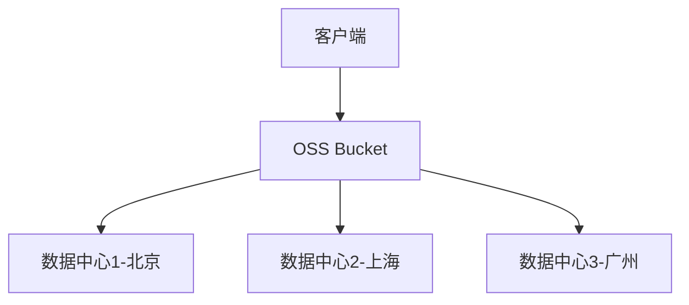
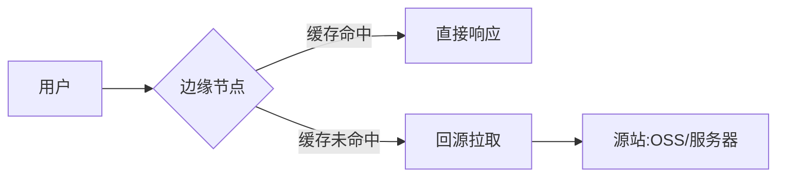

OSS（对象存储服务）和CDN（内容分发网络）是两种不同的云服务，虽然它们经常结合使用，但核心功能有明显区别。以下是详细解析：

---

### **一、核心概念对比**
| **维度**       | **OSS（对象存储）**                          | **CDN（内容分发网络）**                  |
|----------------|---------------------------------------------|-----------------------------------------|
| **主要功能**    | 海量非结构化数据存储（图片、视频、文档等）    | 内容加速分发，降低访问延迟                |
| **数据位置**    | 集中存储在特定地域的数据中心                  | 缓存分发到全球边缘节点                    |
| **典型应用**    | 数据持久化存储、备份、归档                    | 网站静态资源加速、视频直播流分发          |
| **计费模式**    | 存储容量 + 请求次数 + 流量                    | 流量 + 请求次数                          |
| **访问方式**    | 通过API/SDK直接访问                           | 通过域名访问（自动选择最优节点）          |
| **数据生命周期**| 支持设置自动删除/归档策略                     | 缓存自动过期（需配置缓存规则）            |

---

### **二、技术架构差异**
#### **1. OSS架构特点**

- **核心能力**：  
  - 数据三副本存储（99.999999999%耐久性）  
  - 支持版本控制、跨区域复制  
  - 服务端加密（SSE-KMS/OSS）  

#### **2. CDN架构原理**

- **关键组件**：  
  - 边缘节点（3000+节点，覆盖中国95%地区）  
  - 智能调度系统（DNS/GSLB）  
  - 缓存策略（支持自定义过期时间）  

---

### **三、典型协作模式（以阿里云为例）**
#### **1. 最佳实践架构**
```
用户请求 --> CDN边缘节点 --> OSS Bucket（源站）
                  ↑
          缓存未命中时回源
```
#### **2. 配置步骤**
1. **OSS准备**：
   - 创建Bucket并上传资源
   - 设置跨域访问CORS规则
   ```json
   [
     {
       "AllowedOrigin": ["*"],
       "AllowedMethod": ["GET"],
       "MaxAgeSeconds": 3000
     }
   ]
   ```

2. **CDN加速配置**：
   - 添加加速域名（如cdn.yourdomain.com）
   - 源站类型选择OSS外网域名
   - 设置缓存策略：
     ```bash
     # 图片类资源缓存30天
     Location: .jpg|.png|.gif
     Cache-Control: max-age=2592000

     # HTML文件不缓存
     Location: .html
     Cache-Control: no-cache
     ```

3. **HTTPS强化**：
   - 上传SSL证书到CDN
   - 开启HTTP/2、QUIC协议
   - 配置HSTS（强制HTTPS）

#### **3. 性能对比数据**
| **场景**        | 直接访问OSS           | 通过CDN访问         |
|----------------|----------------------|--------------------|
| 北京用户访问广州OSS | 延迟45-60ms         | 延迟8-15ms         |
| 上海用户访问美西OSS | 带宽成本$0.12/GB    | 带宽成本$0.02/GB   |
| 万级QPS突发请求   | 可能出现503错误       | 自动弹性扩展        |

---

### **四、成本优化技巧**
#### **1. OSS成本控制**
- **存储分层**：  
  ```bash
  标准存储（热数据） → 低频访问（>30天未访问） → 归档存储（>60天）
  ```
- **生命周期规则**：  
  ```xml
  <LifecycleConfiguration>
    <Rule>
      <ID>delete-old-files</ID>
      <Prefix>logs/</Prefix>
      <Status>Enabled</Status>
      <Expiration>
        <Days>365</Days>
      </Expiration>
    </Rule>
  </LifecycleConfiguration>
  ```

#### **2. CDN成本优化**
- **流量包采购**：  
  - 中国内地流量包 1TB = ¥199  
  - 全球流量包 1TB = $89  
- **智能压缩**：  
  ```nginx
  gzip_types text/plain application/xml image/svg+xml;
  brotli on;
  ```

---

### **五、中国特色场景实践**
#### **1. 短视频平台架构**
```
用户上传 → OSS（华东1） → 转码集群 → CDN分发
                     ↓
               异地灾备（华北3）
```

#### **2. 政务云合规要求**
- OSS必须部署在政务专区
- CDN节点需具备等保三级认证
- 数据不出省（通过CDN区域缓存控制实现）

#### **3. 电商大促备战**
- **预热策略**：  
  ```bash
  curl -X POST "https://cdn.aliyuncs.com/?Action=PushObjectCache" \
  -d "ObjectPath=image/product/12345.jpg&Area=cn"
  ```
- **限流保护**：  
  - 设置QPS阈值告警  
  - 开启带宽封顶（如10Gbps）

---

### **六、常见误区澄清**
1. **“有了CDN就不需要OSS”**  
   - ✘ CDN只是缓存层，持久化存储仍需OSS/S3  
   - ✔ 正确架构：CDN+OSS组合使用

2. **“OSS可以直接替代Web服务器”**  
   - ✘ OSS不支持动态计算（如PHP）  
   - ✔ 静态网站托管需配合API网关/Serverless

3. **“CDN缓存会降低数据实时性”**  
   - ✔ 解决方案：  
     - 版本化文件名（如style.v2.css）  
     - 设置Cache-Control: no-cache + 短时缓存（max-age=300）

---

### **结论**
OSS是存储基础设施，CDN是加速网络，二者如同仓库与物流的关系：  
- **OSS** 相当于中心仓库，负责安全存储货物  
- **CDN** 相当于各地分仓，保障货物快速送达  

在实际应用中，建议：  
1. 静态资源统一存储到OSS  
2. 通过CDN加速分发  
3. 根据业务场景配置缓存策略  
4. 中国用户优先选择同一云厂商的OSS+CDN组合（如阿里云OSS+CDN）以获得最佳性能
