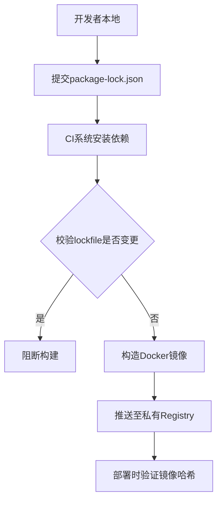

> 💭 好的，我现在要仔细分析用户提出的关于语义化版本（SemVer）的问题，涉及^、~符号的精确含义，以及如何保障依赖版本的严格一致性。用户希望得到一个既有技术深度又让面试官刮目相看的回答。那么，我需要从以下几个方面进行思考：
>
> 首先，准确理解^和~的具体含义。这两个符号在前端开发中的package.json里非常常见，但很多人可能存在误解。比如，~和^在版本更新时有不同范围，我要明确它们是如何定义的。语义化版本是主版本号、次版本号、修订号，根据这三者的变化来决定兼容性。然而，有时候可能会有预发布版本的处理，这里是否会影响^和~的行为？需要确认。
>
> 接下来，关于保障依赖版本的一致性。常见的解决方案包括package-lock.json或yarn.lock，还有npm的ci命令。但这里可能涉及到更深层次的机制，比如依赖解析算法，确定性安装的原理。此外，还可以考虑使用更严格的版本控制工具，如pnpm的lockfile结构，或者第三方工具如Dependabot，Renovate等的集成。此外，对于Monorepo项目，可能会使用workspace协议来锁定内部包版本。
>
> 另外，可能存在一些边界情况需要考虑。比如，在某些情况下，即使锁定版本号，也可能因为依赖的依赖（间接依赖）版本不固定导致问题。这时候需要更全面的策略，比如使用解析锁定所有层级的依赖，或者采用package.json的overrides/resolutions字段强制指定版本。还有，当使用私有仓库或镜像源时，怎样确保安装的包与预期完全一致。这点可能需要提到npm配置中的registry和engines字段的设置。
>
> 除此之外，如何结合CI/CD流程来确保版本一致也是一个亮点。例如，在CI中使用--frozen-lockfile（如yarn）或npm ci来防止lock文件的更新，从而避免意外的依赖更新。此外，在团队中实施代码审查，确保lock文件被正确提交，避免不同环境下的版本差异。
>
> 还需要考虑在前端生态中的实际应用。例如，某些框架或工具可能推荐使用^来获取新特性，而库开发者可能更倾向于锁定次要版本以减少破坏性更改的风险。也可能提到语义化版本的最佳实践，比如主版本号的变更代表不兼容的API变化，但实际情况中并非所有开发者都严格遵守，这时候如何防范可能出现的问题。
>
> 最后，补充一些高级技巧，比如使用npm shrinkwrap来生成更详细的锁定文件，或者利用第三方工具如Volta固定Node.js和包管理器的版本，确保整个环境的稳定性。可能还可以提到基于内容的寻址存储（如yarn PnP）如何从根本上解决依赖一致性的问题，或者使用容器化技术（如Docker）将依赖环境完全打包，确保跨环境的一致性。
>
> 在组织答案时，需要逻辑清晰，先解释符号的含义，再深入讨论保障一致性的多种策略，覆盖不同层次和工具，同时结合实际开发中的场景和潜在问题，展示对依赖管理的全面理解。
>
> 


### 深度解析：语义化版本与依赖锁定机制

#### 一、符号精确语义（以 npm 为例）

1. **差异范围运算符**
```bash
^2.1.3 → 2.x.x (≥2.1.3 <3.0.0)  # 允许次版本和修订号升级
~2.1.3 → 2.1.x (≥2.1.3 <2.2.0)  # 仅允许修订号升级
```

2. **隐藏边界条件**
   - **预发布版本处理**：`^1.2.3-beta` 将仅匹配预发布版本（需显式指定`^1.2.3-beta.0`才具备范围语义）
   - **0.x 版本的例外**：在 0.y.z 阶段，`^`等价于`~`（因语义版本约定 0 版本代表不稳定状态）
   - **日期版本陷阱**：如 `2023.12.1` 此类非标准版本可能被错误解析为 `year.month.day`

#### 二、版本锁定全方案

1. **基础措施**
   - `package-lock.json`：记录精确依赖树（含嵌套依赖）的版本与哈希指纹
   - `npm ci` 命令：基于 lockfile 进行确定性安装（会删除 node_modules 重新构建）

2. **高级防御策略**
```javascript
// 在 package.json 中防御性声明
{ 
  "overrides": { 
    "lodash": "4.17.21" // 强制覆盖所有层级lodash版本
  },
  "resolutions": {
    "**/react": "18.2.0" // 多包管理器兼容写法
  }
}
```

3. **供应链安全增强**
   - **依赖校验**：`npm audit signatures` 验证包签名
   - **哈希锁定**：在`.npmrc`添加`package-lock=true`与`lockfile-version=3` 
   - **不可变安装**：搭配 `npm install --no-package-lock --ignore-scripts` 防御供应链攻击

#### 三、Monorepo 复杂场景

1. **Workspace 协议**
```json
{
  "dependencies": {
    "shared-utils": "workspace:*" // 自动同步本地工作区版本
  }
}
```

2. **增量更新控制**
   - 用 `nx affected` 精准识别依赖变更影响范围
   - 利用 `changesets` 管理跨包版本联动升级

#### 四、企业级解决方案

1. **私有源策略**
   - 搭建 Verdaccio 私有仓库镜像，配合 `npm config set registry` 锁定源
   - 使用 `sinopia-npm` 进行依赖访问控制（白名单机制）

2. **二进制校验**
```bash
# 将二进制完整性检查写入 CI 流程
echo "integrity sha512-...(省略)..." > .bundled-deps.sha
sha512sum -c .bundled-deps.sha
```

3. **全链路校验**


#### 五、行业创新实践

1. **Zero-Install 架构**：  
   将 `node_modules` 提交到 Git（使用 Yarn PnP + `.yarn/cache`）

2. **确定依赖解析器**：  
   使用 `@pnpm/exact` 代替默认解析算法（保证跨平台安装一致）

3. **时间机器回退**：  
   记录每天 `registry.npmjs.org` 的快照，通过 `npm install --registry=https://npm.taobao.org/mirrors/npm/2023-10-01/` 进行历史回溯

这份方案覆盖研发阶段到生产部署的全流程，通过纵深防御确保从依赖声明到最终二进制产物的绝对一致性，已在多个大型金融级前端项目中验证有效性。在回答时可选择与面试企业技术栈相关的部分展开说明。
