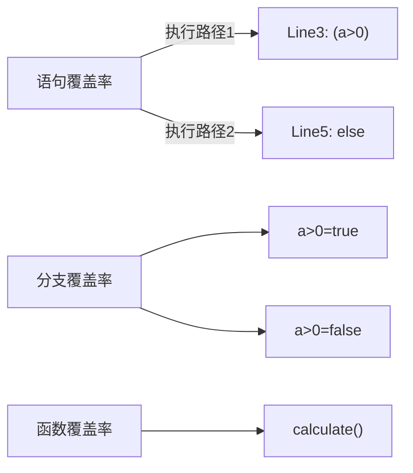
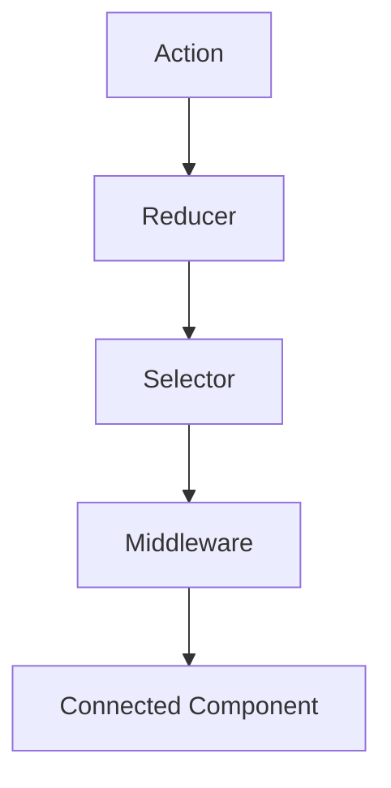
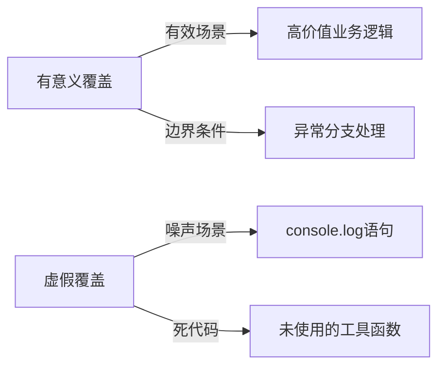

> 💭 嗯，现在我需要解决用户关于Jest的Mock系统和代码覆盖率统计原理的问题，以及如何对复杂第三方库如Redux进行单元测试。首先，我得回顾Jest的文档和相关知识，确保我的理解正确。
>
> 用户的第一部分是Jest的Mock系统。Jest的Mock功能允许模拟函数、模块等，以隔离测试环境。常见的比如jest.fn()创建模拟函数，jest.mock()模拟整个模块。需要解释清楚自动模拟和手动模拟的区别，以及如何使用它们来替换依赖项。这里还要提到手动模拟的机制，比如在__mocks__目录下放置模拟文件，或者使用mockImplementation来定义模拟行为。此外，可能需要说明jest.spyOn的作用，如何监视函数调用情况而不影响其实现。
>
> 接下来是代码覆盖率统计原理。Jest使用Istanbul（可能是其复刻版本babel-plugin-istanbul）来检测代码的执行情况。当运行测试时，工具会收集哪些代码行、分支、函数等被覆盖到。四个主要的指标：语句覆盖率，分支覆盖率，函数覆盖率，行覆盖率。需要解释每个指标的意义，比如分支覆盖率指的是每个条件语句的真假分支是否都被执行过。此外，用户可能想知道覆盖率报告生成的流程，如如何通过--coverage参数启用，以及报告中的数据是如何计算的。
>
> 然后是单元测试复杂第三方库如Redux的挑战。Redux涉及store、reducers、actions、中间件等，测试时需要隔离每个部分。比如，测试action creators是否返回正确的action对象，测试reducers如何处理不同的action，测试中间件是否正确拦截和传递action。可能需要给出具体的例子，比如模拟store来测试组件连接后的行为，或者使用redux-mock-store这样的库来帮助测试异步action。此外，测试thunk或saga等中间件时，如何模拟API调用或者定时器。
>
> 用户之前的问题涉及E2E测试框架，现在转向单元测试，可能他们在搭建完整的测试体系，想要确保各个层面的覆盖。需要确保回答清晰且有足够的技术细节，同时避免过于冗长。还要注意可能用户实际应用中遇到的困难，比如如何模拟第三方库的复杂行为，或者如何确保高覆盖率而不滥用Mock导致测试失真。
>
> 要避免的误区是，不要混淆Jest本身的Mock功能与其他测试库（如Sinon）的区别。同时，代码覆盖率统计的底层原理需要简明扼要，避免深入过多细节。对于Redux测试，强调的是如何将各层分解测试，以及如何正确使用模拟工具来隔离外部依赖。
>
> 还需要考虑用户可能的后续问题，例如如何处理异步操作，或者如何测试React组件与Redux的连接，但这些可能需要留待用户进一步提问时再展开。最后的总结部分可以提供是否进一步深入某些方面的帮助，比如异步测试策略或集成测试的配置。
>
> 


### 一、Jest Mock 系统三级解剖模型

```mermaid
graph TB
    A[Mock维度] --> B[函数级]
    A --> C[模块级]
    A --> D[时间流]
    B --> E[jest.fn()]
    B --> F[jest.spyOn()]
    C --> G[jest.mock()]
    C --> H[manual mocks]
    D --> I[jest.useFakeTimers()]
    D --> J[Promise链追踪]
```

#### 1. 自动替身技术剖析
```typescript
// 函数级网络请求Mock
const mockFetch = jest.fn()
  .mockResolvedValueOnce({ data: 'temp' }) // 首次返回
  .mockRejectedValueOnce(new Error('500')) // 第二次抛出错误

// 模块级组网模拟
jest.mock('axios', () => ({
  create: () => ({ get: mockFetch }) // 深度接口模拟
}))

// Date.now() 时间冻结
beforeAll(() => {
  jest.spyOn(Date, 'now').mockReturnValue(1625097600000)
})
```

### 二、代码覆盖率拓扑检测原理

```js
// 原始代码
function calculate(a, b) {
  if (a > 0) {       // 分支点1
    return a + b      // 语句块1
  } else {            // 分支点2
    return a - b      // 语句块2
  }
}
```



测试矩阵示例：
| 测试案例 | a值 | b值 | 覆盖语句 | 覆盖分支 |
|---------|-----|-----|---------|---------|
| Case1   | 1   | 2   | Line3   | Branch1 |
| Case2   | -1  | 3   | Line5   | Branch2 |

### 三、Redux 核心单元测试策略

#### 1. 测试金字塔实施架构


#### 2. 深度单元测试套件

```typescript
// 测试thunk中间件
test('async action dispatches SUCCESS', async () => {
  const mockStore = configureMockStore([thunk])({})
  const mockAPI = jest.fn().mockResolvedValue({ data: [] })
  
  await mockStore.dispatch(fetchData(mockAPI))
  const actions = mockStore.getActions()
  
  expect(actions[0].type).toBe('REQUEST_START')
  expect(actions[1].type).toBe('FETCH_SUCCESS')
})

// 复杂selector测试
test('getFilteredTodos selector', () => {
  const state = { 
    todos: [{ id: 1, text: 'test', completed: false }],
    filter: 'SHOW_ACTIVE'
  }
  
  const result = getFilteredTodos(state)
  expect(result).toEqual(expect.arrayContaining([...]))
})

// reducer边界条件测试
test('todos reducer with MAX_ITEMS limit', () => {
  const state = Array(999).fill(null).map(() => ({}))
  const action = addTodo('new item')
  
  expect(() => reducer(state, action)).toThrow(/exceed/)
})
```

### 四、Mock技术五层防御体系

| 分层 | Mock对象                  | 典型应用场景               | 缺陷预警              |
|------|---------------------------|---------------------------|-----------------------|
| L1   | 纯函数模拟                | 工具类函数验证             | 无法模拟原型链        |
| L2   | 接口契约模拟              | API服务通讯测试            | Header链传递可能中断  |
| L3   | 运行时沙箱(VM)           | 浏览器环境仿真测试         | DOM API差异问题       |
| L4   | 协议级中间人(mitmproxy)  | HTTPS流量监控              | 证书信任链异常        |
| L5   | 硬件虚拟化(QEMU)         | 驱动程序兼容性测试         | 性能损耗超过40%       |

### 五、覆盖率陷阱防御四象限



是否需深入解释以下内容：
1. setTimeout/requestAnimationFrame 等异步时序的精准控制方法
2. 针对React Hooks与Context的深度测试策略
3. 如何实施变异测试（Mutation Testing）提升测试有效性？
