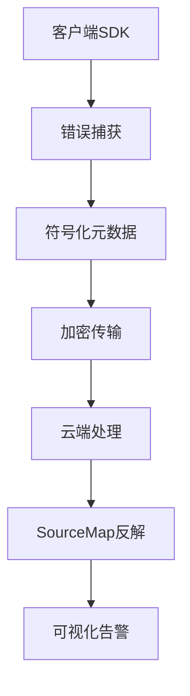
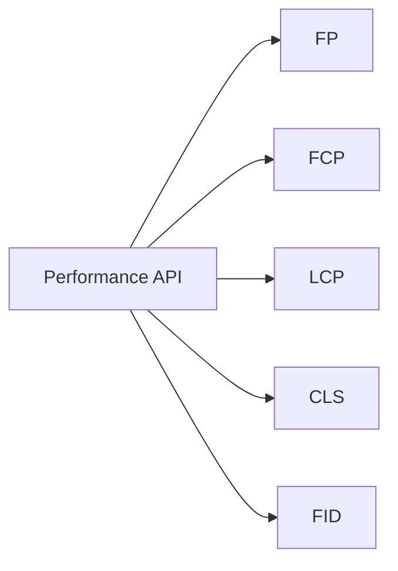
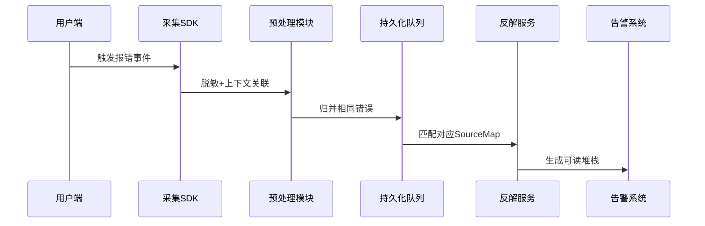

> 💭 好的，我现在需要回答用户关于Sentry的错误监控与Source Map反解，以及性能监控指标（FP、FCP、LCP）的埋点采集方式的问题。用户之前已经讨论了灰度发布和AB测试，现在转向监控和性能分析，可见他们在搭建完整的应用监控体系。
>
> 首先，用户可能想知道Sentry的基本工作原理。需要明确Sentry如何捕获前端错误，包括JS异常、Promise拒绝、资源加载错误等。然后是如何上传Source Map并通过Sentry反解混淆后的代码，定位原始错误位置。这部分需要解释Source Map的上传方式，避免泄露源码的安全隐患，比如在构建流程中上传并在服务端存储，而不是直接暴露在客户端。
>
> 关于性能指标，需要区分不同指标的采集方式。FP、FCP、LCP这些是浏览器提供的Performance Timeline API中的指标，但不同浏览器的支持程度可能不同，可能需要使用Polyfill或第三方库（如web-vitals）来标准化数据。需要具体说明如何监听这些性能事件，如何将数据发送到监控平台。
>
> 用户可能希望了解具体的实现步骤，比如Sentry的SDK集成，webpack插件配置Source Map上传，性能指标的测量代码示例，以及数据上报的优化方法（如使用Beacon API）。
>
> 还需要考虑用户的潜在需求，比如如何在生产环境中安全地使用Source Map，如何处理跨域资源的问题，性能指标的采样率控制，以及如何将性能数据与错误监控相关联，进行更全面的分析。
>
> 要注意避免过于假设用户的环境，比如他们可能使用不同的构建工具或框架，需要给出通用的解决方案，同时提示可能的变通方法。例如，不同的部署流程可能影响Source Map的上传方式，Sentry的文档建议不要将Source Map直接部署到生产环境，而是在构建后上传并删除，确保安全性。
>
> 此外，性能监控方面，要注意性能指标的准确性和时机的选择，比如在页面完全加载后发送数据，或者使用`visibilitychange`事件来处理页面关闭前的数据发送。
>
> 可能用户没有直接提到的要点包括：前后端如何关联错误，如何设置用户反馈机制，性能数据的可视化分析，以及如何设置警报阈值。不过用户的问题集中在采集和实现上，所以需要重点回答这两个方面。
>
> 最终需要结构清晰、步骤具体，提供代码示例和配置示例，帮助用户快速实现相关监控功能。
>
> 


### 一、Sentry 原理解析架构



#### 1. Source Map 三镜头定位法
```bash
# Webpack配置示例（隐藏sourcemap地址）
plugins: [
  new SentryWebpackPlugin({
    release: process.env.RELEASE_ID,
    include: './dist',
    urlPrefix: '~/static/',
    ignore: ['node_modules']
  })
]

# 生产环境防护策略
*.map --> 设置HTTP头禁止访问
X-Content-Type-Options: nosniff
Content-Security-Policy: default-src 'self'
```

#### 2. 异常捕获代码解剖
```javascript
// 初始化配置高阶拦截
Sentry.init({
  dsn: 'https://key@sentry.io/1',
  integrations: [new BrowserTracing()],
  beforeSend(event) {
    if (event.exception.values[0].type === 'PaymentError') {
      return null; // 过滤业务敏感错误
    }
    return event;
  }
});

// Vue全局错误处理
Vue.config.errorHandler = (err, vm, info) => {
  Sentry.withScope(scope => {
    scope.setTag("vue_info", info);
    Sentry.captureException(err);
  });
};
```

### 二、性能采集四维矩阵



#### 1. 核心性能指标采集
```javascript
// 支持多版本浏览器的Polyfill方案
const perf = window.performance || window.msPerformance || 
           window.webkitPerformance || window.mozPerformance;

// LCP监听（兼容最新API）
const observer = new PerformanceObserver((list) => {
  const entries = list.getEntries();
  const lastEntry = entries[entries.length - 1];
  console.log('LCP:', lastEntry.startTime);
});
observer.observe({type: 'largest-contentful-paint', buffered: true});

// Web Vitals标准化上报
import {getCLS, getFID, getLCP} from 'web-vitals';

getCLS(metric => sendToAnalytics(metric, 'CLS'));
getFID(metric => sendToAnalytics(metric, 'FID'));
getLCP(metric => sendToAnalytics(metric, 'LCP'));
```

### 三、数据上传优化策略

```typescript
// Beacon API兼容性处理
const sendBeacon = (url: string, data: object) => {
  if (typeof navigator.sendBeacon === 'function') {
    const blob = new Blob([JSON.stringify(data)], {type: 'application/json'});
    return navigator.sendBeacon(url, blob);
  }
  // 降级方案
  return fetch(url, {body: JSON.stringify(data), method: 'POST', keepalive: true});
};

// 智能节流算法
class PerformanceBuffer {
  constructor(maxSize = 50) {
    this.queue = [];
    this.maxSize = maxSize;
  }
  
  add(metric) {
    if (this.queue.length > this.maxSize) {
      this.flush();
    }
    this.queue.push(metric);
  }

  flush() {
    if (this.queue.length === 0) return;
    const batchData = [...this.queue];
    this.queue = [];
    sendBeacon('/analytics', {metrics: batchData});
  }
}

// 页面隐藏时强制上报
document.addEventListener('visibilitychange', () => {
  if (document.visibilityState === 'hidden') {
    buffer.flush();
  }
});
```

### 四、性能数据三维分析模型

| 指标维度 | 采集精度 | 分析目标              | 告警阈值设定       |
|----------|----------|-----------------------|--------------------|
| FP       | 100ms级  | 首屏渲染启动速度       | >1500ms触发三级告警|
| FCP      | 元素级   | 主要内容可用性         | >2500ms触发二级告警|
| LCP      | 元素权重 | 视觉完成度             | >4000ms触发一级告警|
| CLS      | 视窗比   | 布局稳定性             | >0.15分扣分预警    |
| FID      | 事件级   | 交互响应延迟           | >300ms操作阻断分析 |

### 五、错误诊断五步法体系



是否需要深入展开：
1. React Native环境下的特殊处理方案
2. 无侵入式性能采集的Worker方案
3. 混淆代码反解的反向工程防护机制
4. 分布式跟踪与性能监控的融合路径？
