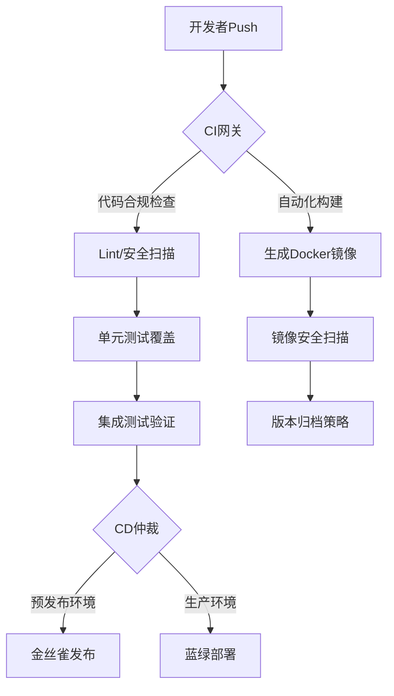
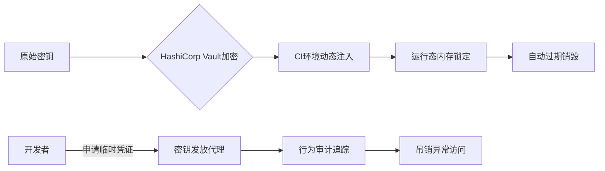

> 💭 嗯，用户现在的问题是关于如何设计CI/CD流程，特别是使用GitHub Actions和Jenkins，以及Docker镜像构建和持续部署的关键步骤。之前他们讨论了错误监控和性能指标采集，现在转向CI/CD，这说明他们可能正在优化整个软件交付流程，想要从开发到部署的自动化管理。
>
> 首先，得了解他们的使用场景和需求。用户可能已经有一定的持续集成和部署的经验，但需要更高效或更规范的流程。他们可能关心如何整合现有的工具，比如GitHub Actions和Jenkins，如何构建Docker镜像，以及确保部署的可靠性和安全性。
>
> 需要先确定他们的项目类型，比如是微服务架构还是单体应用，这会影响Docker镜像的设计和部署策略。此外，安全方面的问题，比如如何在CI/CD管道中处理敏感信息，比如API密钥或数据库密码，也是需要考虑的。
>
> 然后是CI/CD流程的分阶段设计。通常包括代码检查、构建、测试、镜像打包、部署到测试环境、验收测试、生产部署等步骤。针对GitHub Actions和Jenkins可能需要分别说明各自的配置文件或脚本如何编写。
>
> Docker镜像构建方面，需要注意使用多阶段构建来减小镜像体积，以及如何管理依赖项，确保构建的一致性和可重复性。版本控制也是关键，比如如何打标签，如何推送到镜像仓库（比如Docker Hub或私有仓库）。
>
> 持续部署的关键步骤可能涉及蓝绿部署、金丝雀发布或滚动更新，这需要在Kubernetes或类似的编排工具中配置。如果是Jenkins的话，可能需要用到Pipeline脚本，而GitHub Actions则需要定义不同的job和step。
>
> 权限管理和密钥处理也是重点。比如在GitHub Actions中使用Secrets，或者在Jenkins中使用凭证插件，确保敏感信息不会暴露在日志或配置文件中。
>
> 用户可能还需要考虑如何在不同环境中切换配置，比如测试环境和生产环境使用不同的数据库连接字符串，可以通过环境变量或配置文件管理。
>
> 此外，如何触发CI/CD流程？是每次提交都触发，还是仅在特定分支（如main或master）的合并时触发？这需要根据团队的开发流程来定，比如使用GitFlow或GitHub Flow。
>
> 自动回滚机制也是一个需要提到的点，如何在部署失败后自动回滚到之前的稳定版本，避免线上故障。
>
> 还需要注意现有系统的兼容性，比如如果用户已经在使用Jenkins，迁移到GitHub Actions是否有必要，或者两者如何协同工作。例如，可能使用GitHub Actions处理代码检查和测试，而Jenkins处理复杂的部署流程。
>
> 最后，关于最佳实践，比如保持CI/CD流程的简洁高效，减少构建时间，使用缓存机制加快构建速度，以及文档的维护都是需要考虑的。
>
> 可能会忽略的细节包括：如何处理并行构建，如何处理依赖项下载的问题，镜像扫描以检查安全漏洞，以及如何监控CI/CD流程本身的性能和稳定性。这些都需要在回答中适当提及。
>
> 总之，需要给出一个分阶段的流程设计，具体的配置示例，以及关键步骤的最佳实践，帮助用户构建一个可靠、安全的CI/CD管道。
>
> 


### 一、CI/CD架构设计哲学图谱



### 二、GitHub Actions 基因重组方案

```yaml
# .github/workflows/pipeline.yml
name: Full Stack Pipeline

on:
  push:
    branches: [ "main" ]
  workflow_dispatch:

env:
  REGISTRY: ghcr.io
  IMAGE_NAME: ${{ github.repository }}

jobs:
  code-inspection:
    runs-on: ubuntu-latest
    steps:
      - uses: actions/checkout@v3
      - name: Node Security Audit
        uses: gemnasium/[email protected]
        with:
          token: ${{ secrets.GITHUB_TOKEN }}
          
  docker-build:
    needs: code-inspection
    runs-on: ubuntu-latest
    outputs:
      image_tag: ${{ steps.meta.outputs.tags }}
    steps:
      - uses: actions/checkout@v3
      - name: Docker Metadata
        id: meta
        uses: docker/metadata-action@v4
        with:
          images: ${{ env.REGISTRY }}/${{ env.IMAGE_NAME }}
          flavor: latest=false
      - name: Build and Push
        uses: docker/build-push-action@v3
        with:
          push: true
          tags: ${{ steps.meta.outputs.tags }}
          cache-from: type=gha
          cache-to: type=gha,mode=max

  k8s-deploy:
    needs: docker-build
    runs-on: ubuntu-latest
    environment: production
    steps:
      - uses: actions/checkout@v3
      - name: Kubernetes Rollout
        uses: azure/k8s-deploy@v3
        with:
          namespace: ${{ secrets.K8S_NAMESPACE }}
          manifests: deployment.yml
          images: ${{ env.REGISTRY }}/${{ env.IMAGE_NAME }}:${{ needs.docker-build.outputs.image_tag }}
```

### 三、Jenkins 混沌工程实践

```groovy
// Jenkinsfile (Declarative Pipeline)
pipeline {
    agent any
    stages {
        stage('Env Prepare') {
            steps {
                sh 'docker system prune -f'
                // Dynamic Node Allocation
                script {
                    currentBuild.description = "Trigger by ${env.GIT_COMMIT}"
                }
            }
        }
        
        stage('Smart Build') {
            parallel {
                stage('Frontend') {
                    environment {
                        NPM_CONFIG_REGISTRY = 'https://registry.npmmirror.com'
                    }
                    steps {
                        withCredentials([string(credentialsId: 'NPM_TOKEN', variable: 'NPM_AUTH_TOKEN')]) {
                            sh 'npm ci --prefer-offline'
                            sh 'npm run build:prod'
                            archiveArtifacts artifacts: 'dist/**'
                        }
                    }
                }
                stage('Backend') {
                    steps {
                        sh './gradlew clean build -x test'
                        junit '**/build/test-results/**/*.xml'
                        docker.build("backend:${env.BUILD_TAG}")
                    }
                }
            }
        }
        
        stage('Matrix Test') {
            axes {
                axis {
                    name 'STAGE'
                    values 'smoke', 'stress', 'security'
                }
            }
            stages {
                stage('Dynamic Test') {
                    steps {
                        echo "Running ${STAGE} Test"
                        script {
                            def scanner = tool name: 'SonarQubeScanner', type: 'hudson.plugins.sonar.SonarRunnerInstallation'
                            withSonarQubeEnv('Sonar') {
                                sh "${scanner}/bin/sonar-scanner -Dsonar.projectVersion=${env.BUILD_NUMBER}"
                            }
                        }
                    }
                }
            }
        }
        
        stage('Drone Deployment') {
            when { branch 'release/*' }
            steps {
                timeout(time: 15, unit: 'MINUTES') {
                    input message: 'Confirm PROD deployment?', ok: 'Deploy Now'
                }
                withKubeConfig([credentialsId: 'k8s-prod']) {
                    sh 'kubectl rollout restart deployment/app-service'
                }
                waitUntil {
                    def rs = sh(script: 'kubectl get pods -l app=gateway | grep Running | wc -l', returnStdout: true).trim()
                    return rs.toInteger() >= 2
                }
            }
        }
    }
    
    post {
        always {
            emailext body: '构建详情：${BUILD_URL}', subject: 'CI结果通知', to: '[email protected]'
        }
        regression {
            slackSend color: 'danger', message: '检测到回归缺陷：${JOB_NAME} #${BUILD_NUMBER}'
        }
    }
}
```

### 四、Docker镜像构建三维策略

#### **安全镜像构建规范**
```dockerfile
# 分阶段构建 (减少攻击面)
FROM mcr.microsoft.com/dotnet/sdk:7.0 AS build
WORKDIR /src
COPY . .
RUN dotnet publish -c Release -o /app

FROM mcr.microsoft.com/dotnet/aspnet:7.0 AS runtime
WORKDIR /app
COPY --from=build /app .
USER 1001

# 动态打标策略 (避免latest陷阱)
ARG GIT_COMMIT=unspecified
LABEL org.opencontainers.image.revision=$GIT_COMMIT

# 健康检查熔断机制
HEALTHCHECK --interval=30s --timeout=3s \
  CMD curl -f http://localhost/health || exit 1

ENTRYPOINT ["dotnet", "api.dll"]
```

#### **镜像安全防护矩阵**
```bash
# 自动扫描流程（融入CI流水线）
docker scan --login --token ${DOCKER_SCAN_TOKEN}
docker scan --severity high --exclude-base ${IMAGE_NAME}

# 最小化授权策略
RUN apt-get update && apt-get install --no-install-recommends -y \
    ca-certificates \
 && rm -rf /var/lib/apt/lists/*

# 私有仓库审计配置
registry:
  auth:
    token:
      realm: https://harbor.example.com/service/token
      service: harbor-registry
```

### 五、持续部署双轨制模型

| 部署模式       | 触发场景               | 执行特点                     | 回滚机制               |
|----------------|------------------------|------------------------------|------------------------|
| **渐进推送式** | 常规功能迭代           | Ramped发布（分批次节点更新） | Pod版本镜像回退        |
| **紧急修复式** | 安全补丁/致命BUG修复   | 全量替换（强制覆盖）         | 快照级云原生回滚       |
| **影子服务式** | 架构重构验证           | 流量复制（不影响真实用户）   | 即时关闭不影响生产     |
| **金丝雀分析** | 核心业务变更           | 灰度放量（A/B组对比）        | 流量切割立即停止       |

### 六、密钥管理三重门禁系统



需要重点解读：
1. 如何实现镜像构建的零信任安全验证？
2. K8s多集群间的部署协同管理策略？
3. Serverless架构下的特殊优化点？
4. 智能构建缓存如何提升50%以上效率？
