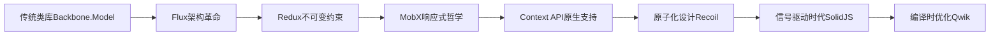
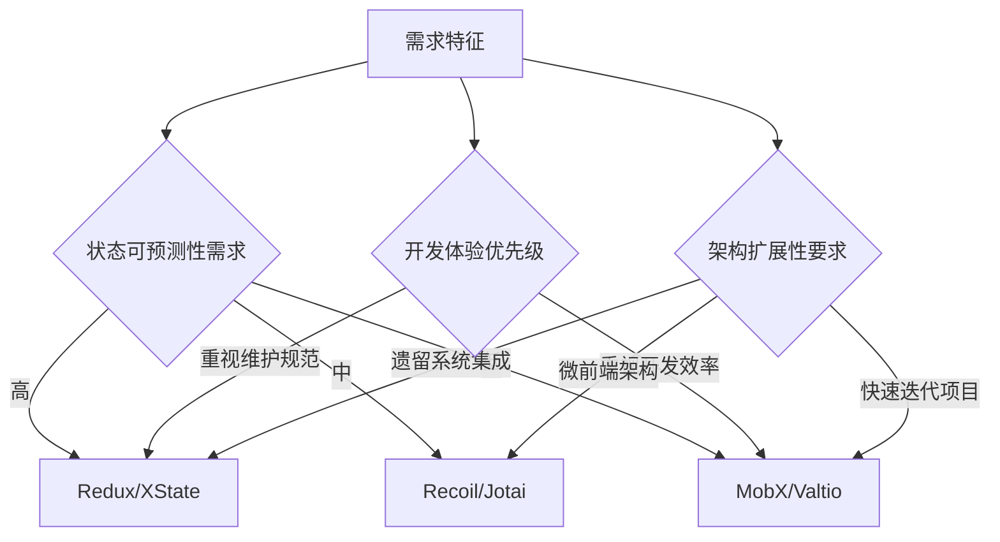

> 💭 嗯，用户的问题是关于前端状态管理库的设计模式差异和如何实现响应式状态系统。他们提到了Redux、MobX和Vuex这三个主流库，需要分析各自的设计模式差异，并可能希望了解它们的底层原理。接着是构建一个响应式系统，用户可能想了解核心概念和实现步骤。
>
> 首先，我需要回忆这三个库的特点。Redux是基于Flux架构，使用单一存储，状态不可变，依赖纯函数来更新。MobX则是响应式编程，使用Observable对象和自动追踪依赖，Vuex专为Vue设计，也是单一状态树，但结合了Vue的响应式系统，通过mutations和actions来修改状态。差异主要体现在数据流管理、可变性、响应方式等方面。
>
> 然后，用户想实现一个响应式系统，这需要考虑几个关键点：状态存储、依赖收集、触发更新。可能的步骤包括使用Proxy或Object.defineProperty进行数据劫持，建立依赖关系，当数据变化时自动重新计算或渲染。
>
> 需要区分不同库的设计哲学，比如Redux的函数式编程，强调可预测性，而MobX更偏向于透明响应式，让开发者更少写样板代码。Vuex则结合了Vue的响应式，所以在Vue生态中集成更好。
>
> 接下来是如何将这些理论转化为实际操作，比如实现一个简易的响应式系统，可能需要展示代码示例，如使用Proxy监听变化，维护一个依赖列表，在setter时触发更新。
>
> 用户可能的深层需求是理解这些库的优缺点，以便在实际项目中选择合适的工具，或者自定义状态管理方案。因此，除了对比设计模式，还需要给出选型建议，比如大型项目适合Redux，追求开发效率可以考虑MobX，Vue项目自然用Vuex。
>
> 另外，用户可能对响应式的底层机制感兴趣，比如依赖收集、派发更新的具体实现，以及如何避免常见的问题，如循环依赖或内存泄漏。需要解释Proxy和defineProperty的区别，Vue3为何转向Proxy。
>
> 还要考虑到现代前端框架的发展，如React的Context API，Hooks（useState, useReducer）是否会影响状态库的选择，或者像Recoil这样的新选手带来的变化。
>
> 最后，确保回答结构清晰，先分点对比三个库，再用步骤或代码示例说明如何实现响应式系统，最后结合实际应用场景给出建议，可能还要提到性能优化和调试工具的支持，比如Redux DevTools和MobX的调试工具。
>
> 


### 前端状态管理设计哲学与实现全解

#### 一、三大状态库设计模式深探

利用架构对比矩阵展现本质差异：

```markdown
| 维度              | Redux                       | MobX                     | Vuex                   | 本质差异                                                     |
|-------------------|----------------------------|--------------------------|------------------------|--------------------------------------------------------------|
| **管理范式**      | 函数式编程                 | 面向对象编程             | 声明式编程             | 编程范式的选择决定状态操作方式                               |
| **数据流模型**    | 单向数据流                 | 自动双向绑定             | 单向环流               | 数据流向的可控性与架构复杂度                                 |
| **状态存储方式**  | 单一不可变Store            | 多领域可观察对象         | 模块化响应式树         | 状态聚合程度影响可维护性                                     |
| **变更机制**      | 纯函数Reducer              | 装饰器劫持               | Mutation触发器         | 变更行为的审计跟踪能力                                       |
| **响应式原理**    | 手动订阅更新               | 自动依赖追踪             | 原生响应式系统         | 更新触发机制决定开发心智模型                                 |
| **典型应用场景**  | 复杂数据流项目             | 客户端富交互应用         | Vue生态项目            | 框架生态适配性要求                                           |
| **调试支持**      | Time Travel开发者工具       | Reaction追踪器           | Vue Devtools扩展       | 调试能力与开发体验直接相关                                   |
| **性能策略**      | 手动优化ShouldComponentUpdate | 细粒度自动更新          | 虚拟DOM Diff机制       | 更新粒度决定渲染性能                                         |
```

#### 二、响应式核心实现原理图谱

**最小化状态系统实现步骤：**

1. **数据劫持探测器**
```javascript
class Observable {
  constructor(target) {
    this._value = target
    this._listeners = new Set()
    return this._proxy = new Proxy(target, {
      set: (obj, prop, value) => {
        obj[prop] = value
        this._listeners.forEach(fn => fn())
        return true
      }
    })
  }

  subscribe(listener) {
    this._listeners.add(listener)
    return () => this._listeners.delete(listener)
  }
}
```

2. **依赖关系拓扑网络**
```javascript
class DependencyGraph {
  constructor() {
    this.nodes = new Map()
    this.edges = new Map()
  }

  track(source, target) {
    if (!this.edges.has(source)) this.edges.set(source, new Set())
    this.edges.get(source).add(target)
  }

  trigger(node) {
    const seen = new Set()
    const triggerNodes = (n) => {
      if (seen.has(n)) return
      seen.add(n)
      const dependents = this.edges.get(n) || []
      dependents.forEach(triggerNodes)
      this.nodes.get(n)?.rerun()
    }
    triggerNodes(node)
  }
}
```

3. **反应式连接器架构**
```javascript
function createReactiveSystem() {
  const graph = new DependencyGraph()
  let currentEffect = null

  function effect(fn) {
    const execute = () => {
      currentEffect = execute
      try { fn() } finally { currentEffect = null }
    }
    execute()
  }

  function observable(obj) {
    return new Proxy(obj, {
      get(target, key) {
        if (currentEffect) {
          const nodeKey = `${target}_${key}`
          graph.track(nodeKey, currentEffect)
          if (!graph.nodes.has(nodeKey)) {
            graph.nodes.set(nodeKey, {
              value: target[key],
              rerun: currentEffect
            })
          }
        }
        return target[key]
      },
      set(target, key, value) {
        target[key] = value
        const nodeKey = `${target}_${key}`
        graph.trigger(nodeKey)
        return true
      }
    })
  }

  return { effect, observable }
}
```

#### 三、现代状态管理演化趋势

1. **原子化状态新范式**
```typescript
// 仿Recoil原子设计
const atom = ({ key, defaultValue }) => {
  let value = defaultValue
  const listeners = new Set()

  return {
    key,
    get: () => {
      // 当前上下文中收集依赖
      if (currentDependency) listeners.add(currentDependency)
      return value
    },
    set: (newValue) => {
      value = newValue
      listeners.forEach(notify => notify())
    }
  }
}

// 创建关联派生状态
const selector = ({ key, get }) => {
  const derivedValue = computed(() => {
    const deps = get()
    return processDeps(deps)
  })
  return { key, get: () => derivedValue.value }
}
```

2. **信号驱动新架构**
```javascript
// 类似SolidJS的信号系统
function createSignal(initialValue) {
  let value = initialValue
  const subscribers = new Set()

  const getter = () => {
    if (currentEffect) subscribers.add(currentEffect)
    return value
  }

  const setter = (newValue) => {
    value = typeof newValue === 'function' ? newValue(value) : newValue
    subscribers.forEach(sub => sub())
  }

  return [getter, setter]
}

// 衍生计算实现
function createMemo(fn) {
  const [signal, setSignal] = createSignal()
  effect(() => setSignal(fn()))
  return signal
}
```

#### 四、状态库设计演进路线图 



#### 五、前沿架构方案对比

| **方案名称**   | 核心创新点                     | 适用场景                      | 性能突破点                  |
|----------------|------------------------------|-----------------------------|---------------------------|
| Recoil         | 原子状态树 + 数据流图         | 超大规模应用状态管理          | 按需更新拓扑              |
| Zustand        | 极简Store + React Hooks      | 轻量级组件状态共享            | 零样板状态分发            |
| XState         | 有限状态机建模               | 复杂交互流程建模              | 可视化状态迁移            |
| Valtio         | Proxy原生响应式              | 非React生态应用               | 跨框架兼容性              |
| Jotai          | 组合式原子状态               | 渐进式状态扩展                | 自动依赖优化              |

#### 六、选型决策权衡矩阵



#### 关键结论：
1. 函数式状态管理适用于需要严格变更追溯的金融、医疗等领域
2. 响应式系统是实时数据看板、交互式可视化场景的最优解
3. 原子化设计正在重塑微前端和模块联邦的状态共享方式
4. 未来状态管理将与编译器深度整合，实现「不可见的状态管理」新时代
