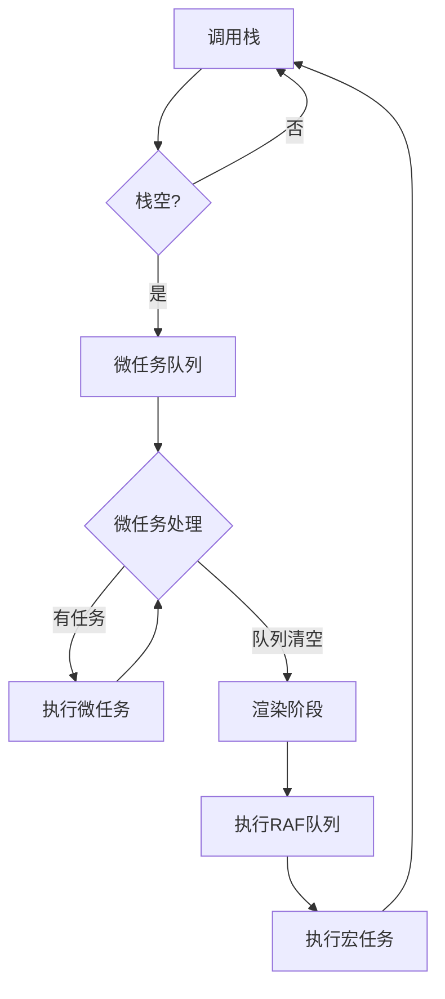
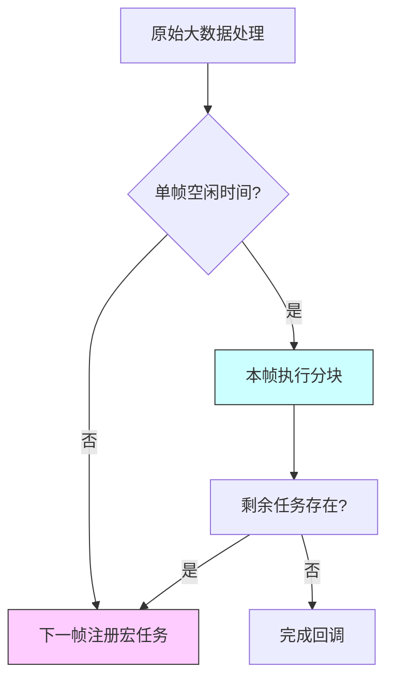

> 💭 好的，我现在需要回答关于浏览器事件循环对前端工程化的影响，以及如何利用微任务和宏任务优化代码执行顺序的问题。让我先把问题拆解一下，理清楚思路。
>
> 首先，事件循环是什么？根据之前的了解，事件循环是浏览器处理异步任务的核心机制，负责管理调用栈、任务队列（宏任务和微任务）的执行顺序。当主线程的执行栈清空后，事件循环会先检查微任务队列，执行所有微任务，然后提取一个宏任务执行，重复这个过程。
>
> 那么对前端工程化的影响这个词，可能指的是事件循环在较大规模前端项目中的设计、开发、维护中的影响。前端工程化通常涉及模块化、组件化、构建工具、性能优化等方面。事件循环如何影响这些方面呢？
>
> 可能的切入点：
>
> 1. **异步编程模式的选择**：前端框架（如Vue、React）中大量使用异步更新，比如Vue的nextTick，React的setState批处理，事件循环机制直接影响了这些框架内部的实现，从而需要开发者在工程实践中遵循特定的模式。
>
> 2. **性能优化策略**：比如长任务可能导致主线程阻塞，影响页面响应。工程化中可能需要通过代码拆分、任务分解等方式优化执行顺序，确保关键任务的及时执行。
>
> 3. **代码执行的可预测性**：在复杂的前端应用中，理解微任务和宏任务的执行顺序可以避免竞态条件或不一致的状态，例如在处理DOM更新后的操作时，可能需要确保操作在正确的任务队列中执行。
>
> 接下来是如何利用微任务和宏任务优化代码执行顺序。常见的做法是，微任务（如Promise.then、MutationObserver）会在当前宏任务结束后立即执行，而宏任务（如setTimeout、setInterval、UI Rendering）则要等到下一个事件循环。
>
> 如何利用它们优化？比如：
>
> - 将高优先级的任务安排为微任务，以确保它们尽快执行。
>
> - 延迟低优先级或重型操作为宏任务，避免阻塞主线程。
>
> - 在框架中使用微任务批量处理更新，减少重绘次数。
>
> 实际例子：Vue的nextTick就是利用微任务来确保DOM更新后的回调执行，React在更新状态时也会合并多个setState操作为一个批处理，利用微任务队列实现效果。
>
> 可能的陷阱需要注意，例如滥用微任务可能影响渲染性能，或者任务的执行顺序不符合预期导致逻辑错误。
>
> 现在需要结构化地回答这个问题：
>
> 1. 先解释事件循环的基本原理，涉及微任务和宏任务的区别。
>
> 2. 前端工程化的具体方面（模块化、性能优化、框架设计等）如何受事件循环影响。
>
> 3. 列举实际应用中的优化技巧，使用微任务和宏任务的最佳实践，避免常见错误。
>
> 4. 可能的框架中的例子，如Vue中的nextTick。
>
> 需要确保术语正确，比如任务队列的正确分类，事件循环的阶段（如渲染步骤位于宏任务之间）。还可能提到requestAnimationFrame，它与事件循环的关系（虽然不是宏任务或微任务，但在渲染前执行）。
>
> 另外还要解释现代前端框架如何处理异步更新，如何利用事件循环来优化渲染流程，减少不必要的计算。
>
> 举一个例子：当需要在DOM更新后执行某个操作，使用Vue的nextTick，这会利用微任务队列，从而确保DOM已经更新。如果此时使用setTimeout，则是宏任务，可能在渲染之后才执行，导致获取的DOM状态不正确。
>
> 再比如，拆解一个耗时任务，使用宏任务分片处理，比如使用setTimeout或requestIdleCallback将任务分割到多个宏任务中，防止长时间阻塞主线程，导致页面卡顿。
>
> 还可以提到，在工程化项目中如何监控长任务，通过性能分析工具识别问题，然后优化任务队列的使用。
>
> 可能的结构如下：
>
> - 事件循环原理简述
>
> - 对前端工程化的影响：
>
>   - 异步代码编写规范
>
>   - 框架内部状态更新机制
>
>   - 性能优化的关键考量
>
> - 优化策略：
>
>   - 微任务用于即时处理高优先级任务
>
>   - 宏任务拆分长任务避免阻塞
>
>   - 合理使用requestAnimationFrame和requestIdleCallback
>
>   - 案例分析与框架实现参考
>
> - 常见误区与解决建议
>
> 需要确保内容的逻辑连贯，语言准确，同时尽量给出实际例子，便于理解。总结一下，整个思考的核心在于如何充分利用事件循环的机制来提升代码执行效率，保证应用的流畅性和响应性。
>
> 


### 浏览器事件循环的工程化影响与任务调度优化

---

#### 一、事件循环运作核心精要

**1. 三阶段动态轮转**



**2. 任务类型划分**

| 分类       | API示例                  | 优先级 | 应用场景                |
|------------|-------------------------|--------|-----------------------|
| **Microtask** | Promise.then          | ★★★★★  | 同步状态更新后的回调      |
|            | MutationObserver      |        | DOM监控响应             |
| **Macrotask** | setTimeout/setInterval| ★★★☆☆  | 延迟操作、任务分片       |
|            | UI Rendering          | ★★★★☆  | 重绘/重排强制触发点      |
|            | I/O Callbacks         | ★★☆☆☆  | 文件/网络异步结果处理     |

---

#### 二、工程化关键影响面

**1. 异步编程规范重构**

```javascript
// 旧模式：纯回调地狱
fetchData(params, (err, data) => {
  if(err) handleError();
  processData(data, () => {
    updateUI();
    setTimeout(logAnalytics, 1000);
  });
});

// 新模式：任务分层控制
async function workflow() {
  try {
    const data = await fetchData(params);
    const processed = await processData(data);
    
    // 微任务层：DOM更新保障
    await nextTick(); 
    updateUI();
    
    // 宏任务层：延迟的非关键操作
    requestIdleCallback(() => {
      logAnalytics();
    });
  } catch(err) {
    handleError(err);
  }
}
```

**2. 框架级状态批处理**

```typescript
// React示例：setState异步合并
class Component extends React.Component {
  state = { count: 0 };
  
  handleClick = () => {
    // 三次更新被合并为一次渲染
    this.setState({count: this.state.count + 1});
    // 微任务层面注册回调
    Promise.resolve().then(() => {
      console.log('Final count:', this.state.count);
    });
    this.setState({count: this.state.count + 1});
    setTimeout(() => {
      this.setState({count: this.state.count + 1});
    });
  }
}
```

**3. 性能特别防御区**

```javascript
// 长任务警示标记
const startTime = performance.now();
while (performance.now() - startTime < 1000) {
  // 模拟耗时同步操作
}

// 检测到长任务自动告警
const observer = new PerformanceObserver(list => {
  list.getEntries().forEach(entry => {
    if (entry.duration > 100) {
      reportLongTask(entry);
    }
  });
});
observer.observe({ entryTypes: ['longtask'] });
```

---

#### 三、高阶调度策略实践

**1. 任务分片协议栈**



**2. 关键路径优先级控制**

```javascript
function criticalPathControl() {
  // 同步关键操作
  processImmediate();
  
  // 微任务：第一优先级异步
  Promise.resolve().then(drawHighPriorityUI);

  // 合并次要DOM更新
  const updateQueue = [];
  const batchUpdate = () => {
    updateQueue.forEach(fn => fn());
    updateQueue.length = 0;
  };
  
  // Animation Frame时机优化
  requestAnimationFrame(() => {
    batchUpdate();
    // 布局计算后执行
    requestPostAnimationFrame(() => {
      recalculateLayout();
    });
  });

  // 空闲期任务注册
  requestIdleCallback(processBackgroundJobs);
}
```

**3. 变化溯源监听矩阵**

```javascript
class StateTracker {
  constructor() {
    this._pending = false;
    this._callbacks = [];
  }

  triggerUpdate() {
    if (!this._pending) {
      this._pending = true;
      Promise.resolve().then(() => {
        this._flush();
        this._pending = false;
      });
    }
  }

  _flush() {
    const snapshots = this._callbacks.map(cb => cb());
    // 差异检测逻辑
    diffSnapshots(snapshots); 
  }
}
```

---

#### 四、性能调优参数对照

**1. 分辨率选择矩阵**

| 策略                   | 时间精度   | 性能消耗 | 适用场景                |
|------------------------|------------|----------|-----------------------|
| RAF调度               | ≈16.6ms帧  | ★★☆☆☆    | 动画序列                |
| MessageChannel         | 0ms        | ★★★★☆    | 超高频触发场景          |
| 双缓冲宏任务            | 多级延时   | ★★★☆☆    | 高频数据流处理          |
| setImmediate聚合        | 立即触发   | ★☆☆☆☆    | Node.js移植代码         |

**2. 资源配置调谐参数**

```javascript
const SCHEDULER_CONFIG = {
  ANIMATION_FRAME_BUDGET: 8,        // 每帧最大动画处理时间(ms)
  MICROTASK_LIMIT: 50,             // 单次事件循环微任务最大处理数
  MACROTASK_TIMEOUT_BASE: 4,       // 初始宏任务调度延迟
  PROGRESSIVE_TIMEOUT_GROWTH: 1.5   // 超时补偿增长系数
};
```

---

#### 五、开发者需知的七戒律

1. **时序圣律**：  
   DOM操作必在样式计算前，避免触发强制同步布局

2. **缓存法则**：  
   重复数据访问需缓存，警惕隐蔽的重复计算

3. **任务均衡规约**：  
   单任务执行耗时不得超过帧时长（<16ms）

4. **原子操作法则**：  
   数据状态变更必须在同一事务周期内完成

5. **层级闭包约束**：  
   避免多层嵌套闭包导致内存泄漏

6. **依赖纯净性原则**：  
   UI渲染函数必须保持输入一致性

7. **资源回收契约**：  
   事件监听和定时器必须成对释放

---

### 典型案例分析

**场景：即时搜索建议优化**

```javascript
// 基础版-频繁触发问题
inputEl.addEventListener('input', (e) => {
  fetchSuggestions(e.target.value)
    .then(showResults);
});

// 优化版-任务三重过滤
{
  let lastRequest = 0;
  const DEBOUNCE_TIME = 300;
  const scheduler = new Scheduler();

  inputEl.addEventListener('input', () => {
    // 设置节流时间窗口
    if (Date.now() - lastRequest < DEBOUNCE_TIME) return;
    lastRequest = Date.now();
    
    // 微任务层防抖
    scheduler.cancelPending();
    scheduler.scheduleMicrotask(() => {
      const query = inputEl.value.trim();
      
      // 空查询过滤
      if (!query) return;
      
      // 异步数据请求
      scheduler.scheduleMacrotask(() => {
        fetchSuggestions(query)
          .then(data => {
            // 结果有效性验证
            if (query !== inputEl.value) return;
            showResults(data);
          });
      });
    });
  });
}
```
