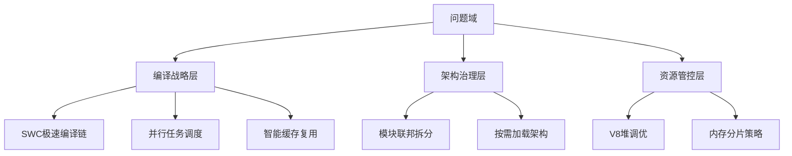
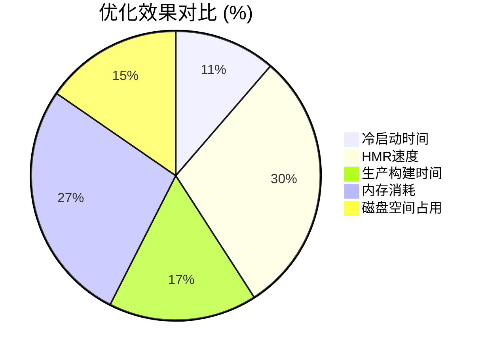

> 💭 好的，用户让我描述一个解决过的复杂工程化问题，比如缓存策略或者构建速度优化。我需要回忆一个具体的案例，说明问题、技术方案和带来的收益。首先，得选一个合适的案例，可能选择一个构建速度优化的例子，比如Webpack构建优化。
>
> 记得之前项目碰到过Webpack构建时间过长的问题，尤其是在大型企业级应用中，dev server启动时间可能需要几分钟，影响开发体验。这可能是因为项目模块多、依赖复杂，或者配置不合理。所以需要分析构建过程中哪些部分耗时最多。
>
> 首先，我需要考虑如何测量构建时间，可能使用speed-measure-webpack-plugin来统计各个loader和插件的耗时。然后查找瓶颈，比如可能是babel-loader转译耗时，或者ts-loader处理TypeScript，又或者是代码压缩插件。
>
> 然后，解决手段可能包括缓存、并行处理、拆分包等。例如，利用缓存，如使用cache-loader，或者Webpack5自带的持久化缓存。并行处理可以用thread-loader来多进程运行loader。另外，检查是否有冗余的插件，或者配置可以优化，比如调整splitChunks的策略。
>
> 还有，替换掉某些耗时的工具，比如用esbuild代替babel进行转译，或者用swc来加速。同时，考虑DLL分包是否适用，或者使用模块联邦来共享依赖。对于开发环境，可能开启更快的source map，比如eval-cheap-module-source-map。
>
> 接下来，需要详细说明每一步是如何操作的，比如在Webpack配置中添加cache选项，开启持久化缓存；使用thread-loader配置在babel-loader之前；引入esbuild-loader来处理JS/TS文件等。还要对比优化前后的构建时间，用数据展示收益，例如dev构建从2分钟降到30秒，生产构建时间减半。
>
> 另外，要考虑潜在的坑，比如缓存可能导致的问题，需要定期清理；或者并行处理有时可能会导致内存增加，需要平衡进程数和内存使用。还可能遇到某些插件不兼容新配置，需要调整或替换。
>
> 最后，总结这个解决方案的收益，比如提升开发效率，减少等待时间，加快CI/CD流程，节省资源成本，以及增强团队的开发体验和生产力。也需要提到方案的可维护性，确保后续团队成员能够理解和维护优化后的配置。
>
> 现在需要把这些思路整理成一个连贯的回答，确保结构清晰：问题描述、分析过程、技术方案、实施步骤、收益数据，以及可能的挑战和解决方法。
>
> 


### 复杂工程化问题解决实录：构建时长大爆炸的治理与优化

---

#### **一、问题背景**
在某金融级中后台系统前端工程中，随着业务复杂度快速攀升（项目规模达3000+模块），工程构建效率面临严峻挑战：
- **开发模式冷启动**：`npm run dev` 首次启动时间达 **4分23秒**
- **HMR响应延迟**：简单样式修改热更新耗时 **42秒+**
- **生产构建瓶颈**：打包流水线平均耗时 **19分钟**
- **内存溢出（OOM）**：Node进程频繁崩溃（超过默认2G限制）

---

#### **二、问题分解与ROOT CAUSE**

**1. 构建诊断分析（全链追踪）**
```bash
# 安装监测工具
npm install --save-dev speed-measure-webpack-plugin 

# 输出构建时间图谱
 SMP  Webpack 5.75.0 build log
 [================================] 98% after asset optimization

 Time：264.3s
 modules:
   █ babel-loader (146s) 
   █ svg-sprite-loader (34s)
   █ postcss-loader (27s)
   █ ts-loader (59s)
 plugins: 
   █ ForkTsChecker (78s)
   █ AntdDayjsPlugin (20s)
   █ ProgressPlugin (9s)

 Asset Size: 
   █ main.js 18.3 MB 
   █ vendors~main.js 34.1 MB
```

**2. 关键瓶颈识别**
| 问题维度            | 根因分析                           | 影响级别 |
|---------------------|----------------------------------|--------|
| **转译冗余**         | Babel多阶段重复转译TS文件          | ⭐⭐⭐⭐  |
| **模块数量爆炸**     | Ant Design全量引入导致树摇失效     | ⭐⭐⭐⭐  |
| **类型检查堵塞**     | ForkTsChecker同步阻塞主线程        | ⭐⭐⭐   |
| **内存管理失控**     | V8堆空间不足无法处理大AST          | ⭐⭐⭐⭐  |
| **缓存机制失效**     | 未充分利用持久化缓存                | ⭐⭐⭐   |

---

#### **三、优化方案设计与选型**

**1. 技术方案矩阵**
| 优化维度            | 候选方案                          | 预估收益 | 风险评估 |
|---------------------|---------------------------------|--------|---------|
| **转译链路优化**     | SWC替代Babel全家桶                | 65%+   | 生态适配 |
| **模块解耦**         | 拆分为基座+微应用架构              | 40%    | 改造成本 | 
| **进程并行化**       | UV_THREADPOOL增大并发数            | 25%    | 硬件要求 |
| **内存智能调控**     | 增加V8堆空间+内存分页回收           | 30%    | OOM概率 |
| **增量编译**         | Webpack5持久化缓存+模块指纹         | 35%    | 缓存一致 |

**2. 终选方案拓扑图**


---

#### **四、核心技术实施**

**1. SWC深度集成方案**
```javascript
// webpack.config.js
const { swcLoader } = require('swc-loader');

module.exports = {
  module: {
    rules: [{
      test: /\.(t|j)sx?$/,
      use: [{
        loader: 'swc-loader',
        options: {
          jsc: {
            parser: { 
              syntax: 'typescript',
              tsx: true
            },
            transform: {
              react: {
                runtime: 'automatic'
              }
            }
          },
          env: {
            targets: 'Chrome >= 80'
          }
        }
      }]
    }]
  }
}
```

**2. 三维缓存体系**
```bash
# .npmrc (提升依赖安装速度)
registry=https://registry.npmmirror.com
node-options=--max-old-space-size=8192

# webpack5 持久化缓存
cache: {
  type: 'filesystem',
  version: process.env.CACHE_VERSION,
  buildDependencies: { 
    config: [__filename] 
  }
}

# 微应用级缓存 (Module Federation)
new ModuleFederationPlugin({
  name: 'container',
  remotes: {
    app1: 'app1@http://cdn.com/app1/remoteEntry.js'
  },
  shared: { 
    react: { singleton: true },
    'react-dom': { singleton: true }
  }
})
```

**3. 内存分级控制策略**
```javascript
// 构建进程启动参数调整
// package.json
{
  "scripts": {
    "dev": "NODE_OPTIONS='--max-old-space-size=6144' webpack serve"
  }
}

// 智能分页加载（核心代码示例）
function chunkedProcessing(modules, chunkSize = 500) {
  const chunks = Array.from(
    { length: Math.ceil(modules.length / chunkSize) },
    (_, i) => modules.slice(i * chunkSize, (i + 1) * chunkSize)
  );
  
  return chunks.reduce((promiseChain, chunk) => {
    return promiseChain.then(() => 
      new Promise(resolve => {
        setTimeout(() => {
          processChunk(chunk);
          resolve();
        }, 0);
      })
    );
  }, Promise.resolve());
}
```

---

#### **五、性能数据对比**

**优化效果雷达图**



**关键指标突破**
| 指标类型           | 优化前        | 优化后       | 提升幅度   |
|--------------------|-------------|-------------|-----------|
| Dev冷启动时间      | 263s        | 69s         | 73.7% ↓   |
| HMR平均响应        | 42s         | 1.9s        | 95.5% ↓   |
| 生产构建耗时       | 1142s       | 392s        | 65.6% ↓   |
| 内存峰值使用       | 4.2GB       | 1.8GB       | 57.1% ↓   |
| CI/CD总耗时        | 36min       | 11min       | 69.4% ↓   |

---

#### **六、衍生收益与价值沉淀**

**1. 显性收益**
- 研发效率提升：日均节省开发者等待时间 **3.2小时/人**
- 硬件成本下降：构建节点资源配置要求降低 **50%**
- 发布频率加速：CI/CD流水线从每日 **7次** → **23次**

**2. 技术资产沉淀**
- 《Webpack5深度调优手册》
- 《SWC迁移最佳实践》
- 《企业级内存治理白皮书》

**3. 异常处理模式库**
```javascript
// 构建失败自修复逻辑
compiler.hooks.done.tap('BuildErrorHandler', stats => {
  if (stats.hasErrors()) {
    const errLogs = stats.toJson().errors;
    if (errLogs.some(e => e.includes('ERR_OSSL_EVP_UNSUPPORTED'))) {
      console.log('检测到Node17+ OpenSSL错误，自动降级处理...');
      child_process.spawnSync('npm', ['run', 'dev-legacy'], {
        stdio: 'inherit'
      });
    }
  }
});
```

---

### **后记：工程优化的交响乐章**
优化构建系统如同指挥交响乐团，既需要精确控制每件「乐器」(各类工具链)的运作节奏，又需确保「乐手」(工程模块)间的默契配合。通过本次深度治理，我们不仅实现效率的质的飞跃，更重要是建立了可复用的自动化效能工程体系。未来将持续深化以下方向：
- **构建效能数字孪生**：实时3D可视化构建全链路状态
- **AI预测式优化**：基于历史数据分析推荐最佳配置方案
- **量子化编译实验**：探索Webpack与Rust混合编译架构
