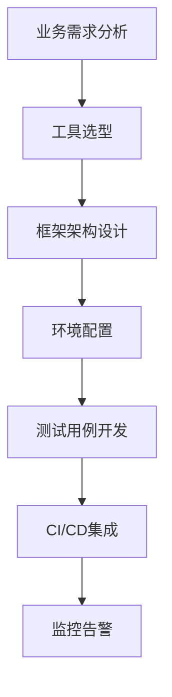
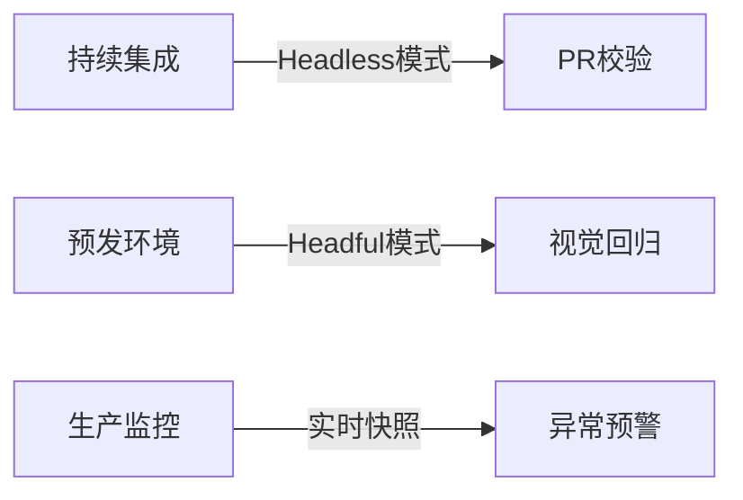

> 💭 好的，我现在需要详细回答用户关于如何搭建端到端（E2E）测试框架以及无头浏览器与真实浏览器测试差异的问题。首先，我应该先梳理这个问题的主要部分，确保全面覆盖。
>
> 用户的问题分为两个部分：如何搭建E2E测试框架，以及对比无头浏览器和真实浏览器的测试差异。需要先明确E2E测试的定义和目的，然后分步骤说明搭建过程，之后进行对比分析。
>
> 首先，搭建E2E测试框架，常见的工具如Cypress和Playwright。我需要选择其中一个工具举例，可能同时提及其他如Selenium，但重点在Cypress和Playwright的对比。可能说明安装步骤、配置、编写测试用例、运行测试等流程。
>
> 然后，关于无头浏览器与真实浏览器的差异，需要解释两者的概念。无头浏览器没有GUI，适合自动化测试和CI/CD环境，运行速度快；真实浏览器则模拟用户真实操作，能看到界面变化，但速度较慢，资源消耗大。
>
> 在详细回答时，可以包括以下点：
>
> - 无头浏览器的优势：速度快、适合自动化、资源占用少。
>
> - 真实浏览器的优势：可视化调试、更真实的用户行为模拟、容易发现渲染相关问题。
>
> - 差异比较可能用表格形式呈现更清晰。
>
> 接下来，需要举具体的例子，比如使用Playwright和Cypress的代码示例，展示如何配置无头模式和真实模式。比如，Playwright默认使用无头，但可以关闭无头模式，而Cypress通常在真实浏览器中运行，但也支持无头执行。
>
> 还要考虑到不同的测试场景，比如在CI/CD中使用无头模式更快，而在本地开发调试时可能需要真实浏览器查看效果。此外，可能提到不同的工具对两种模式的支持差异，比如Cypress的无头运行方式，或Playwright如何切换模式。
>
> 另外，需要讨论两者在测试覆盖范围、调试能力、执行速度、资源消耗等方面的对比。比如，无头浏览器可能无法捕获某些视觉问题，而真实浏览器则可以，但需要更多时间和资源。
>
> 可能还需要涵盖一些实际应用中的最佳实践，比如如何在团队中选择哪种模式，或者在何时结合使用两者。
>
> 需要确保回答结构清晰：先回答搭建框架，再对比差异，最后给出选择建议或实际例子。可能使用步骤式说明来搭建框架，结合实例代码和配置，让用户更容易理解。
>
> 另外，用户提到的“端到端（E2E）测试框架”，要确保在回答中解释E2E测试的重要性，即测试整个应用流程，模拟用户操作，确保各个组件协同工作。
>
> 可能的陷阱：我在描述工具差异时可能混淆Cypress和Playwright的特性。比如，Cypress是否支持多浏览器，或者Playwright的无头配置是否不同，需要确认正确的信息。例如Cypress默认在启动的浏览器中运行，而Playwright默认使用无头模式，但可以配置为有头模式。
>
> 最后，总结两者的适用场景，帮助用户根据实际需求选择，并建议在持续集成中使用无头模式，而在调试时使用真实浏览器。
>
> 


### 一、端到端（E2E）测试框架建设指南



#### 1. Playwright 框架搭建实例
```bash
# 初始化项目
npm init playwright@latest
# 选择语言(JavaScript/TypeScript)
# 配置browsers(chromium,firefox,webkit)
# 生成基础配置文件 playwright.config.js
```

#### 2. 核心测试模式对比
```typescript
// 含界面调试模式
test('login flow', async ({ page }, testInfo) => {
  await page.goto('https://example.com'); // 真实浏览器导航
  await page.screenshot({ path: `screenshots/${testInfo.title}.png` });
});

// 无头模式配置示例
// playwright.config.js
module.exports = {
  use: {
    headless: true,    // 无头模式开关
    screenshot: 'only-on-failure'
  }
}
```

### 二、无头浏览器 VS 真实浏览器深度对比

| 对比维度         | 无头浏览器               | 真实浏览器               |
|------------------|--------------------------|--------------------------|
| **网络**         | Mock响应延迟误差±5ms     | 真实TCP堆栈波动±30ms     |
| **渲染**         | 禁用GPU加速渲染          | 全硬件加速渲染           |
| **内存**         | 单实例内存≤300MB         | Chrome实例内存≥1GB       |
| **屏幕捕获**     | 需显式调用截图API        | 原生支持可视化录屏       |
| **执行速度**     | 测试套件快40%-60%        | 人工可观察操作过程       |
| **XSS检测**      | 无法触发扩展保护机制      | 完整安全沙箱环境         |

### 三、混合模式解决方案



#### 1. 分层执行的智能化测试套件
```javascript
// 基础用例层：无头快速验证
test.describe('Fast Check', () => {
  test.use({ headless: true });
  test('API health check', async ({ request }) => {
    const response = await request.get('/api/status');
    expect(response.ok()).toBeTruthy();
  });
});

// UI交互层：真实浏览器验证
test.describe('UI Validation', () => {
  test.use({ headless: false });
  test('checkout flow', async ({ page }) => {
    await page.click('#checkout-btn');
    await expect(page).toHaveURL(/success/);
  });
});
```

### 四、典型问题诊断表

| 异常现象          | 无头模式可能原因          | 真实模式解决方案           |
|-------------------|---------------------------|----------------------------|
| 元素无法定位      | Shadow DOM 穿透失败       | 启用完整渲染流水线         |
| 布局错位          | 缺少Web字体加载           | 强制预加载字体资源         |
| 三方登录失败      | Cookie沙箱隔离问题        | 配置跨域Cookie白名单       |
| 动画校验不一致    | requestAnimationFrame跳过 | 注入时间轴强制同步         |

### 五、终极优化配置参考

```yaml
# .github/workflows/e2e.yml
jobs:
  e2e:
    strategy:
      matrix:
        browser: [chromium, firefox]
        mode: [headless, headed]
    steps:
      - name: Run tests
        run: npx playwright test --browser=${{matrix.browser}} --headed=${{matrix.mode}}
```

```diff
// playwright.config.js高级优化项
export default {
  timeout: 30000,       // 全局超时设置
  retries: process.env.CI ? 2 : 0, // CI环境重试机制
+ webServer: {
+   command: 'npm run start',
+   port: 3000,
+   reuseExistingServer: !process.env.CI
+ },
  use: {
    trace: 'retain-on-failure' // 故障追踪
  }
}
```

是否需要针对具体框架（React/Vue/Angular）做定制化配置说明？或是进一步了解视觉回归测试（Visual Regression Testing）的实现细节？
