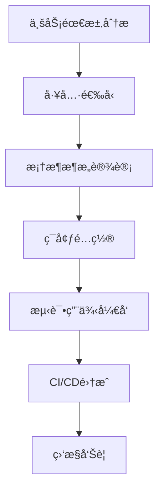
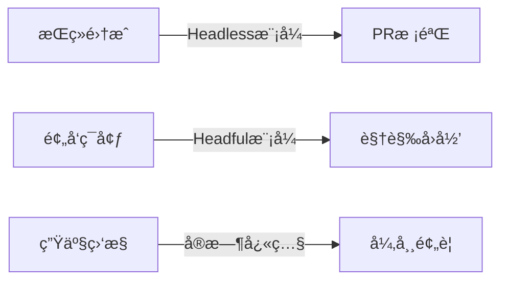

> 💭 好的，我ç°åœ¨éœ€è¦è¯¦ç»†å›ç­”用户关äºå¦‚何æ­å»ºç«¯åˆ°ç«¯ï¼ˆE2E）测试框æ¶ä»¥åŠæ— å¤´æµè§ˆå™¨ä¸çœŸå®æµè§ˆå™¨æµ‹è¯•å·®å¼‚的问题。首先，我应该先梳ç†è¿™ä¸ªé—®é¢˜çš„主è¦éƒ¨åˆ†ï¼Œç¡®ä¿å…¨é¢è¦†ç›–。
>
> 用户的问题分为两个部分：如何æ­å»ºE2E测试框æ¶ï¼Œä»¥åŠå¯¹æ¯”无头æµè§ˆå™¨å’ŒçœŸå®æµè§ˆå™¨çš„测试差异。需è¦å…ˆæ˜ç¡®E2E测试的定义和目的，然å分步骤说æ˜æ­å»ºè¿‡ç¨‹ï¼Œä¹‹å进行对比分æ。
>
> 首先，æ­å»ºE2E测试框æ¶ï¼Œå¸¸è§çš„工具如Cypresså’ŒPlaywright。我需è¦é€‰æ‹©å…¶ä¸­ä¸€ä¸ªå·¥å…·ä¸¾ä¾‹ï¼Œå¯èƒ½åŒæ—¶æåŠå…¶ä»–如Selenium，但é‡ç‚¹åœ¨Cypresså’ŒPlaywright的对比。å¯èƒ½è¯´æ˜å®‰è£…步骤ã€é…ç½®ã€ç¼–写测试用例ã€è¿è¡Œæµ‹è¯•ç­‰æµç¨‹ã€‚
>
> 然å，关äºæ— å¤´æµè§ˆå™¨ä¸çœŸå®æµè§ˆå™¨çš„差异，需è¦è§£é‡Šä¸¤è€…的概念。无头æµè§ˆå™¨æ²¡æœ‰GUI，适åˆè‡ªåŠ¨åŒ–测试和CI/CDç¯å¢ƒï¼Œè¿è¡Œé€Ÿåº¦å¿«ï¼›çœŸå®æµè§ˆå™¨åˆ™æ¨¡æ‹Ÿç”¨æˆ·çœŸå®æ“作，能看到界é¢å˜åŒ–，但速度较慢，资æºæ¶ˆè€—大。
>
> 在详细å›ç­”时，å¯ä»¥åŒ…括以下点：
>
> - 无头æµè§ˆå™¨çš„优势：速度快ã€é€‚åˆè‡ªåŠ¨åŒ–ã€èµ„æºå ç”¨å°‘。
>
> - 真å®æµè§ˆå™¨çš„优势：å¯è§†åŒ–调试ã€æ›´çœŸå®çš„用户行为模拟ã€å®¹æ˜“å‘ç°æ¸²æŸ“相关问题。
>
> - 差异比较å¯èƒ½ç”¨è¡¨æ ¼å½¢å¼å‘ˆç°æ›´æ¸…晰。
>
> æ¥ä¸‹æ¥ï¼Œéœ€è¦ä¸¾å…·ä½“的例å­ï¼Œæ¯”如使用Playwrightå’ŒCypress的代ç ç¤ºä¾‹ï¼Œå±•ç¤ºå¦‚何é…置无头模å¼å’ŒçœŸå®æ¨¡å¼ã€‚比如，Playwright默认使用无头，但å¯ä»¥å…³é—­æ— å¤´æ¨¡å¼ï¼Œè€ŒCypress通常在真å®æµè§ˆå™¨ä¸­è¿è¡Œï¼Œä½†ä¹Ÿæ”¯æŒæ— å¤´æ‰§è¡Œã€‚
>
> 还è¦è€ƒè™‘到ä¸åŒçš„测试场景，比如在CI/CD中使用无头模å¼æ›´å¿«ï¼Œè€Œåœ¨æœ¬åœ°å¼€å‘调试时å¯èƒ½éœ€è¦çœŸå®æµè§ˆå™¨æŸ¥çœ‹æ•ˆæœã€‚此外，å¯èƒ½æ到ä¸åŒçš„工具对两ç§æ¨¡å¼çš„支æŒå·®å¼‚，比如Cypress的无头è¿è¡Œæ–¹å¼ï¼Œæˆ–Playwright如何切æ¢æ¨¡å¼ã€‚
>
> å¦å¤–，需è¦è®¨è®ºä¸¤è€…在测试覆盖范围ã€è°ƒè¯•èƒ½åŠ›ã€æ‰§è¡Œé€Ÿåº¦ã€èµ„æºæ¶ˆè€—等方é¢çš„对比。比如，无头æµè§ˆå™¨å¯èƒ½æ— æ³•æ•è·æŸäº›è§†è§‰é—®é¢˜ï¼Œè€ŒçœŸå®æµè§ˆå™¨åˆ™å¯ä»¥ï¼Œä½†éœ€è¦æ›´å¤šæ—¶é—´å’Œèµ„æºã€‚
>
> å¯èƒ½è¿˜éœ€è¦æ¶µç›–一些å®é™…应用中的最佳å®è·µï¼Œæ¯”如如何在团队中选择哪ç§æ¨¡å¼ï¼Œæˆ–者在何时结åˆä½¿ç”¨ä¸¤è€…。
>
> 需è¦ç¡®ä¿å›ç­”结æ„清晰：先å›ç­”æ­å»ºæ¡†æ¶ï¼Œå†å¯¹æ¯”差异，最å给出选择建议或å®é™…例å­ã€‚å¯èƒ½ä½¿ç”¨æ­¥éª¤å¼è¯´æ˜æ¥æ­å»ºæ¡†æ¶ï¼Œç»“åˆå®ä¾‹ä»£ç å’Œé…置，让用户更容易ç†è§£ã€‚
>
> å¦å¤–，用户æ到的“端到端（E2E）测试框æ¶â€ï¼Œè¦ç¡®ä¿åœ¨å›ç­”中解释E2E测试的é‡è¦æ€§ï¼Œå³æµ‹è¯•æ•´ä¸ªåº”用æµç¨‹ï¼Œæ¨¡æ‹Ÿç”¨æˆ·æ“作，确ä¿å„个组件ååŒå·¥ä½œã€‚
>
> å¯èƒ½çš„陷阱：我在æ述工具差异时å¯èƒ½æ··æ·†Cypresså’ŒPlaywright的特性。比如，Cypress是å¦æ”¯æŒå¤šæµè§ˆå™¨ï¼Œæˆ–者Playwright的无头é…置是å¦ä¸åŒï¼Œéœ€è¦ç¡®è®¤æ­£ç¡®çš„ä¿¡æ¯ã€‚例如Cypress默认在å¯åŠ¨çš„æµè§ˆå™¨ä¸­è¿è¡Œï¼Œè€ŒPlaywright默认使用无头模å¼ï¼Œä½†å¯ä»¥é…置为有头模å¼ã€‚
>
> 最å，总结两者的适用场景，帮助用户根æ®å®é™…需求选择，并建议在æŒç»­é›†æˆä¸­ä½¿ç”¨æ— å¤´æ¨¡å¼ï¼Œè€Œåœ¨è°ƒè¯•æ—¶ä½¿ç”¨çœŸå®æµè§ˆå™¨ã€‚
>
> 


### 一ã€ç«¯åˆ°ç«¯ï¼ˆE2E）测试框æ¶å»ºè®¾æŒ‡å—



#### 1. Playwright 框æ¶æ­å»ºå®ä¾‹
```bash
# åˆå§‹åŒ–项目
npm init playwright@latest
# 选择语言(JavaScript/TypeScript)
# é…ç½®browsers(chromium,firefox,webkit)
# 生æˆåŸºç¡€é…置文件 playwright.config.js
```

#### 2. 核心测试模å¼å¯¹æ¯”
```typescript
// å«ç•Œé¢è°ƒè¯•æ¨¡å¼
test('login flow', async ({ page }, testInfo) => {
  await page.goto('https://example.com'); // 真å®æµè§ˆå™¨å¯¼èˆª
  await page.screenshot({ path: `screenshots/${testInfo.title}.png` });
});

// 无头模å¼é…置示例
// playwright.config.js
module.exports = {
  use: {
    headless: true,    // 无头模å¼å¼€å…³
    screenshot: 'only-on-failure'
  }
}
```

### 二ã€æ— å¤´æµè§ˆå™¨ VS 真å®æµè§ˆå™¨æ·±åº¦å¯¹æ¯”

| 对比维度         | 无头æµè§ˆå™¨               | 真å®æµè§ˆå™¨               |
|------------------|--------------------------|--------------------------|
| **网络**         | Mockå“应延迟误差±5ms     | 真å®TCP堆栈波动±30ms     |
| **渲染**         | ç¦ç”¨GPU加速渲染          | 全硬件加速渲染           |
| **内存**         | å•å®ä¾‹å†…存≤300MB         | Chromeå®ä¾‹å†…存≥1GB       |
| **å±å¹•æ•è·**     | 需显å¼è°ƒç”¨æˆªå›¾API        | åŸç”Ÿæ”¯æŒå¯è§†åŒ–å½•å±       |
| **执行速度**     | 测试套件快40%-60%        | 人工å¯è§‚察æ“作过程       |
| **XSS检测**      | 无法触å‘扩展ä¿æŠ¤æœºåˆ¶      | 完整安全沙箱ç¯å¢ƒ         |

### 三ã€æ··åˆæ¨¡å¼è§£å†³æ–¹æ¡ˆ



#### 1. 分层执行的智能化测试套件
```javascript
// 基础用例层：无头快速验è¯
test.describe('Fast Check', () => {
  test.use({ headless: true });
  test('API health check', async ({ request }) => {
    const response = await request.get('/api/status');
    expect(response.ok()).toBeTruthy();
  });
});

// UI交互层：真å®æµè§ˆå™¨éªŒè¯
test.describe('UI Validation', () => {
  test.use({ headless: false });
  test('checkout flow', async ({ page }) => {
    await page.click('#checkout-btn');
    await expect(page).toHaveURL(/success/);
  });
});
```

### å››ã€å…¸å‹é—®é¢˜è¯Šæ–­è¡¨

| 异常ç°è±¡          | 无头模å¼å¯èƒ½åŸå›           | 真å®æ¨¡å¼è§£å†³æ–¹æ¡ˆ           |
|-------------------|---------------------------|----------------------------|
| å…ƒç´ æ— æ³•å®šä½      | Shadow DOM ç©¿é€å¤±è´¥       | å¯ç”¨å®Œæ•´æ¸²æŸ“æµæ°´çº¿         |
| å¸ƒå±€é”™ä½          | 缺少Web字体加载           | å¼ºåˆ¶é¢„åŠ è½½å­—ä½“èµ„æº         |
| 三方登录失败      | Cookie沙箱隔离问题        | é…置跨域Cookie白åå•       |
| 动画校验ä¸ä¸€è‡´    | requestAnimationFrame跳过 | 注入时间轴强制åŒæ­¥         |

### 五ã€ç»ˆæ优化é…ç½®å‚考

```yaml
# .github/workflows/e2e.yml
jobs:
  e2e:
    strategy:
      matrix:
        browser: [chromium, firefox]
        mode: [headless, headed]
    steps:
      - name: Run tests
        run: npx playwright test --browser=${{matrix.browser}} --headed=${{matrix.mode}}
```

```diff
// playwright.config.js高级优化项
export default {
  timeout: 30000,       // 全局超时设置
  retries: process.env.CI ? 2 : 0, // CIç¯å¢ƒé‡è¯•æœºåˆ¶
+ webServer: {
+   command: 'npm run start',
+   port: 3000,
+   reuseExistingServer: !process.env.CI
+ },
  use: {
    trace: 'retain-on-failure' // 故障追踪
  }
}
```

是å¦éœ€è¦é’ˆå¯¹å…·ä½“框æ¶ï¼ˆReact/Vue/Angular）åšå®šåˆ¶åŒ–é…置说æ˜ï¼Ÿæˆ–是进一步了解视觉å›å½’测试（Visual Regression Testing）的å®ç°ç»†èŠ‚？
