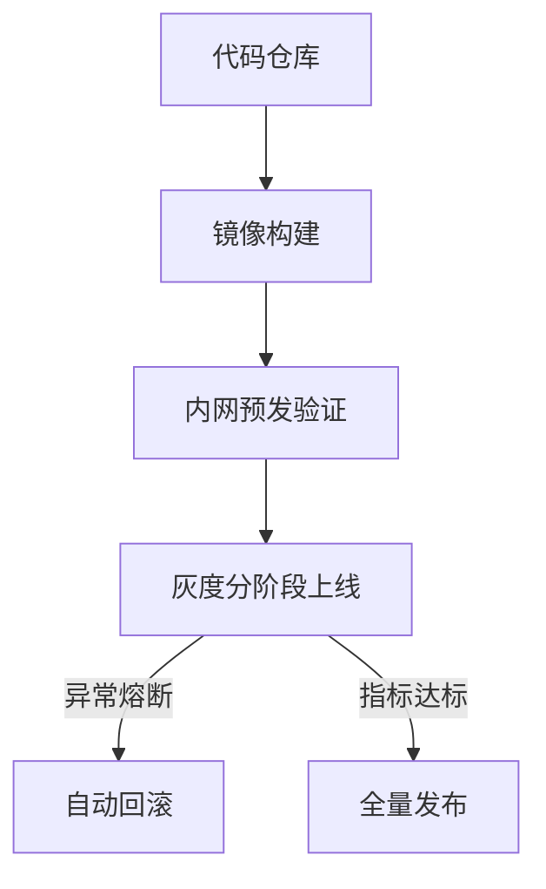
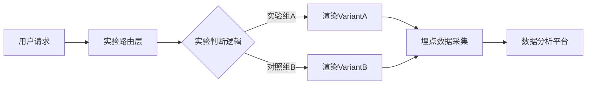
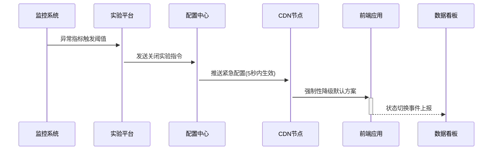

> 💭 好的，用户现在提出了新的问题，关于灰度发布和渐进式发布的工程化实现方案，以及前端如何进行AB测试。我需要从之前的对话背景出发，用户之前已经了解了Jest的Mock和代码覆盖率的原理，以及Redux的单元测试，现在转向部署和测试策略，显然他们在搭建一个完整的开发和部署流程，希望确保各个阶段的代码质量和发布安全。
>
> 首先，灰度发布和渐进式发布是两个相关但略有不同的概念。我需要先区分这两个概念，避免混淆用户。灰度发布通常是指逐步向用户群体推出新版本，比如先让内部员工试用，再逐渐扩大范围到部分用户，最后全面发布。而渐进式发布可能包括多种策略，比如金丝雀发布、蓝绿部署等，不过有时候这两个术语会被混用。另外，用户可能想知道具体的实现方案，比如通过Kubernetes的流量切分、Nginx的权重配置，或者云服务如AWS的发布工具。
>
> 接下来，关于前端AB测试的实现。AB测试通常用于比较不同版本的页面或功能对用户行为的影响。前端需要能够根据用户标签或分组展示不同的UI，并收集数据进行分析。需要考虑如何拆分流量，如何保证用户的一致性（比如同一用户每次访问都看到同一版本），以及如何与后端协作传递实验参数。可能涉及的工具包括Google Optimize、Optimizely，或者自建的系统。
>
> 我需要详细阐述以下几个方面：
>
> 1. 灰度发布的工程化方案：
>
>    - 基于基础设施的流量控制：使用Kubernetes的Service Mesh（如Istio）进行流量切分，设置不同版本的Pod，并通过VirtualService分配流量比例。
>
>    - 使用网关层路由：如Nginx的split_clients模块，根据客户端IP或Cookie来决定转发到哪个版本。
>
>    - 特征标控制：通过用户ID、设备类型、地理位置等特征进行用户分桶，在应用层实现路由逻辑。
>
> 2. 前端AB测试的实现要点：
>
>    - 实验分组逻辑：确定随机分组的算法，如基于用户ID的哈希取模，确保同一用户始终进入同一分组。
>
>    - 动态加载配置：通过配置中心或CDN动态获取实验方案，无需重新部署代码。
>
>    - 数据收集与分析：与数据分析平台集成，跟踪关键指标如点击率、转化率等。
>
>    - 代码层面的无侵入设计：使用高阶组件或装饰器模式，将AB测试逻辑与业务代码分离，便于维护和下线实验。
>
> 在讲解实现方案时，可能需要举例说明具体的代码或配置，比如如何使用Nginx配置流量分割，或者前端如何根据不同分组渲染不同组件。同时，应该提到灰度发布和AB测试的监控与回滚机制，确保在出现问题时能够快速响应。
>
> 用户的深层需求可能包括如何在不影响用户体验的情况下安全地验证新功能，以及如何高效收集和分析测试数据。因此，除了技术实现，还需要简要提及最佳实践，比如逐步扩大流量比例、设置关键指标阈值、自动化监控报警等。
>
> 可能需要注意的点：
>
> - 灰度发布和AB测试的关系：AB测试可以作为灰度发布的一部分，用于比较不同版本的性能。
>
> - 前后端协作：某些AB测试需要后端配合返回不同数据，需要考虑接口的兼容性。
>
> - 数据一致性：确保实验期间的日志收集准确无误，避免数据污染。
>
> - 用户体验一致性：确保用户在不同阶段或不同分组中的体验连贯，比如同一用户在不同设备上应属于同一分组。
>
> 需要避免过于深入特定工具的实现，而是聚焦于通用方案和原理，同时给出具体的例子帮助用户理解。
>
> 


### 一、灰度发布五级递进实施方案



#### 1. 灰度规则引擎实现
```nginx
# Nginx流量分割策略示例
split_clients $request_id $variant {
    10%     "v2_service";
    20%     "v1.1_canary";
    70%     "v1_stable";
}

upstream v2_service {
    server 10.1.0.1:8080;
}

location /api {
    proxy_pass http://$variant; 
}
```

#### 2. Kubernetes精细化控制
```yaml
# Istio VirtualService 配置
apiVersion: networking.istio.io/v1alpha3
kind: VirtualService
spec:
  hosts:
  - product-service
  http:
  - route:
    - destination:
        host: product-service
        subset: v1
      weight: 90
    - destination:
        host: product-service
        subset: v2-canary
      weight: 10
```

### 二、前端AB测试技术矩阵



#### 1. 分组策略核心代码
```javascript
// 确定性哈希分组算法
function getExperimentGroup(userId, experimentId) {
  const hash = cyrb128(userId + experimentId)[0];
  return hash % 100 < 20 ? 'A' : 'B'; // 20%流量分配实验组A
}

// AB测试组件封装
const withABTest = (experimentId, variants) => (WrappedComponent) => {
  return (props) => {
    const userId = getCurrentUserID();
    const variant = getExperimentGroup(userId, experimentId);
    return <WrappedComponent {...props} variant={variants[variant]} />;
  };
};
```

### 三、关键架构分层设计

| 层级        | 功能组件                      | 技术实现示例                          |
|-------------|-----------------------------|-------------------------------------|
| 流量入口层   | 用户身份标识                  | Cookie指纹/SDK设备ID生成             |
| 策略决策层   | 实验规则引擎                  | 规则引擎服务/动态配置中心              |
| 渲染执行层   | 差异化UI组件                 | React高阶组件/Vue混合指令              |
| 数据采集层   | 行为日志收集                  | Beacon API/WebSocket实时上报           |
| 分析决策层   | 实验效果可视化                | ELK Stack/Tableau实时看板             |

### 四、实验平台配置化示例

```json
{
  "experimentId": "2023_checkout_button",
  "description": "结账按钮颜色优化实验",
  "owner": "growth-team",
  "variants": {
    "A": {"color": "#FF4500", "text": "立即购买"},
    "B": {"color": "#20B2AA", "text": "马上抢购"}
  },
  "metrics": ["conversion_rate", "avg_order_value"],
  "targetUsers": ["china_mobile_users"],
  "rolloutStrategy": {
    "startTime": "2023-07-01T00:00:00Z",
    "stages": [
      {"duration": "24h", "trafficPercent": 5},
      {"duration": "48h", "trafficPercent": 30},
      {"duration": "72h", "trafficPercent": 100}
    ]
  }
}
```

### 五、数据对比洞察模型

```javascript
// 实验效果验证算法示例
function calculateImprovement(control, treatment) {
  const conversionDiff = treatment.conversionRate - control.conversionRate;
  const confidence = mannWhitneyUTest(control.samples, treatment.samples);
  
  return {
    effectSize: conversionDiff,
    statisticalSignificance: confidence > 0.95,
    samplesNeeded: powerAnalysis(0.8, 0.05)
  };
}
```

### 六、灾难熔断恢复机制


是否需要继续深入：
1. 如何设计用户分桶算法避免流量倾斜
2. 用户身份标识体系的最佳实践方案
3. 多变量正交实验的实现原理
4. 无服务化架构下的灰度发布特殊处理？
