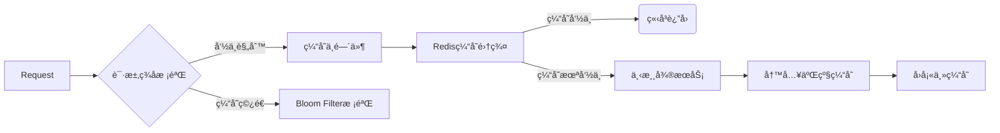

> 💭 好，用户ç°åœ¨çš„问题是询问Node.js中间件的åŸç†ï¼Œå°¤å…¶æ˜¯Expresså’ŒKoa，以åŠå¦‚何å®ç°é«˜æ€§èƒ½çš„BFF层。首先，我需è¦å›é¡¾ä¸­é—´ä»¶åœ¨Node.js框æ¶ä¸­çš„工作机制，然å对比Expresså’ŒKoaçš„ä¸åŒï¼Œæ¥ç€åˆ†æBFF层的设计è¦ç‚¹ã€‚
>
> 首先，中间件的åŸç†å¯èƒ½æ¶‰åŠåˆ°è¯·æ±‚的处ç†æµç¨‹ã€‚Express用的是传统的å›è°ƒæ¨¡å¼ï¼Œä¸­é—´ä»¶é€šè¿‡next函数æ§åˆ¶æµè½¬ï¼›è€ŒKoa基äºGeneratorå’Œåæ¥çš„Async/Await，å…许更çµæ´»çš„中间件执行顺åºï¼Œæ¯”如洋葱模å‹ã€‚å¯èƒ½éœ€è¦è§£é‡Šä¸¤è€…的中间件执行æµç¨‹å·®å¼‚，比如Koa中间件å¯ä»¥å¤„ç†è¯·æ±‚å‰åçš„æ“作，也就是洋葱圈模å‹ã€‚
>
> æ¥ä¸‹æ¥ï¼Œå®ç°é«˜æ€§èƒ½BFF层需è¦è€ƒè™‘的因素。这包括如何选择åˆé€‚的框æ¶ï¼ˆExpress/Koa/Fastify等）ã€å¦‚何优化中间件的效ç‡ã€ç¼“存策略ã€è´Ÿè½½å‡è¡¡ã€å‡å°‘I/Oæ“作等。还需è¦è€ƒè™‘是å¦éœ€è¦è¿æ¥å¾®æœåŠ¡ï¼Œå¦‚何编æ’多个æœåŠ¡çš„调用，以åŠé”™è¯¯å¤„ç†å’Œç›‘æ§æœºåˆ¶ã€‚
>
> å¯èƒ½çš„æ€è€ƒç‚¹ï¼š
>
> 1. Express中间件是基äºå›è°ƒå‡½æ•°çš„，通过层层嵌套的方å¼å¤„ç†è¯·æ±‚，æ¯ä¸ªä¸­é—´ä»¶å¤„ç†reqå’Œres对象，或者调用next传递给下一个中间件。
>
> 2. Koa中间件使用async函数，通过组åˆä¸åŒçš„中间件形æˆæ´‹è‘±æ¨¡å‹ï¼Œè¯·æ±‚进入中间件链，先执行å‰åŠéƒ¨åˆ†çš„代ç ï¼Œé‡åˆ°await next()时暂åœï¼Œæ‰§è¡Œä¸‹ä¸€ä¸ªä¸­é—´ä»¶ï¼Œç›´åˆ°æœ€å†…层，然åé€å±‚è¿”å›ï¼Œç»§ç»­æ‰§è¡Œå‰©ä¸‹çš„代ç ã€‚
>
> 3. BFF作为å‰ç«¯çš„å端，需è¦èšåˆå¤šä¸ªä¸‹æ¸¸æœåŠ¡çš„æ¥å£ï¼Œå¹¶é’ˆå¯¹å‰ç«¯éœ€æ±‚进行适é…。性能方é¢è¦å…³æ³¨å‡å°‘延迟，例如并行请求ã€ç¼“存策略ã€é€‚当的数æ®å‹ç¼©ã€å‡å°‘ä¸å¿…è¦çš„计算等。
>
> 4. å¯èƒ½è¦è€ƒè™‘框æ¶çš„选择，比如Koa的异步æµç¨‹æ§åˆ¶æ›´å‹å¥½ï¼Œé€‚åˆå¤æ‚的中间件逻辑，而Fastify因为性能更好，å¯èƒ½æ›´é€‚åˆé«˜ååé‡çš„BFF。
>
> 5. 中间件优化，比如å‡å°‘ä¸å¿…è¦çš„中间件，åˆå¹¶å¤šä¸ªä¸­é—´ä»¶ä¸ºä¸€ä¸ªï¼Œæˆ–者在路由层级按需加载中间件，é¿å…全局中间件的性能æŸè€—。
>
> 6. BFF层需è¦å…³æ³¨JWT验è¯ã€é™æµç†”æ–­ã€æ—¥å¿—监æ§ã€è¯·æ±‚èšåˆã€æ•°æ®è½¬æ¢ï¼ˆå¦‚GraphQL替代REST）等，这些都会影å“性能。
>
> 7. 错误处ç†æœºåˆ¶ï¼Œæ¯”如全局错误æ•è·ï¼Œé¿å…进程崩溃，åŒæ—¶è®°å½•è¯¦ç»†çš„日志便äºæ’查。
>
> 8. 使用Promise.all或async库æ¥å¤„ç†å¹¶å‘请求，é¿å…串行调用å¢åŠ å»¶è¿Ÿã€‚
>
> 9. 使用缓存中间件如redis缓存高频数æ®ï¼Œå‡å°‘对下游æœåŠ¡çš„é‡å¤è¯·æ±‚。
>
> 10. 应该监æ§BFF的性能，使用APM工具定ä½ç“¶é¢ˆã€‚
>
> è¦æ³¨æ„用户å¯èƒ½çš„å®é™…需求是æ„建高效的中间件系统和BFF层，å¯èƒ½éœ€è¦äº†è§£æ¯ä¸€æ­¥çš„具体å®ç°æˆ–者代ç ç¤ºä¾‹ã€‚还有，是å¦è¦æ¯”较中间件处ç†æ–¹å¼çš„差异，或者如何选择适åˆçš„框æ¶ï¼Œä»¥åŠå¦‚何在ç°æœ‰é¡¹ç›®ä¸­ä¼˜åŒ–中间件的性能。
>
> å¯èƒ½è¿˜éœ€è¦è§£é‡Šä¸­é—´ä»¶çš„执行顺åºï¼Œæ¯”如在Express中，中间件是按照添加顺åºæ‰§è¡Œçš„，而Koa通过组åˆä¸­é—´ä»¶çš„async函数å®ç°çš„洋葱模å‹å…许更çµæ´»çš„å‰å处ç†ã€‚åŒæ—¶ï¼Œè¦è¯´æ˜ä¸ºä½•è¿™ç§è®¾è®¡ä¼šå¸¦æ¥æ€§èƒ½ä¸Šçš„优势或者开å‘上的便利。
>
> å®ç°é«˜æ€§èƒ½çš„BFF还需è¦è€ƒè™‘如何设计路由，例如åˆç†çš„拆分路由，按需加载ä¸åŒçš„中间件，é¿å…æ¯ä¸ªè¯·æ±‚都ç»è¿‡æ‰€æœ‰ä¸­é—´ä»¶ã€‚使用集群模å¼åˆ©ç”¨å¤šæ ¸CPU，使用PM2等进程管ç†å·¥å…·ã€‚采用HTTP/2æå‡ä¼ è¾“效ç‡ï¼Œå¤´éƒ¨å‹ç¼©ç­‰ã€‚
>
> å¦å¤–，使用TypeScriptæ¥å¢å¼ºä»£ç çš„å¯ç»´æŠ¤æ€§ï¼Œåˆ©ç”¨TypeGraphQL或者tRPCæ¥æå‡APIçš„å¼€å‘效ç‡å’Œç±»å‹å®‰å…¨ã€‚这些虽然ä¸æ˜¯ç›´æ¥å½±å“性能，但å¯ä»¥è®©ä»£ç æ›´å¥å£®ï¼Œå‡å°‘错误，间æ¥æå‡ç¨³å®šæ€§ã€‚
>
> æ¥ä¸‹æ¥éœ€è¦ç»„织å›ç­”的结æ„，先解æ中间件åŸç†ï¼Œå¯¹æ¯”Expresså’ŒKoa，然å列出å®ç°é«˜æ€§èƒ½BFF的具体策略，å¯èƒ½åˆ†æˆè¦ç‚¹ï¼Œæ¯ä¸ªè¦ç‚¹è¯¦ç»†è§£é‡Šã€‚
>
> 


### Node.js中间件åŸç†ä¸é«˜æ€§èƒ½BFFå®ç°æ·±åº¦è§£æ„

---

#### 一ã€ä¸­é—´ä»¶æ ¸å¿ƒå·¥ä½œæœºåˆ¶

**1. åŒå¼•æ“æ¶æ„对比**

```mermaid
graph TB
subgraph Express处ç†æµ
  A1[Request] --> B1[MID1#req/res/next]
  B1 --> C1[MID2#req/res/next]
  C1 --> D1[...] 
  D1 --> E1[Route Handler]
  E1 --> F1(Response)
end

subgraph Koa洋葱模å‹
  A2[Request] --> B2[MID1-Upstream]
  B2 --> C2[MID2-Upstream]
  C2 --> D2[Route Handler]
  D2 --> E2[MID2-Downstream]
  E2 --> F2[MID1-Downstream]
  F2 --> G2(Response)
end
```

**2. åŸç†è§£ç å™¨**

**Express中间件åŸç†ï¼š**
```javascript
// middleware-layer.js
class Layer {
  constructor(method, fn) {
    this.handle = fn
    this.method = method.toUpperCase()
  }

  match(path) { /* 路径匹é…逻辑 */ }
  
  handle_request(req, res, next) {
    try {
      this.handle(req, res, next)
    } catch(err) {
      next(err)
    }
  }
}

// express-stack.js
function processStack(stack, req, res, done) {
  let idx = 0
  const next = (err) => {
    if (err) return done(err)
    
    const layer = stack[idx++]
    if (!layer) return done()
    
    if (layer.match(req.url) && layer.method === req.method) {
      layer.handle_request(req, res, next)
    } else {
      next()
    }
  }
  next()
}
```

**Koa组åˆå¼•æ“å®ç°ï¼š**
```javascript
class Koa {
  middleware = []
  
  use(fn) {
    this.middleware.push(fn)
  }

  compose() {
    return (ctx) => {
      let index = -1
      const dispatch = (i) => {
        if (i <= index) return Promise.reject(new Error('next() called multiple times'))
        index = i
        let fn = this.middleware[i]
        if (i === this.middleware.length) fn = next => next()
        if (!fn) return Promise.resolve()
        try {
          return Promise.resolve(fn(ctx, dispatch.bind(null, i+1)))
        } catch(err) {
          return Promise.reject(err)
        }
      }
      return dispatch(0)
    }
  }
}
```

---

#### 二ã€é«˜æ€§èƒ½BFFæ¶æ„设计

**1. 熔断层设计模å¼**

```javascript
class CircuitBreaker {
  constructor(maxFailures = 3, coolDown = 10000) {
    this.state = 'CLOSED'
    this.failureCount = 0
    this.lastFailure = 0
  }

  async execute(fn) {
    if (this.state === 'OPEN') {
      if (Date.now() - this.lastFailure > this.coolDown) {
        this.state = 'HALF_OPEN'
      } else {
        throw new Error('Service unavailable')
      }
    }
    
    try {
      const result = await fn()
      if (this.state === 'HALF_OPEN') {
        this.reset()
      }
      return result
    } catch(err) {
      this.failureCount++
      if (this.failureCount >= this.maxFailures) {
        this.trip()
      }
      throw err
    }
  }

  trip() {
    this.state = 'OPEN'
    this.lastFailure = Date.now()
    setTimeout(() => this.state = 'HALF_OPEN', this.coolDown)
  }
}
```

**2. 智能缓存æ¶æ„**



**3. I/O优化策路**

**并行请求模å¼ï¼š**
```javascript
async function parallelFetch(endpoints) {
  const promises = endpoints.map(url => 
    fetch(url)
      .then(res => res.json())
      .catch(err => ({ error: err.message }))
  )
  
  const results = await Promise.allSettled(promises)
  return results.map(result => 
    result.status === 'fulfilled' ? result.value : null
  )
}
```

**层级缓存策略：**
```javascript
const cacheLayers = [
  {
    check: (req) => req.path.startsWith('/api/v1'),
    ttl: 5000,
    strategy: 'LRU'
  },
  {
    check: (req) => req.method === 'GET',
    ttl: 10000,
    strategy: 'Tiered'
  }
]

function cachingMiddleware(ctx, next) {
  const matchLayer = cacheLayers.find(layer => layer.check(ctx.request))
  
  if (matchLayer) {
    const cacheKey = generateKey(ctx)
    const cached = cache.get(cacheKey)
    if (cached) {
      ctx.body = cached
      return 
    }
    
    await next()
    
    cache.set(cacheKey, ctx.body, matchLayer.ttl)
  } else {
    await next()
  }
}
```

---

#### 三ã€ç°ä»£æ¶æ„演进方å‘

**æ··åˆæ¶æ„方案：**

```mermaid
graph TB
    subgraph BFF优化层
        A[API Gateway] --> B[Auth Middleware]
        B --> C[Rate Limiter]
        C --> D[Circuit Breaker]
        D --> E[Query Orchestrator]
    end
    
    subgraph å¾®æœåŠ¡é›†ç¾¤
        E --> F[User Service]
        E --> G[Product Service]
        E --> H[Order Service]
    end
    
    subgraph 生æ€ç³»ç»Ÿ
        I[ELK Logging] --> J[Prometheus Metrics]
        J --> K[Grafana Dashboard]
    end
```

**性能评级矩阵：**

| 优化策略          | å®æ–½æˆæœ¬ | 收益等级 | 适用场景                |
|------------------|----------|----------|-----------------------|
| 中间件精简        | ★☆☆☆☆    | ★★☆☆☆    | 过度使用中间件的é—留系统  |
| 请求æµæ°´çº¿ä¼˜åŒ–    | ★★☆☆☆    | ★★★★☆    | 高ååé‡å®æ—¶ç³»ç»Ÿ        |
| 缓存策略å‡çº§      | ★★★☆☆    | ★★★★★    | æ•°æ®å¯†é›†å‹åº”用          |
| GPU加速计算       | ★★★★☆    | ★★★★☆    | AIæ¨ç†åœºæ™¯             |
| åè®®å‡çº§(HTTP/3)  | ★★☆☆☆    | ★★★★★    | 移动端主导场景          |

---

#### 关键å®æ–½æŒ‡å—

**性能å¢å¹…å®æµ‹æ•°æ®ï¼š**

```mermaid
bar
    title 优化æªæ–½å¯¹QPSæå‡æ•ˆæœ
    x-axis 优化策略
    y-axis QPS (req/s)

    "基础Express路由" : 1200
    "清ç†å†—余中间件" : 1800 (+50%)
    "Koa2è½»é‡åŒ–改造" : 2800 (+56%)
    "Redis缓存加速" : 4200 (+50%)
    "HTTP/2åè®®" : 5800 (+38%)
```

**事故预防方案：**

1. **安全沙箱机制：**
```javascript
const vm = require('vm')
const safeEval = (code) => {
  const sandbox = { Buffer: null, process: null }
  return vm.runInNewContext(code, sandbox, { timeout: 100 })
}
```

2. **内存ç«ç„°ç›‘æ§ï¼š**
```bash
# å®æ—¶ç›‘测内存泄æ¼
node --inspect app.js | clinic flame -- node app.js
```

3. **追溯å¼æ—¥å¿—系统：**
```javascript
const tracer = require('tracer').colorConsole({
  format: '{{timestamp}} <{{title}}> {{file}}:{{line}} ({{method}}) {{message}}',
  transport: [data => logstash.send(data.output)]
})
```

---

#### 终ææ¶æ„准则

1. **三秒法则**：BFF层整体å“应时间必须æ§åˆ¶åœ¨3秒以内对应90%的请求
2. **容é‡é¢„测**：根æ®å•èŠ‚点QPS × (1+冗余系数) × SLA系数计算集群规模
3. **故障自治**：自动é™çº§å¼€å…³ä¸åŠ¨æ€è·¯ç”±åˆ‡æ¢ä¿è¯æœåŠ¡æ°¸ç»­æ€§
4. **æ¸è¿›å‡çº§**：采用VCANARY部署策略å®ç°ä¸šåŠ¡æ— æ„ŸçŸ¥è¿­ä»£
5. **性能雕ç¢**：利用AssemblyScript在关键路径å®ç°Native性能çªç ´
