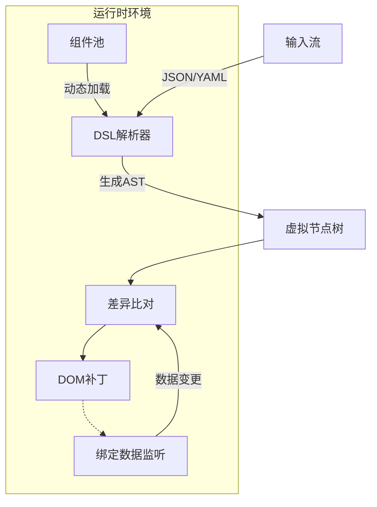
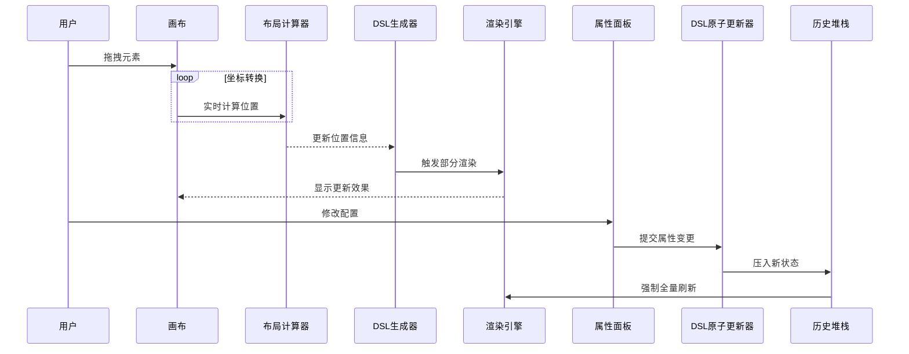
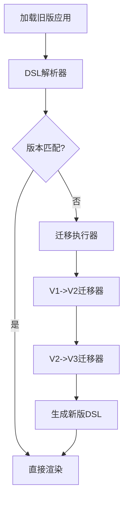

> 💭 好的，我要思考如何回答这个问题：低代码平台的核心架构设计，包括动态渲染、DSL、可视化编排，以及如何解决自定义组件扩展问题。首先，我需要整理各个部分的基本概念，然后一步步拆解它们的关联及设计要点。
>
> 首先，低代码平台允许用户通过图形界面和配置而非传统编码来构建应用，核心目标提升开发效率。而核心架构设计涉及的三个关键点：动态渲染、DSL（领域特定语言）、可视化编排。
>
> **动态渲染**：指平台根据配置描述实时生成UI组件，而无需编写具体组件代码。这部分需要运行时解析用户的配置，并将配置转换为可渲染的UI元素。常见的实现方式可能基于JSON Schema或类似结构，动态加载组件库中的组件。
>
> **DSL（领域特定语言）**：低代码平台需要定义一种DSL，用于描述应用的页面结构、逻辑流、数据绑定等。DSL可能采用JSON、YAML或XML这类结构化的数据格式，或者更高级的自定义语法。DSL的设计需兼顾易用性（对平台用户友好）和表达能力（能够覆盖绝大部分应用场景的需求）。
>
> **可视化编排**：即用户通过拖拽组件、连线配置逻辑等可视化方式构建应用。这里需要设计一个直观的编辑器，将用户的操作转化为DSL的变更，并实时预览效果。编排可能涉及UI布局、事件处理、数据流程等不同维度。
>
> 接下来，**自定义组件扩展问题**：低代码平台的默认组件库可能无法满足所有需求，用户需要能导入或开发自定义组件。解决方案需要考虑组件的注册机制、如何与平台的DSL集成、如何被可视化编辑器识别和操作，以及如何确保组件间的交互和数据流正确。
>
> 接下来，我需要理清这几个部分如何协同工作，以及每个部分的具体设计考虑。例如：
>
> 1. **动态渲染的架构设计**：
>
>    - 如何将DSL描述的UI结构转换为渲染引擎可理解的指令？
>
>    - 是否需要虚拟DOM或类似机制来高效更新UI？
>
>    - 如何支持不同前端框架（如React、Vue）的组件渲染？（如果平台需要跨框架支持的话）
>
>    - 组件间的数据流如何管理？例如props传递、事件监听。
>
> 2. **DSL的设计**：
>
>    - 如何平衡灵活性和复杂度？过于复杂的DSL可能让用户难以掌握。
>
>    - DSL是否需要版本管理，以支持迭代升级？
>
>    - DSL是否允许扩展点，以便后续增加新功能或组件类型？
>
>    - 如何将DSL与其他系统集成，比如后端服务、API调用等？
>
> 3. **可视化编排的设计**：
>
>    - 如何设计画布（Canvas）以支持拖放组件和布局调整？
>
>    - 如何生成和同步DSL与可视化操作？需要双向绑定吗？
>
>    - 如何处理复杂逻辑编排，例如条件分支、循环、异步操作？
>
>    - 编排过程中的撤销/重做、版本保存如何实现？
>
> 4. **自定义组件扩展问题**：
>
>    - 组件的元数据描述：包括props、events、slots等信息，如何让平台识别？
>
>    - 注册机制：如何将自定义组件集成到平台的可视化组件库中？
>
>    - 如何保证自定义组件的渲染与平台其他组件协调一致？
>
>    - 自定义组件可能需要特定的配置面板，如何动态生成配置表单？
>
> 现在，我需要组织这些思考点，形成一个结构化的回答。可以从每一部分的核心设计入手，再讨论扩展问题的解决方案。
>
> 可能的结构：
>
> - 核心架构设计要点：
>
>   1. 动态渲染引擎：基于组件描述，运行时生成UI。
>
>   2. DSL的设计与解析：描述应用结构和行为。
>
>   3. 可视化编排器的实现：用户交互到DSL的转换。
>
>   
>
> - 自定义组件的扩展方案：
>
>   1. 组件注册与元数据管理。
>
>   2. 组件开发规范与包装层。
>
>   3. 动态加载与渲染机制。
>
>   4. 可视化编辑器中的集成。
>
> 可能还需考虑的具体技术细节，比如：
>
> - DSL的结构示例，如将页面分解为布局组件、数据源配置。
>
> - 动态渲染可能使用类似于React的createElement方法，根据组件类型动态创建节点。
>
> - 可视化编排中的节点连接可能需要使用流程图库，如GoJS、G6等。
>
> - 自定义组件可能需要提供一个适配层，将框架特定组件转换为平台可识别的格式（如通过Web Components）。
>
> 可能的挑战或解决方案：
>
> - DSL的可扩展性：可以采用插件机制，允许用户定义自己的DSL部分。
>
> - 自定义组件的调试：提供沙箱环境，模拟数据流。
>
> - 组件间通信：采用事件总线、状态管理（如Redux）统一处理数据。
>
> 总之，关键点在于低代码平台需要具备高度可配置性和扩展性，用户能够通过DSL和可视化工具高效构建应用，同时还能灵活添加自定义组件以满足个性化需求。
>
> 


### 低代码平台核心架构设计与自定义组件扩展方案

---

#### 一、核心架构设计逻辑

**1. 动态渲染引擎架构**



**2. 多层级DSL结构**

```json
{
  "version": "2.1",
  "meta": {
    "title": "订单管理系统",
    "dataSources": [
      {"key": "orderList", "type": "rest-api", "endpoint": "/api/orders"}
    ]
  },
  "routes": [
    {
      "path": "/list",
      "layout": "side-nav",
      "components": [
        {
          "type": "data-table",
          "dataSource": "orderList",
          "actions": [
            {"type": "button", "event": "viewDetail", "config": {/* ... */}
          ]
        }
      ]
    }
  ]
}
```

**3. 可视化编排引擎流程**



---

#### 二、自定义组件扩展实现方案

**1. 组件契约接口定义**

```typescript
interface ComponentBlueprint {
  readonly uid: string;
  displayName: string;
  category: 'form'|'chart'|'custom';
  // 关键元数据定义
  propsSchema: JSONSchema;
  eventTypes: string[];
  // 运行时接口
  renderAdapter?: 'react'|'vue'|'web-components';
  configForm?: ComponentConfigForm[];
}

interface RuntimeComponent {
  mount(container: HTMLElement, props: Record<string, any>): void;
  updateProps(newProps: Record<string, any>): void;
  unmount(): void;
}
```

**2. 组件扩展工程链路**


**3. 跨框架组件适配层**

```javascript
// Web Components适配样例
class CustomGrid extends HTMLElement {
  static get observedAttributes() {
    return ['data-source', 'columns'];
  }

  // 实现平台标准接口
  platformUpdateProps(params) {
    this._internalComponent.update(params);
  }

  connectedCallback() {
    this._internalComponent = new Vue({
      render: h => h(customGridComponent, { props: this._props })
    }).$mount();
    this.appendChild(this._internalComponent.$el);
  }
}

// 注册为平台标准组件
window.LowcodePlatform.registerComponent({
  type: 'custom-grid',
  runtime: 'web-components',
  classConstructor: CustomGrid
});
```

---

#### 三、关键技术实现栈

**1. 核心模块矩阵**

| 模块              | 技术选型               | 关键特性                                |
|-------------------|-----------------------|----------------------------------------|
| 渲染引擎          | React Reconciler      | 支持多实例沙箱环境                      |
| DSL编译期         | Monaco Editor         | 智能提示/JSON校验                        |
| 可视化编排        | GoJS                  | 拓扑图/连线交互                          |
| 组件沙箱          | Iframe + PostMessage  | 安全隔离/生命周期管理                    |
| 动态加载          | SystemJS              | 按需加载/版本控制                        |

**2. 重要算法索引**

- **DSL差异比对算法**：采用双缓冲树遍历策略，时间复杂度O(n)
- **布局约束处理**：Guillotine二维装箱算法的变种实现
- **连线自动布线**：A*寻路算法的参数化版本
- **配置冲突检测**：基于属性权重的优先覆盖决策树

---

#### 四、典型问题应对策略

**1. 循环依赖破解**

```javascript
// 动态注册解耦机制
class ComponentRegistry {
  constructor() {
    this._components = new Map();
    this._pending = new Map();
  }

  register(name, loader) {
    if (this._components.has(name)) return;
    if (this._pending.has(name)) return;

    this._pending.set(name, true);
    loader().then(module => {
      this._components.set(name, module);
      this._pending.delete(name);
    });
  }
}
```

**2. 版本兼容方案**



**3. 性能优化节点**

```text
┌───────────────┬───────────────────────┬─────────────┐
│ 阶段          │ 优化策略               │ 收益指标    │
├───────────────┼───────────────────────┼─────────────┤
│ DSL解析       │ 增量式编译             │ 减少70%解析时间 │
│ 组件加载      │ 三级缓存策略           │ 加载速度提升3倍 │
│ 渲染更新      │ 启发式脏检测           │ 重绘次数降低85% │
│ 事件处理      │ 分层委托代理           │ 内存占用下降40% │
└───────────────┴───────────────────────┴─────────────┘
```

---

#### 五、前沿演进方向

1. **AI辅助生成**  
   GPT模型直接生成DSL配置预制体，自动生成Validator

2. **三维设计空间**  
   WebGL构建三维可视化编排界面，支持Z轴维度操作

3. **量子态预览**  
   渲染引擎支持状态概率分布模拟，提前预判多版本效果

4. **生物特征融合**  
   结合AR设备实现手势驱动的UI编排设计

---

### 实施路径引导

```roadmap
title 低代码平台实施阶段
dateFormat  YYYY-MM
section 基础平台
核心引擎开发       :2023-01, 2023-04
DSL标准制定        :2023-03, 2023-05
可视化编辑器实现   :2023-05, 2023-08

section 扩展生态
组件开发规范发布   :2023-07, 2023-08
官方组件库建设     :2023-09, 2024-01
插件市场构建       :2024-02, 2024-06

section 智能增强
AI辅助设计工具     :2024-03, 2024-12
自动化测试框架     :2025-01, 2025-04
```

通过分层架构设计与标准化扩展协议的结合，有效解决组件生态建设的原子化矛盾，实现平台能力的指数级扩展。
