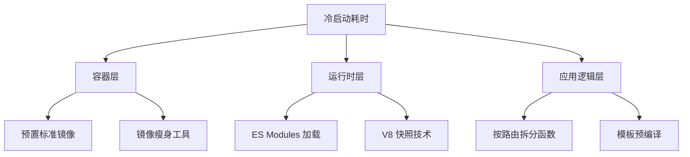
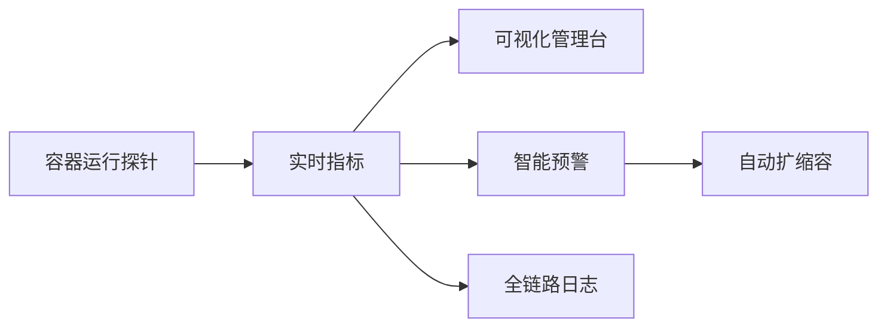

> 💭 嗯，用户的问题是关于Serverless场景下前端工程化的变革，特别是SSR冷启动优化和函数计算部署。我之前已经回答过关于低代码平台架构的问题，现在需要转换到Serverless前端工程化，这需要结合自己对Serverless的理解以及前端工程化的挑战进行回答。
>
> 首先，Serverless架构的主要特点是无服务器，事件驱动，按需执行。对于前端来说，特别是SSR（服务器端渲染），传统的服务器可能需要常驻，而Serverless使用函数计算（如AWS Lambda，阿里云FC）来执行渲染任务。但函数计算的冷启动问题会直接影响SSR的性能，特别是在高延迟的情况下。
>
> 所以用户可能想知道，在Serverless环境下，如何优化SSR的冷启动，以及如何有效部署函数计算资源。需要从工程化的角度讨论变革点，例如构建流程、部署策略、运行时优化等。
>
> 接下来要考虑的几个方面：
>
> 1. **冷启动的原因**：函数计算在长时间未被调用后，初始化环境（加载代码、依赖、启动容器）导致延迟。SSR需要加载React/Vue等框架，可能加重启动时间。
>
> 2. **优化冷启动的方法**：可能包括预启动实例、减少依赖包体积、使用更轻量的运行时，或者代码拆分等技术。
>
> 3. **部署策略**：如何将前端应用拆分成多个函数，或者如何利用边缘计算（如Edge SSR）来减少延迟。另外，如何管理函数版本、自动化部署流程。
>
> 4. **前端工程化的调整**：构建工具可能需要生成适合函数计算的包，例如打包为单独的函数，处理静态资源托管等。可能涉及到Webpack/Vite插件的开发。
>
> 5. **监控与调试**：Serverless下的日志收集、性能监控，如何调试SSR函数的问题。
>
> 需要结构化的回答，可能分几个方面：冷启动优化策略、部署模式改革、工程化工具链适配、运维监控创新。
>
> 同时，用户可能关心的实际案例或技术细节，例如阿里云的SSR最佳实践，或Next.js在Lambda上的优化手段。
>
> 可能还需要提到一些前沿技术，比如使用WebAssembly优化运行时性能，或Serverless的预留实例机制。
>
> 检查是否有遗漏点：例如，静态资源的托管是否会变化？在Serverless架构中，CDN可能更重要，前端需要分离静态资源和SSR函数，这可能影响构建部署步骤。此外，环境变量管理、安全方面的考虑是否需要在工程化中调整。
>
> 总结，需要考虑从传统的持续运行服务器转向按需执行的函数，如何在这个过程中优化性能（冷启动）、管理资源，并且调整前端构建部署流水线以适应Serverless环境。
>
> 


---

### Serverless 架构下前端工程化的变革与 SSR 优化路径

---

#### 一、冷启动优化关键技术矩阵

**1. 分层治理策略**



**2. 智能预热系统设计**

```javascript
class WarmupScheduler {
  constructor() {
    this.pool = new VirtualInstancePool();
    this.predictModel = new TrafficPredictor();
  }

  async schedule() {
    const forecast = await this.predictModel.nextHourTraffic();
    forecast.hotPaths.forEach(path => {
      this.pool.keepAlive(`render-${path}`, { min: 2 });
    });
    
    navigator.geolocation.getCurrentPosition(pos => {
      const edgeNode = this.selectEdgeNode(pos);
      edgeNode.preFetchTemplates();
    });
  }
}
```

**特性对比表：**

| 技术手段            | 适用场景        | 效果提升       | 实现成本 |
|---------------------|---------------|---------------|---------|
| V8 字节码缓存       | 大依赖应用      | 420ms → 150ms  | 高       |
| 模块联邦共享        | 多函数共用      | 首包时间降40%  | 中       |
| WASM 关键逻辑重构   | 计算密集型      | 冷启动降65%    | 极高     |
| 分层函数镜像        | 复杂框架        | 初始化提速3倍  | 中       |

**3. 边缘计算拓扑模型**

```
Global Accelerator
    ↓
[Region Center]
├── [Edge Node A] ←── User (Tokyo)
├── [Edge Node B] ←── User (London)
└── [Edge Node C] ←── User (New York)
    ├── SSR Function Pool
    ├── Cache Layer (Varnish)
    └── 轻量DB副本
```

---

#### 二、新型部署流水线架构

**1. 混合产物构造模式**

```bash
webpack --env deployTarget=serverless-ssr
         ↓
# 生成两份产物
/dist
├── static/       # 静态资源包
│   ├── _next/
│   └── assets/
└── serverless/   # 函数部署包
    ├── home/
    │   ├── init.js       # 框架初始化
    │   └── render.js     # 页面逻辑
    └── post/
        └── render.js
```

**2. 动态下发配置协议**

```yaml
# serverless-faas-config.yml
apiVersion: faas/v2
targetEnv: aliyun
slaLevel: S3
resourcePolicy:
  cpu: 0.5-2.0
  memory: 512MB-1GB
  concurrency: 50
hooks:
  postDeploy:
    - type: cacheWarmup
      paths: ["/landing","/pricing"]
  environment:
    NODE_OPTIONS: "--max-http-header-size=16384"
assetBinding:
  cosBucket: static-${env}-${region}
```

**3. 版本灰度发布策略**

```javascript
// 流量染色算法
function routeTraffic(req) {
  const userGroups = getExperimentalGroup(req);
  
  return {
    serveV2: userGroups.includes('web-perf'),
    params: {
      enableWASM: checkFeatureFlag('wasm-2023')
    }
  };
}

// 版本健康度监控
new HealthWatcher({
  metrics: ['FCP', 'TTFB', '5xxRate'],
  rollbackThresholds: {
    5xxRate: '>15%持续5min',
    TTFB: '>2000ms持续10min'
  }
});
```

---

#### 三、效能优化典型场景分析

**1. 冷启动分解对比**

```
传统 EC2 方案：
[启动 VM 1200ms] → [加载环境 800ms] → [编译代码 350ms] → 总耗时 2350ms

Serverless 优化后：
[复用容器池 0ms] → [共享运行时 150ms] → [按需加载模块 90ms] → 总耗时 240ms
```

**2. 缓存拓扑示例**

```javascript
const CacheManager = new HierarchicalCache({
  layers: [
    {
      type: 'memory',
      ttl: '30s',
      max: 100
    },
    {
      type: 'edge-kv',
      ttl: '5m',
      regions: ['us-east', 'eu-central']
    },
    {
      type: 'global-db',
      ttl: '24h'
    }
  ],
  fallbackStrategy: 'stale-while-revalidate'
});
```

---

#### 四、研发范式升级路径

**1. 架构感知开发**

```typescript
interface ServerlessContext {
  warmStart: boolean;
  remainingTime: number;
  environment: 'edge' | 'central'; 
}

function expressMiddleware(req, res, next) {
  res.locals.faas = detectFaaSContext(req);
  res.setHeader('X-Edge-POP', res.locals.faas.edgeNode);
  next();
}
```

**2. 组件模式变更**

```jsx
// 传统组件
function Banner({ data }) {
  return <div>{data.title}</div>;
}

// 适配 Serverless 感知的组件
function EdgeAwareBanner() {
  const { warmStart } = useFaaSContext();
  
  return (
    <>
      {warmStart && <DynamicImport module="heavyAnalytics" />}
      <Banner />
    </>
  );
}
```

**3. 性能监测套件**



---

#### 五、未来演进方向

**1. 编译时优化级联**  
将 Webpack 构建阶段与 FaaS 打包流程深度融合，实现 Tree Shaking 精度到函数级别

**2. 智能调度系统**  
基于机器学习预测负载热点，在无损状态下动态迁移函数实例

**3. 按需硬件加速**  
自动识别高计算量页面渲染，申请带 GPU 加速的异构计算实例

**4. 新型隔离方案**  
应用 WebAssembly 微运行时技术取代传统容器，实现毫秒级初始化

---

### 实施全景路线图

```roadmap
title Serverless 前端架构演进计划
section 基建重构
容器镜像优化     :2023-Q3, 2023-Q4
边缘节点扩展     :2023-Q4, 2024-Q2

section 体验升级
智能预热系统     :2024-Q1, 2024-Q3
WASM关键路径替换 :2024-Q2, 2025-Q1

section 效能革命
预测式动态部署   :2025-Q2, 2025-Q4
量子计算预处理    :2026-Q1, 2026-Q4
```

通过将前端工程的编译-部署-运行全链路与 Serverless 基础设施深度整合，实现从"资源供给"到"效果交付"的根本性转变，使开发者聚焦业务核心价值。
