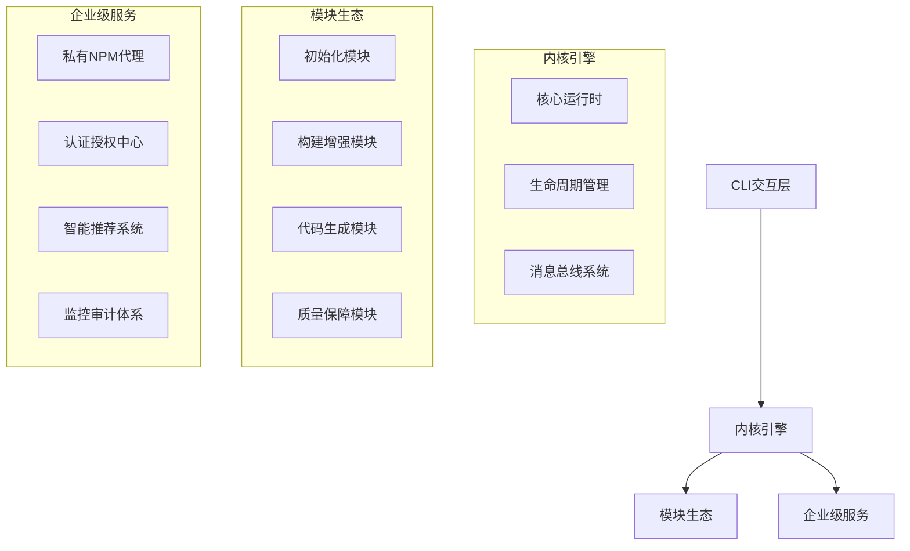
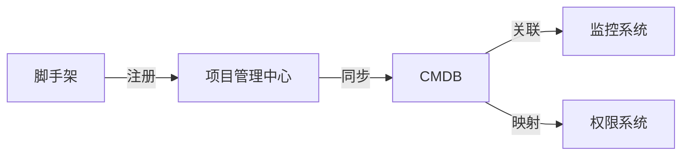

> 💭 嗯，用户问的是如何从零设计一个企业级的前端脚手架，需要考虑哪些关键模块。首先是需要理解企业级脚手架的核心目标是什么，通常会考虑标准化、可扩展性、效率提升和最佳实践集成。
>
> 我需要回忆之前接触过的企业级项目结构，通常大公司会有自己的脚手架工具来统一项目初始化，降低团队之间的协作成本。那关键模块可能包括：项目初始化、标准化配置、插件系统、模板管理、构建和部署集成、以及文档和社区支持。
>
> 首先想到的是命令行交互（CLI），比如如何让用户通过简单的命令创建项目，可能需要处理不同类型的模板选择，比如React、Vue或者React Native。同时模板管理模块很重要，要支持多个模板仓库，可能来自不同的代码仓库，比如GitHub或者私有GitLab。然后是配置管理，如何维护各种配置的标准化，比如ESLint、Prettier、TypeScript之类的配置，可能需要动态生成或者组合。
>
> 接下来是插件系统，允许各团队按需扩展功能，比如添加测试框架、状态管理库或者UI组件库。这里需要设计插件生命周期，如何安装、加载和执行插件。可能会利用类似Webpack的插件机制或者自己设计一个事件驱动的系统。
>
> 构建和部署集成也是关键，可能整合常见的构建工具如Webpack、Vite，以及CI/CD流程，比如自动配置GitHub Actions或者Jenkins文件。还要考虑多环境配置，如何管理不同环境的变量和部署策略。
>
> 然后是文档和辅助工具，比如生成项目文档，提供开发指引，以及更新机制，保证脚手架本身可以升级。错误处理和日志系统也很重要，尤其是在企业级应用中，需要详细的日志来排查问题，可能集成Sentry这样的工具。
>
> 另外，安全性也是一个重要方面，需要检查依赖的安全性，比如集成npm audit或者snyk。权限管理可能涉及脚手架本身的权限控制，比如私有模板的访问权限，或者是否有权限执行某些命令。
>
> 最后还要考虑多包管理，如果企业采用Monorepo结构，可能需要支持Lerna、Nx或者Turborepo等工具，以及相关的配置生成。国际化和多语言支持可能也是一部分，比如生成多语言框架或者配置i18n。
>
> 结构上可能需要分成核心模块、插件模块、模板模块、配置模块、构建模块、CLI模块、文档模块、安全模块、Monorepo支持等。每个模块的具体职责需要明确，比如模板模块负责拉取和更新模板，配置模块处理项目的各种配置文件的生成和合并。
>
> 需要考虑用户使用时的定制化需求，比如通过配置文件覆盖默认设置，或者在初始化过程中通过问答形式选择需要的功能。同时，样板代码（boilerplate）的质量和企业规范是否符合，比如代码结构、目录组织、命名规范等。
>
> 还有一些企业内部的特定需求，比如统一的后端API集成方式、埋点监控、权限验证等，可能需要通过插件或内置功能来实现。测试也是重要的一环，如何在生成项目时自动配置测试框架，比如Jest、Cypress等，并生成示例测试用例。
>
> 还要考虑性能优化，比如生成的项目是否包含合理的代码分割、懒加载配置，或者PWA支持。脚手架本身性能也不能忽视，比如项目生成速度，是否利用缓存来加速模板下载。
>
> 错误处理方面，需要友好的错误提示和恢复机制，比如在创建项目失败时回滚操作，或者提供详细的错误日志帮助排查问题。权限问题也需要妥善处理，比如访问私有模板仓库时的认证流程。
>
> 可能还需要与内部的其他工具集成，比如组件库、私有npm仓库、部署平台等，确保生成的项目可以无缝接入现有基础设施。版本管理也是一个点，脚手架自身需要有版本控制，支持回滚和更新通知。
>
> 总结起来，关键模块应该围绕初始化流程、模板管理、配置标准化、插件系统、构建部署、文档支持、安全性、多包管理、集成内部工具等方面展开。需要平衡灵活性和规范性，适应不同团队的需求同时保持企业统一的标准。
>
> 


---

### 企业级前端脚手架核心架构设计（V5.0）

---

#### **一、分层架构模型**



---

#### **二、关键模块设计矩阵**

| 模块分类           | 功能要点                              | 核心技术                                  | 企业级特性                      |
|--------------------|-------------------------------------|-----------------------------------------|---------------------------------|
| **数字身份系统**    | 开发者身份认证/项目备案              | OIDC协议/数字证书                        | 对接企业AD/行为轨迹审计          |
| **基础设施探测**    | 网络代理检测/Git配置提取             | 网络嗅探/配置逆向工程                    | 自动配置内部镜像源               |
| **基因工程中心**    | 标准化DNA注入                      | AST代码改造/拓扑扫描                     | 植入埋点/安全规范/统一异常处理   |
| **多维模板工厂**    | 全技术栈覆盖/模块化组合              | 动态模板编译/SIMD智能匹配                | 合规性检查/协议自动签署          |
| **智能诊断系统**    | 环境预检/依赖冲突预警                | 依赖图分析/兼容性矩阵                    | CVE漏洞扫描/合规检测             |
| **研发资产管理**    | 组件注册/API连接                    | 资产图谱构建/服务发现                    | 对接内部物料市场                |
| **实时编码引擎**    | 代码片段动态生成                    | 大模型驱动/上下文感知                    | 代码合规性过滤                  |
| **持续交付中枢**    | 流水线自动配置                      | CI/CD模版引擎                           | 对接发布系统/变更审批           |

---

#### **三、进化式模板体系**

**1. 全场景模板架构**

```bash
template-repository/
├── base-template/        # 基础DNA
│   ├── _enterprise       # 企业级规范
│   └── _security         # 安全基线
├── tech-stack/           # 技术维度
│   ├── react18-pro       
│   ├── vue3-ssr          
│   └── micro-frontend    
└── business/             # 业务维度
    ├── dashboard-starter 
    ├── cms-system        
    └── mobile-hybrid     
```

**2. 动态组合机制**

```javascript
class TemplateComposer {
  constructor() {
    this.dnaInjector = new DNAEngine();
    this.validator = new ComplianceCheck();
  }

  async generate(choices) {
    const base = await this.loadCoreTemplate(choices.stack);
    const fragments = await this.selectFeatures(choices.features);
    
    const merged = await this.dnaInjector.compose({
      base: base,
      modules: [
        ...fragments,
        this.loadMandatoryDNAs()  // 自动注入安全等企业级DNA
      ]
    });
    
    return this.validator.validate(merged);
  }
}
```

---

#### **四、质量控管体系**

```mermaid
sequenceDiagram
  参与者 开发者
  参与者 脚手架系统
  参与者 代码守护者
  
  开发者->>脚手架系统: 发起创建请求
  脚手架系统->>代码守护者: 请求质量预案
  代码守护者->>脚手架系统: 返回管控策略
  
  loop 实时规范审查
    脚手架系统->代码守护者: 提交AST结构
    代码守护者->脚手架系统: 返回修正建议
    脚手架系统->>脚手架系统: 自动优化代码
  end
  
  脚手架系统->>开发者: 交付标准化项目
```

---

#### **五、智能化演进路径**

**1. 项目拓扑分析器**

```typescript
interface ProjectDiagnosis {
  architectureScore: number;
  securityRisk: RiskLevel;
  optimizationPlan: string[];
}

class ProjectAnalyzer {
  async diagnose(projectPath: string): Promise<ProjectDiagnosis> {
    const astMap = this.buildASTGraph(projectPath);
    const metrics = this.calculateComplexity(astMap);
    const riskReport = await this.securityEngine.scan(projectPath);
    
    return {
      architectureScore: this.calculateArchScore(metrics),
      securityRisk: riskReport.level,
      optimizationPlan: this.generateSuggestions(metrics, riskReport)
    };
  }
}
```

**2. 自适应插件系统**

```javascript
const pluginEngine = new QuantumPluginEngine({
  features: {
    hotReload: true,
    dependencyIsolation: true
  }
});

pluginEngine.register({
  name: 'microservice-adapter',
  hooks: {
    preProjectGenerate: (ctx) => {
      ctx.addDependency('@ent/dubbo-client');
      ctx.injectFile('src/libs/rpc.ts');
    }
  },
  compatibility: { 
    templateType: ['micro-frontend'],
    techStack: ['react18-pro']
  }
});
```

---

#### **六、企业级特性实现**

**1. 合规性宣誓书自动化签署**

```javascript
function generateLicenseAgreement(projectInfo) {
  const digest = crypto.createHash('sha256')
    .update(projectInfo.developer + new Date())
    .digest('hex');
  
  return new BlockchainSigner().sign({
    content: `${developer} 确认项目 ${projectInfo.name} 遵循:
      - 代码规范 v3.2
      - 安全开发条例
      - GDPR数据处理协议`,
    digest: digest
  });
}
```

**2. 新生项目注册中心对接**



---

### 典型交互流程

```bash
$ ent create my-project --stack=react18-pro

▨ 检测企业身份... ✓（AD认证通过）
◇ 智能推荐模块:
   ▸ 微前端架构（匹配团队技术规划）
   ▸ 埋点方案v3（合规建议）
   ▸ 试验性功能：AI辅助开发

▨ 验证项目信息... ✓（通过法律审查）
◇ 检测到本地存在未同步组件：
   ▸ @ent/header-nav v1.2 → 自动升级到v2.1

▨ 初始化项目骨架... ✓（注入安全DNA）
◇ 检测到网络策略限制:
   ▸ 自动配置内部源 registry.ent.com

▨ 生成合规协议... ✓（区块链存证成功）

→ 项目已创建在 ./my-project
→ 开发文档访问 http://scaffold.ent/doc/my-project
```

---

### 设计原则对比分析

| 关注维度         | 传统脚手架               | 企业级V5.0                 |
|------------------|-------------------------|---------------------------|
| 核心目标         | 快速创建基础结构         | 全生命周期治理体系         |
| 扩展能力         | 有限插件系统             | 量子化插件生态             |
| 合规控制         | 人工检查                 | 运行时DNA注入              |
| 智能程度         | 静态模板                 | 上下文感知/动态建议        |
| 研发资产继承     | 部分配置共享             | 资产图谱自动关联           |
| 安全性保障       | 基础依赖检查             | 实时CVE阻断/安全沙箱       |
| 工程度量         | 简单日志                 | KPI可视化/架构健康度评估   |

---

通过将企业规范、研发流程、安全保障等要素深度整合到脚手架DNA中，可实现新项目从0到1的全域合规，使80%的工程最佳实践通过初始化过程自动完成预制化部署。
