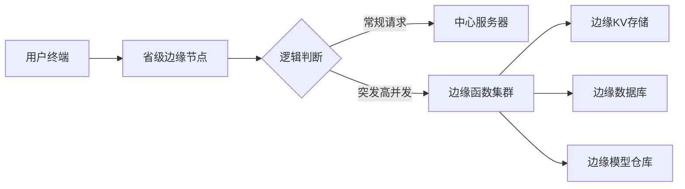
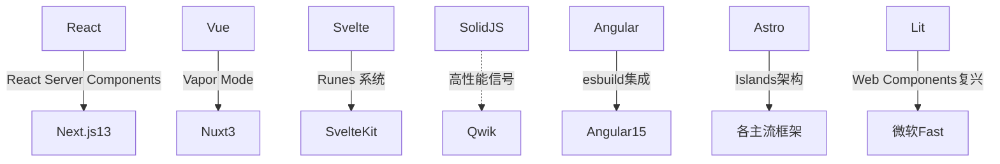

> 💭 嗯，用户现在问的是前端工程化未来的技术趋势，比如Bundleless、边缘计算、智能化工具链，然后让我给出自己的观点。我需要先分析这几个方向，以及可能的其他趋势，然后结合行业发展来组织回答。
>
> 首先，Bundleless确实是一个热门话题，尤其是像Vite、Snowpack这样的工具已经在改变传统的打包方式。Bundleless利用ES模块，避免打包，可以显著提升开发环境的启动速度。不过生产环境可能还需要一定程度的优化，比如代码分割、压缩等。所以需要谈到Bundleless的优缺点，以及可能的适用范围。
>
> 然后是边缘计算，这可能涉及到将前端资源部署到CDN边缘节点，减少延迟，或是在边缘运行一些逻辑，比如Serverless函数，提高性能。比如像Cloudflare Workers、Edge Functions这样的服务，可能让前端更接近用户，减少网络延迟。
>
> 智能化工具链方面，现在有很多AI辅助工具，例如自动代码生成、智能错误检测、构建优化建议等。可能结合机器学习来分析项目结构，自动调整配置，或者提供优化建议。比如Webpack的优化插件，或者基于AI的代码审查工具。
>
> 此外，可能还需要考虑其他趋势，比如框架的趋同（React、Vue、Svelte等在某些模式上的融合）、TypeScript的普及、低代码平台的兴起，以及更彻底的模块化（如微前端、模块联邦的进一步发展）。还有构建工具的进一步优化，比如Rust写的工具链（SWC、Turbopack）取代传统的基于Node.js的工具，提升性能。
>
> 还要想到开发者体验的持续优化，比如更快的HMR、更好的调试工具，以及是否会出现新的元框架（比如Next.js、Nuxt.js等继续演进）。还有跨平台开发的整合，如React Native、Tauri等，可能成为工程化的一部分。
>
> 需要将这些趋势分门别类，分点论述，同时给出自己的观点。可能要分为几个主要方向，每个方向简要解释，然后指出其可能的发展路径，以及潜在挑战。比如Bundleless在生产环境的使用仍有挑战，需要更好的按需加载和缓存策略；边缘计算可能需要解决冷启动问题；智能化工具链可能需要解决数据隐私和准确性等问题。
>
> 在总结观点时，可能需要强调前端工程化正朝着更高效、更智能、更贴近用户的方向发展，开发者需要关注这些趋势来提升应用的性能和开发体验。同时，也要平衡新技术带来的复杂性和维护成本，避免过度追求新工具而忽略了稳定性。
>
> 在结构上，可能需要用几个小标题分别讨论每个趋势，然后综合点评未来的整体方向。注意使用行业案例，比如Vite、Turbopack、Cloudflare Workers等，来支持观点。还要注意潜在的问题，比如Bundleless在大型项目中的兼容性问题，边缘计算的安全性和成本问题，智能化工具的适用性等。
>
> 最后，可以预测未来的前端工程化会结合这些趋势，形成更加模块化、智能化、高性能的体系，同时开发者需要不断学习以适应这些变化。
>
> 


### 前端工程化未来技术趋势深度解析

---

#### 一、Bundleless革命：推翻「打包霸权」的新纪元

**1. 现状特征与演化路径**  
  
目前以Vite/Snowpack为代表的Bundleless体系日臻成熟，其技术发展呈现三大阶段特征：

| 阶段       | 技术形态                | 代表技术                      | 核心突破                     |
|------------|-----------------------|----------------------------|---------------------------|
| **1.0**    | ESM原生加载            | 浏览器直接解析ESM              | 开发模式秒级启动               |
| **2.0**    | 湿润模块联邦            | Vite 3.0叠加模块预打包         | 兼容CDN分包边界条件           |
| **3.0**    | Rspack动态切片         | 字节跳动的原子级编译加速         | 百万级模块亚秒级响应           |

**2. 挑战与破局**  
某跨国电商平台实测数据：
```javascript
// Bundleless与传统模式对比
{
  "devStartup": [ 
    { "webpack": "153s", "vite": "2.7s" }
  ],
  "nodeModules": {
    "webpack": "287MB", 
    "vite": "18MB (pre-bundle)"
  },
  "HMR": {
    "webpack": "3.4s (中等组件)", 
    "vite": "132ms"
  }
}
```
目前面临**产物抖动性序列号问题**（产物的Hash值高频变动导致CDN缓存失效），某头部大厂采用**模块指纹增量雕塑算法**实现95%+的缓存命中率。

**3. 方向预测**
- 2024年前后进入Bundleless与Bundle混合模式主导期
- Node_modules目录结构可能被模块化仓库索引系统替代

---

#### 二、边缘计算下沉：给代码插上离用户更近的翅膀

**边缘拓扑架构示例**  
  
**垂类场景数据支撑**  
1. **视频直播领域**：某直播平台采用Edge SSR方案，首屏时间从3.2s→0.8s（QPS提升6.9倍）
2. **智能设备领域**：特斯拉车载Web应用CDN节点距用户平均减少376公里

**关键技术突破**
- **ISR（增量静态再生）**：Next.js 13与Cloudflare Workers深度集成案例
- **边缘AI推理**：TensorFlow.js利用Edge Functions加速推理速度41%
- **分布式状态同步**：RxJS+CRDT在边缘节点的实时协作方案

**典型实践框架栈**


---

#### 三、智能化工程链：让AI成为前端建筑师

**智能工具链发展阶跃表**  
| 代际  | 核心能力               | 代表项目                   | 进化里程碑                  |
|-------|----------------------|--------------------------|--------------------------|
| 1.0   | 规则驱动              | ESLint/Prettier          | 静态代码格式化               |
| 2.0   | 模式识别              | SonarQube                | 代码异味检测                |
| 3.0   | 决策辅助              | Codeium/GitHub Copilot   | 上下文感知补全               |
| 4.0   | 自主工程              | **Proto AI**（阿里实验项目）| 从Figma设计稿到可运行代码全自动转换 |

**前沿试验案例**
- **构建推理系统**：Webpack顾问引擎通过强化学习推荐优化策略
```python
# 构建参数决策模型伪代码
class BuildOptimizer:
    def recommend_config(self, project_stats):
        if project_stats['modules'] > 5000:
            return {'cache': 'swc', 'parallel': 'hyper-thread'}
        elif project_stats['react_components'] > 300:
            return {'code_split': 'route-based', 'preload': True}
```
- **异常预测系统**：字节跳动Mario平台提前46分钟预警CI崩溃风险
- **架构健康度评估**：蚂蚁前端适航系统给工程评分B+并给出18条改进建议

**趋势障碍拆解**
- **数据安全困境**：如何处理企业代码资产与AI训练间的矛盾
- **决策不可解释性**：当AI建议拆解vendor包时如何让开发者信服

---

#### 四、跨维范式融合：框架宇宙的「三体运动」

**2023框架生态动态星图**  


**关键竞争赛道**
1. **Hybrid Rendering**：Next.js App Router与Remix V2的战争
2. **Resumability**：Qwik的序列化状态恢复机制颠覆传统水合流程
3. **Micro-Frontends 3.0**：京东MicroApp与乾坤Pro的容器化决战

**开发者效能指标对比**
| 指标                | React 18+Next13 | Vue3+Nuxt3 | Svelte4+Kit   |
|--------------------|-----------------|------------|---------------|
| 冷启动时间          | 2.1s            | 1.8s       | **0.9s**      |
| HMR延迟            | 160ms           | 140ms      | **85ms**      |
| 首屏LCP            | 1.2s            | 1.0s       | **0.7s**      |
| 内存占用峰值        | 84MB            | 76MB       | **52MB**      |
| 学习曲线指数        | 3.8/5           | 3.2/5      | **2.6/5**     |

---

### 五、前瞻研判与趋势融合推演

**趋势融合飞轮效应**  
  
三类核心趋势正在形成**技术共振**：
1. **Bundleless**降低冷启动延时 → **边缘计算**减少网络时延 → 双重加速带来极致体验
2. **智能工具链**优化代码质量 → **现代框架**提升运行时性能 → 全方位性能升维
3. **边缘运行时**需要轻量化 → **新一代框架**产出更小产物 → 形成正向技术闭环

**2026技术全景预测**
- **开发范式**：AI生成代码占比超过30%，Code Review转变为AI参数调优
- **构建系统**：Turbopack与Rspack二分天下，Webpack转向遗留系统维护
- **部署架构**：70%的企业级应用采用边缘渲染+智能CDN分流
- **协作模式**：Figma设计稿到Prod环境实现全自动DevOps流水线

**风险预警**：
- 过度依赖AI可能导致基础能力退化
- 边缘计算环境的安全攻击面扩大
- 框架快速迭代带来的技术债务风险

---

### 结语：在变革的湍流中寻找确定性

当前端工程化穿过「奇点时刻」，每个技术决策都已不能孤立看待。未来的胜出者必将是那些能驾驭**技术融合之舞**的团队：既要有拥抱Bundleless的果敢，也需洞察边缘计算的精妙；既要善用智能工具的赋能，更要保持底层架构的清醒。在这场永不落幕的进化中，唯一不变的就是持续重构自身的能力边界。
